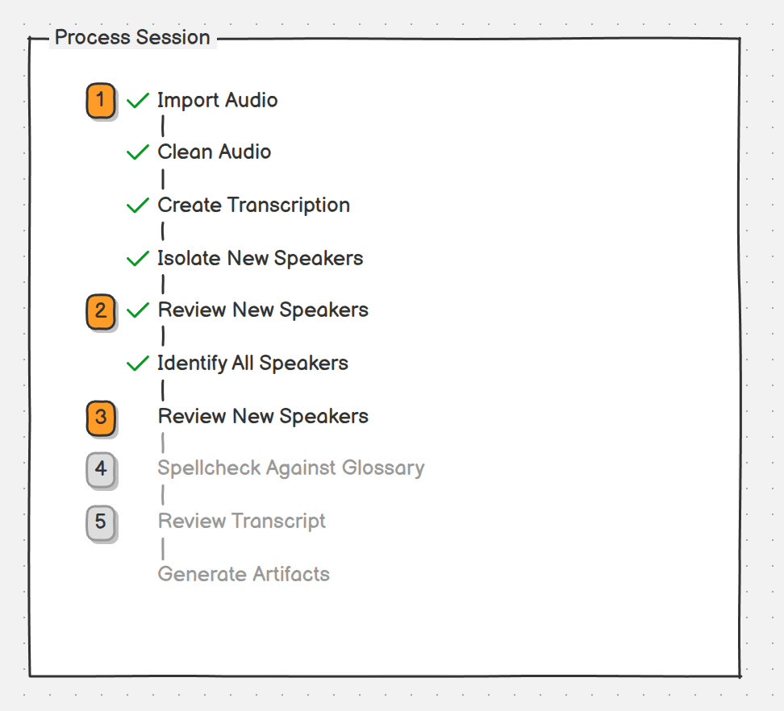

# New player in session — intent

## Intended outcome

Let Process Session handle attendees who have no prior voice samples. Use conversational evidence in the newly transcribed session to associate speech with those players, derive initial voice centroids, and run player identification before human transcript review. Use the completed reviewed transcript to build or improve those players' stored voice clips and centroids for future sessions.

A centroid is the representative voice embedding computed from a set of audio clips. Diarized speaker labels group speech anonymously; they do not themselves establish a player's identity.

## Agreed direction

- After transcription, use an LLM to find evidence connecting speech to new players. For example, someone addresses a question to a named player and that player answers.
- Use the attributed speech to build initial centroids, then run player identification.
- The reviewer reviews and corrects the resulting transcript before its assignments supply durable player voice samples.
- Completing review approves the final speaker assignments, including automatic assignments left unchanged. Clip eligibility must not depend on whether a reviewer explicitly edited a row. Otherwise correctly identified utterances would be unnecessarily excluded.
- Bootstrap only attendees without a usable centroid. Attendees with usable centroids are outside this feature's automatic profile-enhancement scope.
- Automatically enhance the eligible players' profiles when session processing completes.
- When provisional evidence is insufficient or conflicts, leave the speaker unresolved and allow the reviewer to assign their utterances.
- Do not replace or regenerate a session's profile contribution when its reviewed transcript or source audio changes. Regenerating clips from well-reviewed sessions is a separate, player-screen operation.

The review establishes identity eligibility for all finally assigned utterances; audio suitability can still determine which utterances become clips.

## Provisional identification flow



The numbered controls in the mockup use the existing command-button component. The image shows the first new-speaker review and identification checked as complete, with command 3 ready for the focused new-speaker assignment review; later stages are disabled until their prerequisites complete. The two speaker-review steps have distinct names below to clarify their purposes.

1. **Import Audio.** The existing command imports and, when selected, cleans audio; it then transcribes and diarizes with the full attendee count. It also isolates new-speaker candidates from attendees without usable centroids, preserving anonymous speaker labels as evidence.
2. **Review Bootstrap Candidates.** The user reviews the LLM's proposed attendee-to-speaker evidence and candidate clips. They can listen to utterances from the candidate speaker, using the interaction model already present in the player-list screen's Import from Audio flow, though that existing screen may change. The user can confirm, correct, reject, or leave a proposed identity unresolved. This produces trusted seeds for the next step rather than durable player clips.
3. **Identify All Speakers.** The system builds session-scoped provisional centroids from the approved candidate clips and runs speaker identification with established and provisional centroids. It leaves uncertain assignments unresolved and does not expand a provisional centroid from its own predictions before review.
4. **Review New-Speaker Assignments.** The user checks the identification results for the bootstrapped players and can unassign utterances that do not belong to that player. This focused check precedes the existing language and full-transcript review stages.
5. **Spellcheck Against Glossary.** This is the existing session-processing screen, enabled after the new-speaker assignment review is complete.
6. **Review Transcript.** The user performs the canonical full-transcript review, which can correct remaining text and speaker assignments. Completing this review establishes final identity eligibility, including automatic assignments left unchanged.
7. **Generate Artifacts.** The existing final stage generates the session artifacts. At session-processing completion, select suitable clips from the final assignments of players who required bootstrapping and recompute their durable centroids. Retire the provisional centroids.

The persistence boundary keeps inferred identity evidence local to this session until review is completed. The durable enhancement runs automatically when the session's processing completes and applies only to players who required bootstrapping. Later session or audio changes do not update those durable clips; a separate player-screen workflow regenerates clips from well-reviewed sessions.

## Strongest-candidate selection

Use sequential gates, rather than a single weighted score. Duration measures whether usable speech is available; acoustic consistency supports a shared voice; separation from other attendees detects conflicting identity evidence. Transcript evidence supplies the connection to a name. Strong audio quality should not compensate for an unsupported identity.

### Identity evidence and audio suitability

Start with exact utterances supported by the LLM's cited conversational exchanges. Prefer corroboration across independent exchanges. Several clips cut from one answer provide more audio but only one piece of identity evidence.

Use these starting settings during calibration:

- Require roughly 3 seconds of speech and prefer clean segments around 5–12 seconds.
- Exclude detectable overlapping speech, laughter-only responses, and heavily interrupted speech.
- Split long answers into suitable segments and cap their contribution, rather than ranking clips by duration without limit.

These numerical settings are unvalidated starting points, not measured thresholds. The available signals for detecting unsuitable audio have not been established.

### Consistent core and outlier removal

Compare candidate embeddings pairwise and find a mutually similar group backed by strong identity clues before computing a centroid. Do not automatically select the largest group: one wrong attribution could supply many acoustically consistent clips of the wrong player. Conflicting groups with credible evidence should leave identity unresolved.

For each candidate, compare its embedding with the centroid of the other retained candidates. Iteratively remove inconsistent candidates, recomputing as necessary. Excluding the candidate from its reference avoids letting it improve its own apparent fit.

The existing [centroid implementation](../../packages/tablesage-tools/src/tablesage_tools/embeddings/similarity.py) compares samples with a centroid that includes them and stops removing samples at a configured floor, five by default in the inspected code. Bootstrap selection may reject below such a floor and reports insufficient evidence instead of retaining inconsistent samples to satisfy a minimum count. Its final minimum-support check is separate from pruning.

### Separation from other players

For each surviving candidate, calculate:

```text
own_similarity = similarity to the centroid of the other retained seed clips
other_similarity = highest similarity to an established attendee centroid
separation = own_similarity - other_similarity
```

Require adequate own similarity and separation with a calibrated margin when established references exist. Being distant from other players alone does not establish useful voice evidence. If the entire group strongly matches an established player, treat that as conflicting identity evidence.

When several new players have provisional centroids, also check for collisions between them before using them. Exact collision rules and behavior when no established references exist remain unresolved.

### Minimum support and centroid construction

Start with three suitable clips totaling approximately 15–30 seconds, supported by at least two separate exchanges. These values require calibration; they are not measured thresholds.

Average retained normalized embeddings with equal clip weights and cap clips per exchange. Freeze the resulting provisional centroid for the identification pass. Similarity thresholds need calibration for the recordings and embedding model; the existing default outlier threshold of 0.6 should not be assumed suitable unchanged.

## Scope and open implementation details

- The core scope is attendees without a usable centroid. Automatic profile enhancement for attendees who already have usable centroids is outside this work.
- Profile enhancement happens automatically as session processing completes; it requires no additional end-of-review action.
- A player-screen workflow, rather than retranscription or a later review completion, regenerates clips from sessions that have been well-reviewed.
- The operational definition of a usable centroid still needs to be specified.
- Candidate grouping, evidence-strength rules, acoustic thresholds, audio-quality checks, and minimum independent support are agreed mechanisms whose numerical settings need validation.
- Handling one surviving candidate, competing identity claims, and indistinguishable provisional profiles needs definition.
- Review completion must admit unchanged assignments as well as corrected ones. The automatic flow's idempotence within one processing run and its clip/centroid update order still need rules.
- Provisional evidence storage, interruption recovery, and downstream invalidation need design within the existing resumable flow. Audio replacement does not trigger profile regeneration under the agreed scope.

The [implementation plan](plan.md) records the completed technical design and verification. The item-specific rubric has agreed dimensions but still needs numerical anchors and calibration examples. Earlier conversational scores against the session-processing-flow rubric should not be treated as measured or item-specific quality evidence.

## Quality basis

The agreed quality dimensions are recorded in [rubric.md](rubric.md). Their numerical anchors and calibration examples remain to be defined before this work can be evaluated against them.

## Related work and implementation constraints

- [Session processing flow](../session-processing-flow/item.md) provides the existing resumable Audio → Transcript → Outputs workflow. Its original implementation plan does not cover this enhancement; the item currently retains an overlapping ideation note from this discussion.
- [New player from session](../new-player-from-session/item.md) covers completed inline attendee creation and clip-count indicators, a separate feature.
- Any future tunable parameters passed through the TUI/application into tools must follow [.agent_context.md](../../.agent_context.md): deployed settings are injected through the application and tools receive plain values.
- Follow the [project workflow](../workflow.md) for later planning and verification, including its prohibition on creating or expanding unit tests.
