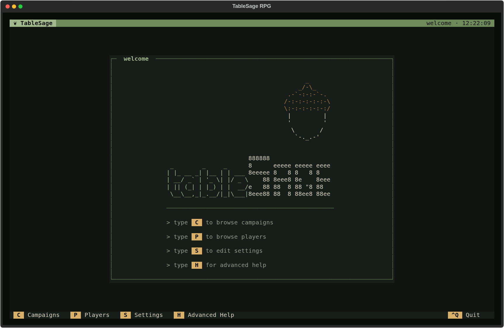

# TableSage RPG

TableSage turns recordings of tabletop roleplaying sessions into transcripts, recaps, and a lasting campaign record. It is a terminal application for game masters: you keep the review decisions, and TableSage does the heavy lifting.



## What it does

- **Transcribes and separates speakers.** Session audio is transcribed with ElevenLabs Scribe, then each line is matched to a player by voice. Voice matching runs on your computer.
- **Learns your players' voices.** Each player has a voice print built from short samples. A new player's first samples are found in the recording itself, and you confirm them.
- **Keeps your world's vocabulary straight.** Each campaign has a glossary of names and terms that informs spelling corrections and generated documents.
- **Puts you in charge of the record.** Guided review steps cover name corrections, glossary terms, spelling, and the transcript itself before anything is generated from it.
- **Generates session artifacts.** A reviewed, role-attributed transcript, a ledger of events and facts, a recap summary, and a player-ready session summary, built with the language models you choose.
- **Prepares the next session.** Campaign-level tools build a "Previously On" recap and suggest ways to bring earlier campaign elements back into play.

## Get started

You need:

- Python 3.12 or newer (managed for you by [uv](https://docs.astral.sh/uv/)) and Git.
- FFmpeg with both `ffmpeg` and `ffplay`.
- An [ElevenLabs](https://elevenlabs.io/) API key.
- An API key for at least one of OpenAI, Anthropic, or Google Gemini.

```sh
uv tool install git+https://github.com/erik-saltwell/tablesage.git
mkdir -p ~/Documents/tablesage && cd ~/Documents/tablesage
tablesage-rpg
```

TableSage stores its data in the directory you launch it from, so start it from the same workspace each time. The [installation guide](docs/getting-started/installation.md) covers every step, including Windows and API-key setup.

## Learn more

- [Install TableSage](docs/getting-started/installation.md)
- [Concepts](docs/concepts/index.md): players and voice prints, sessions and processing, campaigns and glossaries
- [Guides](docs/guides/index.md): ten task walkthroughs covering campaign setup, session processing, outputs, preparation, corrections, glossaries, voice recognition, workspace transfers, and settings
- [Screen Reference](docs/reference/screens/index.md): every screen, key, secondary action, and dialog, with screenshots
- [Privacy and Data Handling](docs/reference/privacy.md): what leaves your computer and what stays on it

## License

[CC BY-NC 4.0](LICENSE).
