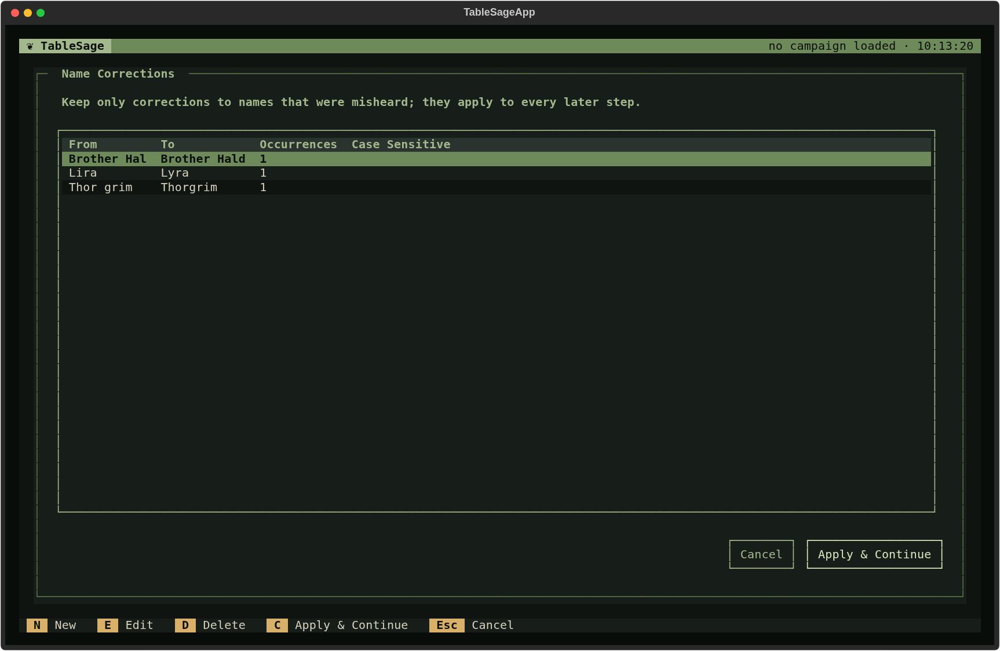
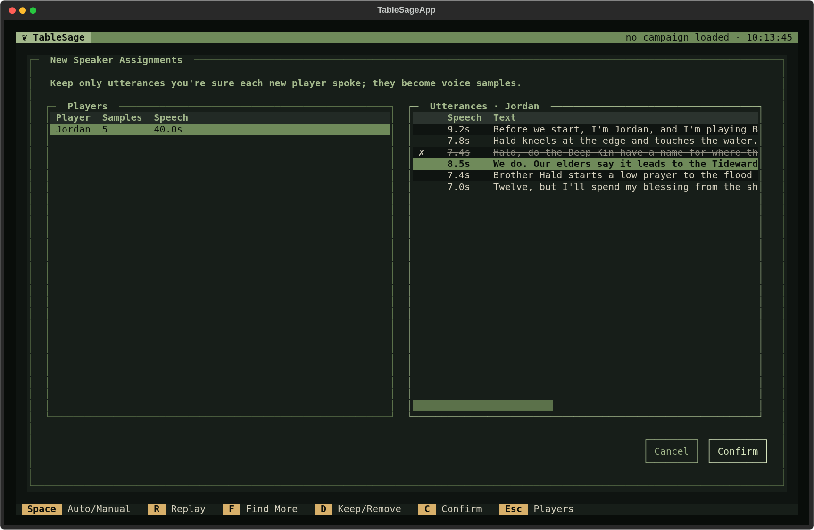
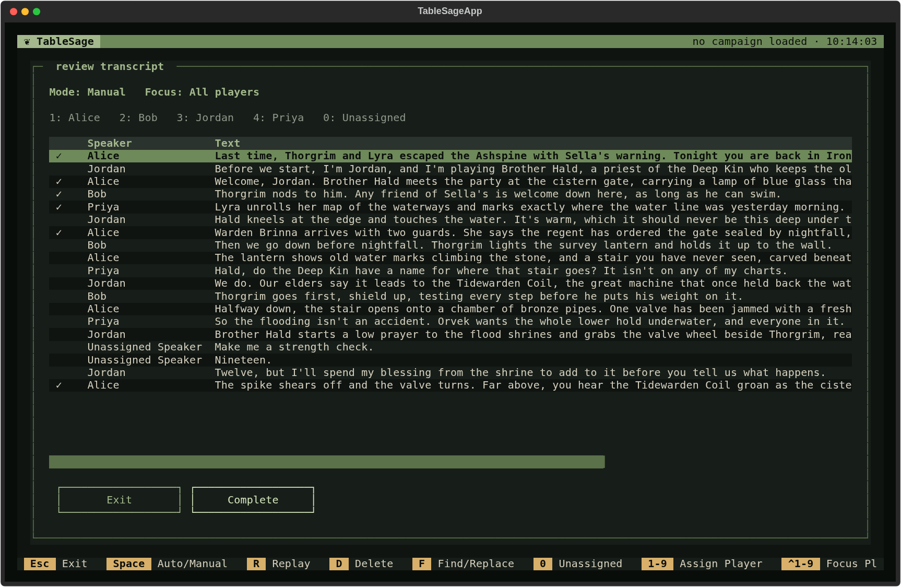
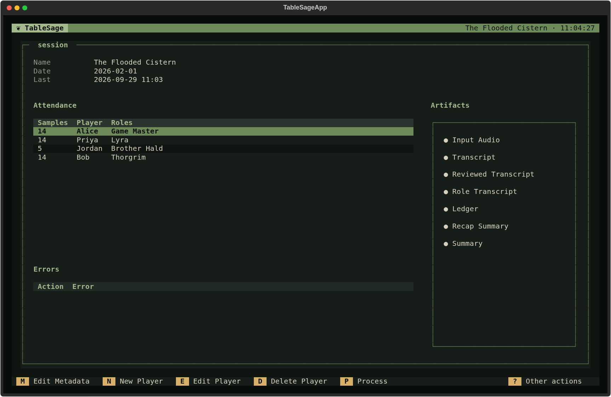

# Processing with New Players

This page follows [Session processing](session-processing.md) step by step
for a Session with at least one **new player**: an attendee without a usable
voice profile, usually because they have no voice samples yet. It builds on
[Processing with returning players](session-processing-returning-players.md).
Every step on that page runs here as well, and this page focuses on what is
different.

On Session Detail, a new player's **Samples** count is a red **0**. Process
Session lists them under **New Players**, and the new-player steps appear in
its list of steps.

## Why new players need extra steps

Identify Speakers can only recognize a voice it has a profile for. Without
extra help, every line a new player spoke would end up as **Unassigned
Speaker**, and you would assign all of them by hand in Review Transcript.

Instead, TableSage uses the recording itself to create a starting voice
profile. It finds lines it is confident the new player spoke, has you
confirm them, and saves them as that player's first voice samples, all
before Identify Speakers runs. By the time speakers are identified, the new
player is just another attendee with a voice profile.

The new-player steps sit between **Remove Bad Utterances** and
**Identify Speakers**. Name corrections also have automatic *Suggest* and
*Apply* rows around your review. The four steps that matter most are:

1. **Review Name Corrections** makes names in the transcript reliable.
2. **Isolate New Speakers** uses those names and other clues to find each new
   player's lines.
3. **Review New Speaker Assignments** lets you confirm those lines.
4. **Seed Player Voice Samples** turns the confirmed lines into voice samples.

Add every attendee before you start processing. TableSage decides who is new
from the attendance, and adding someone after these steps have run does not
send processing back through them.

## Get the words

**Import Audio**, **Create Transcript**, and **Remove Bad Utterances**
work exactly as they do for
[returning players](session-processing-returning-players.md#get-the-words).

## Build the new players' voice profiles

### Review Name Corrections

Your Medium model compares the transcript with every attendee's player name
and character names and proposes corrections for ones that were misheard,
such as *Thor grim* for *Thorgrim* or *Brother Hal* for *Brother Hald*.
Keep only real mishearings and choose **Apply & Continue**. The corrected
transcript is what every later step works from.

This step comes first because the next one finds new players' lines largely
from how people talk to and about each other: *I'm Jordan, and I'm playing
Brother Hald*, *Welcome, Jordan*, or a question addressed to *Hald*. A
misheard name hides that evidence. If there are no corrections to propose,
the step completes without opening.

### Isolate New Speakers

Your Medium model reads the whole Session and lists the lines it is confident
each new player spoke, citing its evidence, and notes which of the
transcript's anonymous speaker labels mostly belongs to them. TableSage keeps
only lines that no other player is claimed for and that are long enough to
make useful voice samples. It aims for about 30 seconds of speech per new
player.

If the model's picks fall short, TableSage tops them up with other lines
from the speaker label the model gave that player, unless another player's
picks share that label. It trims these additions by dropping the shortest
lines and those that sound least like the player's own picks. A new player who still has too little
speech—someone who barely spoke—is left for you to assign by hand in
Review Transcript.

### Review New Speaker Assignments

Here you confirm the proposed lines. Every line you keep becomes a voice
sample, so this is the most important check for a new player.

The left pane lists each new player with the number of kept lines and their
total speech time. The right pane lists the selected player's proposed
lines.

- **R** plays the highlighted line. **Space** switches between Manual
  playback and Auto, which moves on to the next line after each one plays.
- **D** toggles a line between kept and removed. Removed lines are struck
  through and marked **✗**.
- **F** (**Find More**) searches the recording for more lines that sound
  like the player's kept ones, while excluding voices TableSage already
  knows. Use it when a player has too little speech.
- **Esc** returns from the lines to the player list. **C** confirms the
  review.

Remove any line that you are not sure the new player spoke. In the example,
the model picked *Hald, do the Deep Kin have a name…* because it mentions
Hald, but Priya asked the question. Keeping it would mix Priya's voice into
Jordan's profile. A few certain lines are better than more lines of mixed
voices.

### Seed Player Voice Samples

TableSage cuts each kept line from the recording into a voice clip in the
player's folder and builds their voice profile from those clips. It applies
no further filtering except a technical minimum clip length, because your
review was the quality check.

From this point, the player is no longer new. The **New Players** panel
is hidden. The new-player steps keep their rows and checks, because they did
real work for this Session.

## Find the speakers

### Identify Speakers

This step now runs with a voice profile for everyone, including the players
seeded a moment ago. That is why seeding comes first. New players' lines are
recognized by voice like everyone else's, including lines that the review
never showed you.

## Fix the vocabulary, review, and build

The remaining steps are the same as for
[returning players](session-processing-returning-players.md#fix-the-vocabulary):
**Extract Glossary Terms**, **Spellcheck Against Glossary**, **Review
Transcript**, **Assign Roles To Players**, and **Generate Artifacts**.
Only a few points differ.

- **Name corrections are already applied.** Spellcheck focuses on glossary
  terms. It also catches misspellings of attendees' player names.
- **Check the new player's lines in Review Transcript.** Their profile was
  built from only a few clips, so check their lines closely. Any lines they
  spoke that TableSage could not isolate will be **Unassigned Speaker**.
  Assign them here.

- **Accept the offer to improve voice profiles if you can.** After
  generation, **Add Samples** adds clips from the reviewed transcript to
  every attendee's profile. A newly seeded profile benefits most. As always,
  do this only if you checked speaker assignments carefully, because a
  mislabeled line teaches TableSage the wrong voice.

## After processing

Once the run is complete, the new player has voice samples of their own.

The next time they attend, they are a returning player, and that Session
follows the simpler workflow.

If you later reopen **Review Name Corrections** and change what you
accepted, every later step becomes out of date, including isolation, your
new-speaker review, and seeding. Work forward from there again. Seeding
changes only players listed in your new-speaker review. Running it again
therefore never touches returning players' profiles.
