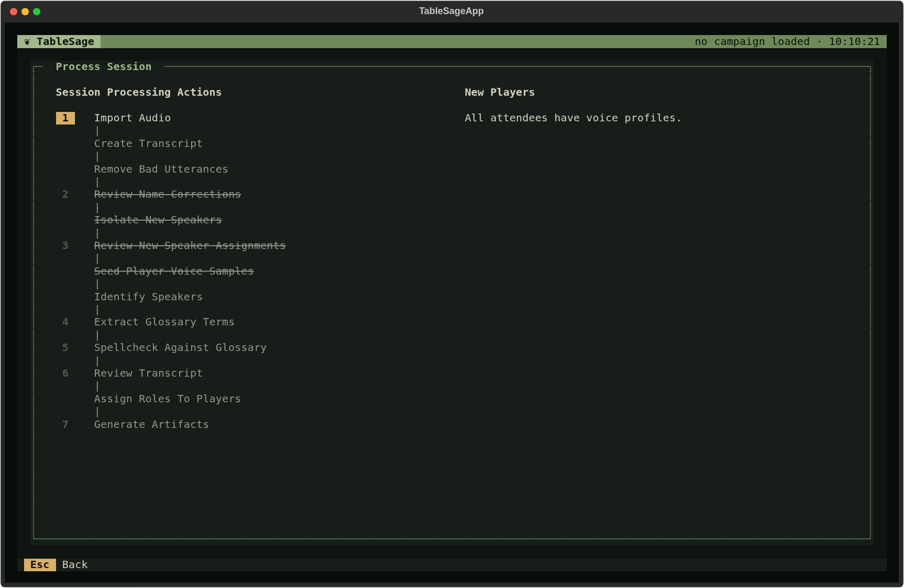
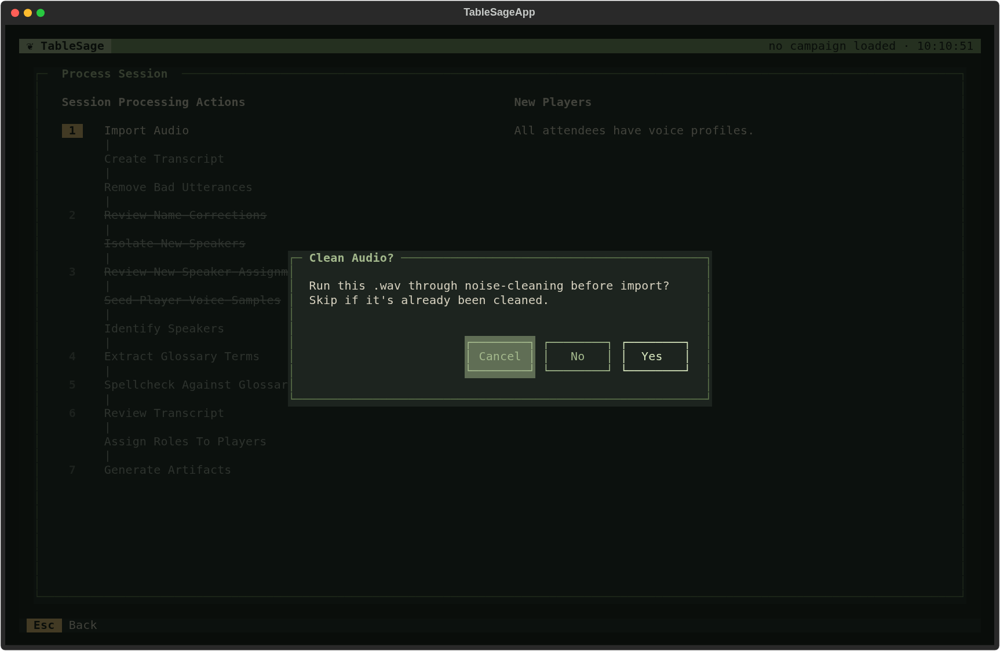
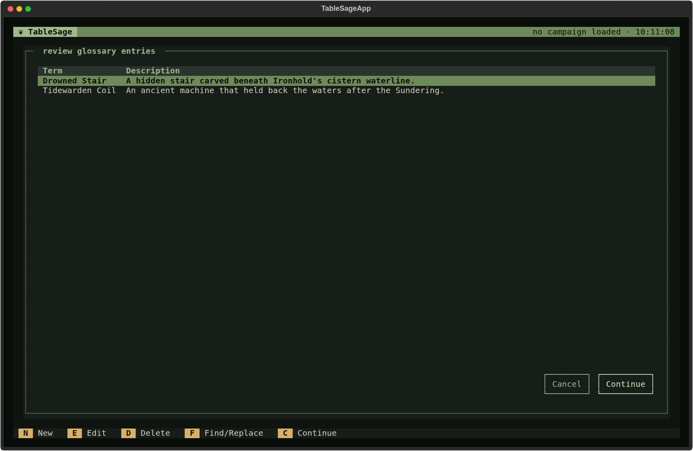
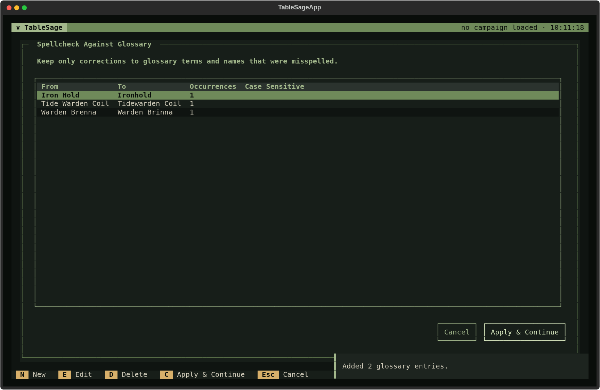
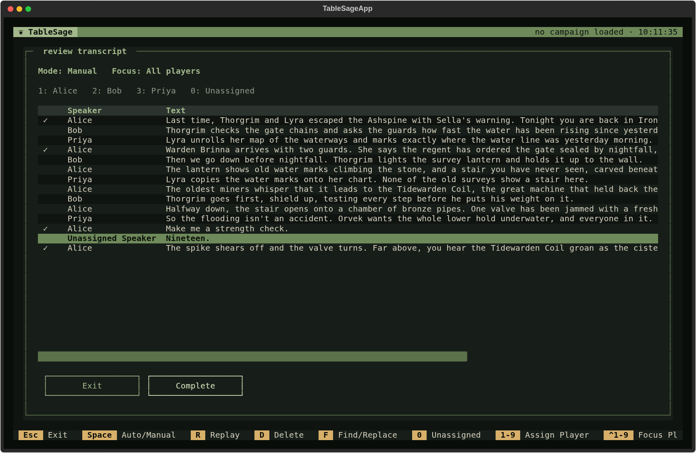
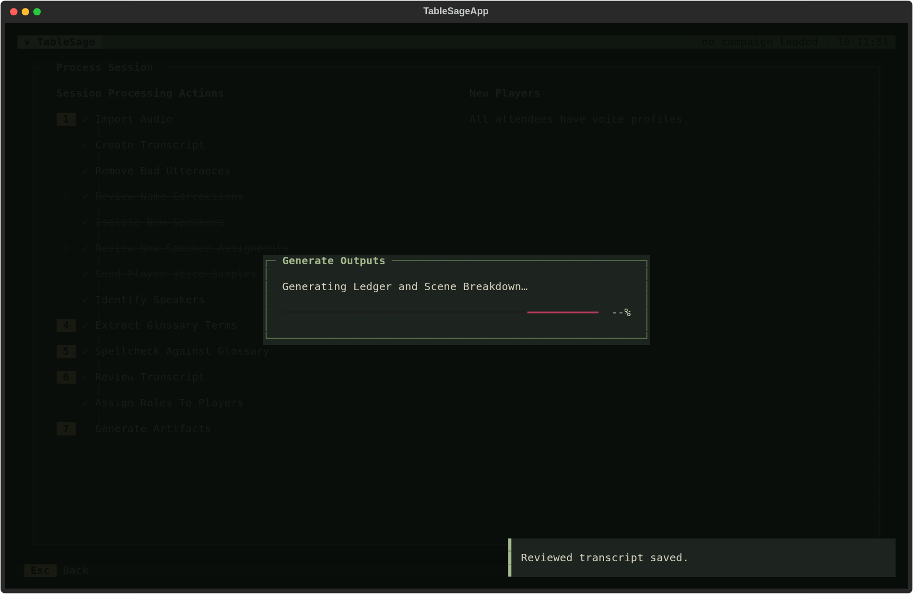
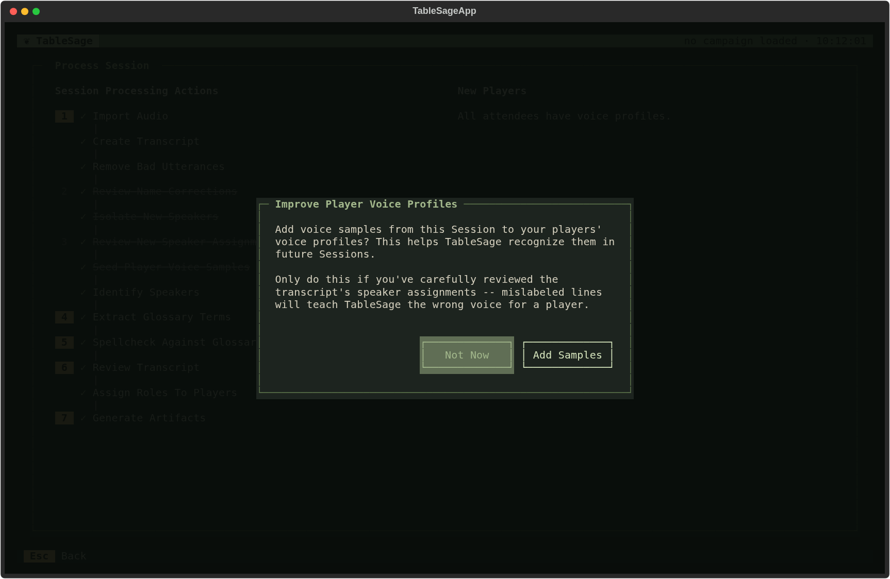
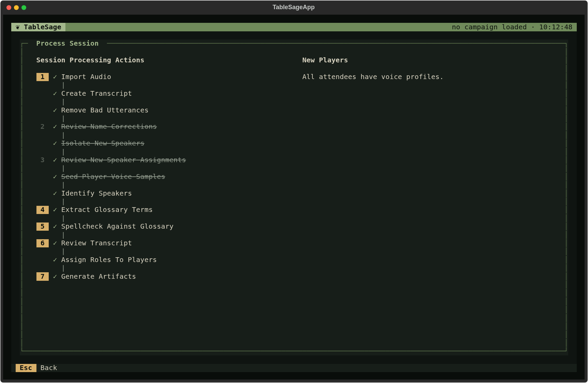

# Processing with Returning Players

This page follows [Session processing](session-processing.md) step by step
for the simpler workflow: every attendee already has a voice profile. That is
the normal case once your group has played a Session or two. Process Session
shows *All attendees have voice profiles* and strikes through the four steps
that exist only for new players.

The workflow falls into four stages:

1. **Get the words** — turn the recording into a clean transcript.
2. **Find the speakers** — decide who said each line.
3. **Fix the vocabulary** — make the campaign's names and terms consistent.
4. **Review and build** — confirm the transcript, then generate the
   artifacts from it.

Each stage exists so the next one has something trustworthy to work from.

## Get the words

### Import Audio (1)

Press **1** and choose the Session's recording. TableSage copies it into the
Session as its **input audio**, the source for everything that follows.

If you choose a `.wav` file, TableSage asks whether to run it through noise
cleaning first. Answer **Yes** for a raw recording of a noisy table, or
**No** if the file has already been cleaned. Other audio formats are always
cleaned as they are imported.

Importing starts a run of automatic steps behind a single progress dialog.

### Create Transcript

ElevenLabs transcribes the recording and separates it into speakers, then
TableSage adds punctuation. At this point the speakers have anonymous labels
such as *speaker_0*, not names. Keeping transcription separate from speaker
identification means TableSage never has to transcribe the audio again when
it identifies speakers again, which is the slowest and most expensive part.

The result is the **transcript** artifact on Session Detail: the raw
machine record, before any correction.

### Remove Bad Utterances

Your Low model reviews short lines and removes pure backchannels—the
*yeah*, *mm-hmm*, and *right* that listeners say while someone else
talks. They add nothing to the record, and because they are so short they
are hard to attribute to a voice. Removing them first keeps them from
cluttering every later step.

## Find the speakers

### The skipped new-player steps

**Review Name Corrections**, **Isolate New Speakers**, **Review New Speaker
Assignments**, and **Seed Player Voice Samples** exist to build a voice
profile for someone TableSage has never heard. With no new players there is
nothing for them to do. Each one completes on its own, passing the
transcript through unchanged, and processing continues without stopping.
They stay struck through, with a check, so you can see they were
deliberately skipped.

### Identify Speakers

TableSage compares the voice in each line with the voice profiles of the
Session's attendees, and labels the line with the closest match. A line that
does not clearly match anyone—often a very short one—is labeled
**Unassigned Speaker** rather than guessed. You assign those during Review
Transcript.

This is the step that voice profiles exist for. Only attendees are
candidates, which is why the attendance on Session Detail needs to be right
before you process.

## Fix the vocabulary

Speech recognition does not know your campaign's invented names. These two
steps use the Campaign glossary to fix that, and they run in this order for a
reason.

### Extract Glossary Terms (4)

Your Medium model reads the transcript and proposes names and terms from
this Session that are not yet in the Campaign glossary—a newly discovered
place, a faction, an artifact. Review the list: add, edit, or delete entries,
then press **Continue** to add them to the glossary. If nothing new turns up,
the step completes without opening.

### Spellcheck Against Glossary (5)

With the glossary now up to date, your Medium model looks for places where
the transcript misspells a glossary term or an attendee's name, and proposes
corrections. Keep only the ones that are really misspellings, then choose
**Apply & Continue**.

Because extraction runs first, a term you added a moment ago is checked
too. In the example above, *Tidewarden Coil* was added by Extract Glossary
Terms, and Spellcheck immediately catches a later *Tide Warden Coil*.

Spellcheck knows attendees' player names and every glossary term. A misheard
character name is only caught if it is in the glossary. Otherwise, fix it in
Review Transcript with **Find/Replace**. Adding your player characters to the
glossary once saves you from doing that every Session.

## Review and build

### Review Transcript (6)

This is where you decide what the record says. The screen lists every line
with its speaker, and you can listen to each one.

- Press a number key to assign the highlighted line to that attendee. The
  legend at the top shows the numbers. **0** sets it back to Unassigned.
- **R** replays the line's audio. **Space** switches between Manual
  playback and Auto, which moves on to the next line after each one plays.
- **Ctrl** plus a number focuses on one attendee's lines, which helps when
  checking a single speaker.
- **D** deletes a line, and **F** opens Find/Replace for the whole
  transcript.

Pay particular attention to **Unassigned Speaker** lines and to anything
that sounds wrong. When you are satisfied, choose **Complete** to save the
**reviewed transcript**. If you leave with unsaved edits, TableSage offers to
save them as a draft that the next visit resumes from, but only **Complete**
finishes the step.

Everything after this step is generated from your reviewed transcript, and
so is any voice sample you later add from this Session. A mistake left here
flows into the ledger, the summaries, and possibly a player's voice
profile.

### Assign Roles To Players

Completing the review starts the rest of processing automatically. This
step writes the **role transcript**. It replaces each player name with that
attendee's Role—*Thorgrim* rather than *Bob*, *Game Master* rather than
*Alice*—and drops any leftover unassigned backchannels. Artifacts are written
about the fiction, so the generator needs to see who spoke in the story, not
who sat at the table.

### Generate Artifacts (7)

Your High model builds the Session's outputs from the role transcript, each
from the ones before it:

1. **Transcript sections** find where the opening recap, the character
   introductions, and actual play begin, so each later output reads the
   right part of the Session.
2. The **ledger** records the events, facts, and developments of play, with
   a scene breakdown alongside it.
3. **Player introductions** capture how each character was introduced at
   the start of the Session.
4. The **recap summary** distills the scene breakdown into a short account
   for use in later Sessions.
5. The **session summary** is the player-ready account, built from the
   ledger and player introductions. It also draws on the previous Session's
   recap summary, which is why an earlier Session matters here.

If the previous Session's outputs are out of date, TableSage asks before
doing extra work. **Regenerate Prior** rebuilds that Session first and then
this one, and **Cancel** stops. If the previous Session can't be rebuilt
because it was never reviewed, its existing recap is used as it stands, or
the summary notes that no recap is available.

### Improve Player Voice Profiles

After generation, TableSage offers to add voice samples from this Session to
the attendees' voice profiles. Each Session you add makes recognition in
future Sessions more reliable.

Choose **Add Samples** only if you checked the speaker assignments carefully
in Review Transcript. A mislabeled line would teach TableSage the wrong voice
for a player. Choose **Not Now** if you are unsure. You can add them later
from **From Session** on the Players screen.

## After processing

Every step now has a check, and the Session's artifacts are current on
Session Detail.

You can reopen any finished step with its number key. Changing its result
puts every later step out of date. For example, accepting a different
spellcheck correction means reviewing the transcript again and regenerating
the artifacts.
