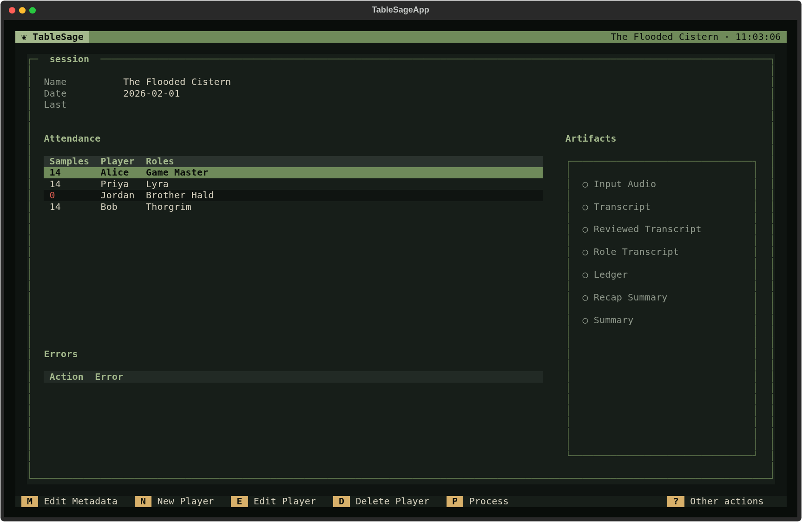
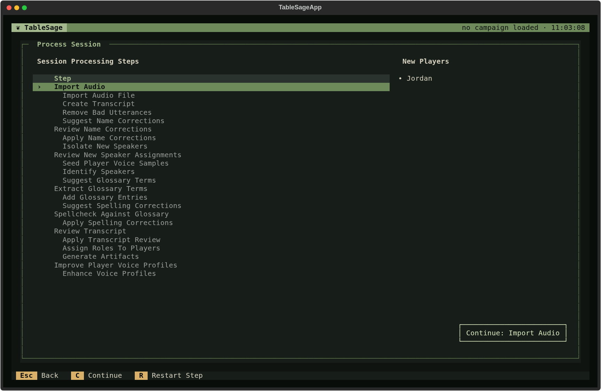

# Session Processing

**Session processing** turns the recording of one Session into a reviewed,
speaker-attributed transcript and the artifacts built from it: the ledger,
the recap summary, and the player-ready session summary. It is a fixed
sequence of steps. TableSage runs some of them automatically; at others it
stops and asks you to check its work before anything is built on top of it.

Open processing from Session Detail by pressing **P**. The **Process
Session** screen lists the steps in order, marks each one with a check once
its output is current, and shows the Session's **New Players** when it has
any. Opening the screen never starts processing; press **C** (Continue) to
start or resume it.

## Before you process

Processing works from the Session's attendance, so set it up first on Session
Detail:

- **Attendees.** Add every Player who was at the table. A Session with no
  attendees can't be processed.
- **Roles.** Give each attendee their Role for this Session—a character
  name, **Game Master**, or another table function. Processing replaces
  player names with these Roles before it generates artifacts.

Processing also calls outside services, so you need an ElevenLabs key for
transcription and keys for the providers of your High, Medium, and Low
models. See [Update your settings](../guides/settings.md).

## Two workflows

TableSage recognizes speakers by comparing their voices with each attendee's
**voice profile**: the voice print built from that Player's voice samples (see
[Players, Voice Samples, Voice Prints, and Roles](players.md)). Everything else
in processing depends on knowing who said what, so the workflow depends on
whether every attendee already has a voice profile.

A **new player** is an attendee without a usable voice profile—usually
someone attending their first Session who has no voice samples yet. Session
Detail's **Samples** column shows how many samples each attendee has; a
new player's count is shown in red as **0**.

You never choose a workflow. Process Session looks at the attendees and
follows the right one:

- **[Processing with returning players](session-processing-returning-players.md)**
  applies when every attendee already has a voice profile. The **New Players**
  panel is hidden, and the steps that serve new players do not appear in the
  list. They still run behind the scenes without asking anything of you, so
  you move straight from the transcript to speaker identification.
- **[Processing with new players](session-processing-new-players.md)**
  applies when at least one attendee is a new player. Those players are
  listed in the **New Players** panel, and the steps that returning players
  never see appear and run for real. Together they find lines each new
  player spoke in this recording, let you confirm them, and turn them into
  that player's first voice samples—so that speaker identification can
  recognize them along with everyone else.

The simpler workflow is the foundation of the more complex one. Every step
in the returning-player workflow also runs, and means the same thing, when
there are new players.

## The steps at a glance

Process Session draws every step as a row. Steps that ask something of you
are shown in bold; steps TableSage performs on its own are indented and
dimmed. Each review is bracketed by automatic rows that prepare its
suggestions (*Suggest …*) and apply your decisions (*Apply …*), so the screen
shows more rows than the table below, which lists the steps that matter.

| Step | You or TableSage | Returning players | New players |
|---|---|---|---|
| Import Audio | You choose the recording | Yes | Yes |
| Create Transcript | Automatic | Yes | Yes |
| Remove Bad Utterances | Automatic | Yes | Yes |
| Review Name Corrections | You review | Hidden | Yes |
| Isolate New Speakers | Automatic | Hidden | Yes |
| Review New Speaker Assignments | You review | Hidden | Yes |
| Seed Player Voice Samples | Automatic | Hidden | Yes |
| Identify Speakers | Automatic | Yes | Yes |
| Extract Glossary Terms | You review | Yes | Yes |
| Spellcheck Against Glossary | You review | Yes | Yes |
| Review Transcript | You review | Yes | Yes |
| Assign Roles To Players | Automatic | Yes | Yes |
| Rebuild Prior Sessions | You approve, only when needed | Sometimes | Sometimes |
| Generate Artifacts | Automatic | Yes | Yes |
| Improve Player Voice Profiles | You choose | Yes | Yes |

## How a run behaves

The same rules apply in both workflows:

- **One guided run.** Press **C** to continue from the first unfinished step.
  The button names it, for example *Continue: Import Audio*. From then on,
  finishing a step continues to the next one. Automatic steps run behind a
  progress dialog, and each review screen opens when processing reaches it.
- **Reviews only when there is something to review.** If a review step has
  nothing to propose—no misspellings or new glossary terms, for
  example—it completes on its own, its row notes *Nothing to review*, and
  processing moves on.
- **You can stop and resume.** Cancel a review screen, or leave Process
  Session with **Esc**, and your finished steps stay finished. Later, open
  Process Session again and press **C** to continue from where you stopped.
- **Order matters.** Each step works from the output of the step before it.
  If you redo an earlier step—select its row and press **Enter** or **R**—or
  something it depends on changes, such as importing different audio or
  changing the corrections you accepted, every later step's output becomes
  out of date and loses its check, and you work forward from there again.
- **Some changes are not detected.** TableSage tracks the output of each step,
  not the attendance or voice profiles it read. If you add an attendee, change
  a Role, or improve a voice profile after a step has run, nothing is marked
  out of date. To apply the change, select the affected row—**Identify
  Speakers** for attendance and voice profiles, **Assign Roles To Players** for
  Roles—and restart it with **Enter** or **R**. Later steps then become out of
  date, so expect to review again. Setting up attendees and Roles before you
  start avoids this.
- **Errors stop the run.** If a key a step needs is missing, TableSage
  offers to open Settings before the step starts. If a step fails while
  running, its row shows a red **!** with the message and processing stops at
  that step. Fix the cause and press **C** to try again. A Session with no
  attendees can't be processed at all; the Continue button says so instead of
  starting.

When every step is checked, the button reads *All steps complete* and the
Session's artifacts are ready on Session Detail. See
[Sessions, Processing, and Session Artifacts](sessions.md) for what each
artifact is.
