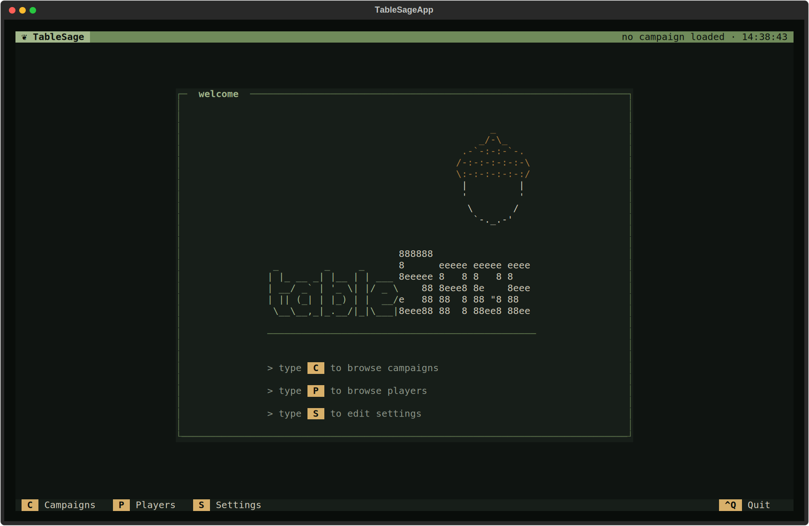

# Install TableSage

TableSage is a terminal application for game masters who want to turn session
recordings into transcripts, recaps, and reusable campaign material. It runs in
a workspace directory that you choose; multiple campaigns can live in one
workspace just fine.

This page installs TableSage and gets you to a working first launch.

## Before you begin

You need:

- A computer with a terminal and an internet connection.
- Several gigabytes of free disk space.
- An [ElevenLabs](https://elevenlabs.io/) API key, for transcription and
  speaker diarization.
- An API key for at least one language-model provider. TableSage supports
  OpenAI, Anthropic, and Google Gemini, and nothing else. The default model
  choices use OpenAI and Anthropic, so most first-time users want a key for
  each.

You will install three things along the way: **uv**, which manages Python and
installs TableSage; **Python** itself, which uv can provide for you; and
**FFmpeg**, which TableSage uses to read and play audio.

## Choose a terminal

This application runs as a textual terminal application (TUI).  To run tablesage
you will need an installed terminal.  The system terminal (or cmd on Windows)
will work fine, as will modern replacements like [Warp](https://www.warp.dev/),
[Ptyxis](https://apps.gnome.org/Ptyxis/), or
[Windows Terminal](https://apps.microsoft.com/detail/9n0dx20hk701).


## Install uv

[uv](https://docs.astral.sh/uv/) is the tool that installs and runs TableSage.
It also downloads and manages the Python version TableSage needs, so you do not
have to install Python separately first.

On macOS or Linux:

```sh
curl -LsSf https://astral.sh/uv/install.sh | sh
```

On Windows, in PowerShell:

```powershell
powershell -ExecutionPolicy ByPass -c "irm https://astral.sh/uv/install.ps1 | iex"
```

Restart your terminal afterward, then confirm uv is available:

```sh
uv --version
```

If the installer offers to add uv to your `PATH`, accept. If `uv --version`
still fails after restarting the terminal, follow the `PATH` instructions the
installer printed.

## Install Python

TableSage requires Python 3.12 or newer. You do not need to download Python
from python.org or install it through a package manager: uv provides its own
Python builds and will fetch a suitable one automatically when you install
TableSage in the next step.

To fetch it ahead of time so the TableSage install itself is quicker, run:

```sh
uv python install 3.14
```

If you already have a system Python 3.12 or newer, uv will find and use it.
Either way, this Python is used only by TableSage and does not change the
`python` command in your shell.

## Install FFmpeg

TableSage checks for `ffmpeg` and `ffplay` before it opens and exits with an
error if either is missing. Install an FFmpeg distribution that provides both
commands, then restart your terminal.

```sh
# Ubuntu or Debian
sudo apt install ffmpeg

# macOS with Homebrew
brew install ffmpeg
```

On Windows, install an FFmpeg build and add its `bin` directory to your `PATH`.
See the [FFmpeg download page](https://ffmpeg.org/download.html) for
platform-specific options.

Confirm that both commands are available from your terminal:

```sh
ffmpeg -version
ffplay -version
```

Both must work. A build that ships `ffmpeg` without `ffplay` will not satisfy
TableSage's startup check.

## Install TableSage

TableSage is currently installed directly from its GitHub repository:

```sh
uv tool install git+https://github.com/erik-saltwell/tablesage.git
```

This is the step downloads large dependencies for machine-learning,
so give it time. It installs two equivalent commands, `tablesage` and `tablesage-rpg`;
either one starts the app. If uv asks to add its tools directory to your
`PATH`, accept that change and restart your terminal before continuing.

To update later, run:

```sh
uv tool install --upgrade git+https://github.com/erik-saltwell/tablesage.git
```

## Create and open a workspace

Choose or create a directory for your TableSage data, then start the app from
inside it.

```sh
mkdir -p ~/Documents/tablesage
cd ~/Documents/tablesage
tablesage-rpg
```

On Windows, in PowerShell:

```powershell
mkdir $HOME\Documents\tablesage
cd $HOME\Documents\tablesage
tablesage-rpg
```

Or in `cmd.exe`:

```bat
mkdir "%USERPROFILE%\Documents\tablesage"
cd /d "%USERPROFILE%\Documents\tablesage"
tablesage-rpg
```

TableSage always uses the directory you launch it from, so start it from this
workspace every time.

On the first launch, TableSage creates a `.tablesage/` folder in the workspace
and opens the welcome screen with a warning: *Configure and save your settings
before progressing. Press S to open Settings.* Until you save settings, the
**Campaigns** and **Players** options on the welcome screen are disabled. This
is expected — configure settings first.



## Configure your API keys and models

Press **S** to open Settings.

Enter your API keys and choose your language models. For the default model
choices, you need:

- an **ElevenLabs** key, for transcription and speaker diarization;
- an **OpenAI** key, for the most demanding generation steps; and
- an **Anthropic** key, for the standard and lightweight steps.

If you select different models, add a key for each provider those choices use.
Model IDs must take the form `provider/model-name`, where the provider is
`anthropic`, `openai`, or `gemini`.

Settings asks for three models — High, Medium, and Low — so you can put a
stronger model where quality matters most and a cheaper, faster one where the
task is simple:

| Model | Default | Used for |
|---|---|---|
| **High** | `openai/gpt-6-astra` | Writing a session's outputs from its transcript and creating campaign-wide material |
| **Medium** | `anthropic/claude-sonnet-4-5` | Helping you review transcripts, build glossaries, and identify players |
| **Low** | `anthropic/claude-haiku-4-5` | Short, high-volume checks while audio is imported |

See [update your settings](../guides/settings.md) for what each model tier is
used for, how keys are found and shared across workspaces, and how a shell
environment variable can override a stored key.


Press **Ctrl+S** to save.  Saving validates
your model IDs, writes your settings, tests each configured model
and downloads local audio-processing models
if they aren't already installed — this may take a while.

## If TableSage does not start

- **`ffmpeg` or `ffplay` is missing.** Install an FFmpeg build with both
  commands, restart your terminal, and re-run the two verification commands
  above.
- **`tablesage-rpg: command not found`.** Restart your terminal so uv's `PATH`
  change takes effect, or follow the instructions `uv tool install` printed.
- **Settings will not save.** Check your model IDs. Each must use the
  `provider/model-name` form with `anthropic`, `openai`, or `gemini` as the
  provider. Expand the collapsed sections to see which field is flagged.
- **A connection test fails but the key looks right.** Check whether the key is
  coming from your shell environment rather than from TableSage — see
  [how shell environment variables override
  keys](../guides/settings.md#how-shell-environment-variables-override-keys).
- **"This workspace uses a newer settings schema."** The workspace was written
  by a newer version of TableSage than the one you have installed. Open it with
  that newer version.

A guided walkthrough of your first recorded session is forthcoming. In the
meantime, [Concepts](../concepts/index.md) explains how TableSage recognizes
players' voices, what actually happens when it processes a session, and what
each generated document is.
