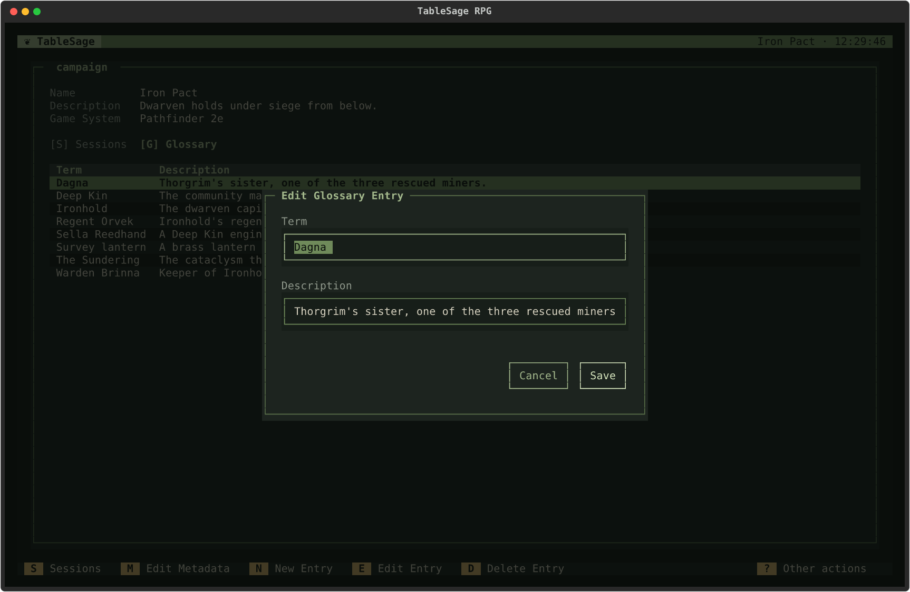

# Build and Maintain Your Campaign Glossary

Keep a shared spelling reference for the Campaign's people, places, factions, objects, and unusual terms. The Glossary helps TableSage propose transcript corrections and use consistent names in generated outputs.

You need a Campaign. From the Welcome screen, press **C**, open the Campaign, and press **G** to select its **Glossary** tab. Each Campaign has its own Glossary.

## Add Names Before Processing

1. Press **N** (**New Entry**).
2. Enter the correct **Term** and, optionally, a short **Description** that distinguishes it.
3. Save with **Enter**. Repeat for the names you expect in the recording.

For example, add *Tidewarden Coil* with the description “Harbor official who holds the party's travel permit.” Put the canonical spelling in Term; use Description for context. You can start with just a few important names and let the Glossary grow through processing.

## Accept Discoveries from a Session

During processing, **Extract Glossary Terms** proposes new entries from the recording. Before choosing **Continue**:

- Correct spellings and descriptions with **E** or **Enter**.
- Remove inaccurate or unwanted entries with **D**.
- Add a missing term with **N**.
- Use **F** (**Find/Replace**) if several proposals share the same misspelling.

The remaining entries are added to the Glossary; existing terms are skipped. The following **Spellcheck Against Glossary** review uses the expanded vocabulary immediately. Check its proposed replacements, including their occurrence counts, rather than assuming every suggestion is right.

For instance, establish *Tidewarden Coil* here, then keep a proposed correction from *Tide Warden Coil* in the spellcheck. Corrections you approve are suggested again in later Sessions, so repeated mishearings become easier to handle.

## Correct an Existing Entry

On the Campaign's Glossary tab, select a term and press **E** to change its spelling or description. Press **D** to delete an entry you no longer want, then confirm.

Changing the Glossary does not itself rewrite reviewed speech or refresh saved spelling suggestions. To apply a corrected name to an already processed Session, open it, press **P**, highlight **Review Transcript**, and press **R**. Use **Find/Replace** (**F**) to correct repeated names, or **Edit Utterance** for one line, then **Confirm** and finish the affected processing steps. See [Correct a Processed Session](correct-processed-session.md).

Restarting **Spellcheck Against Glossary** reopens saved corrections; it does not ask the LLM for new suggestions based on the edited Glossary. You can edit or add corrections if that review opens. If there are no saved suggestions or decisions, it completes automatically; use **Review Transcript** instead.

If you want fresh term proposals from a Session, open **Other actions** (**?**) on Session Detail and choose **Extract Glossary** (**L**). This restarts glossary suggestions and review, followed by the dependent processing steps.

## Reuse a Glossary

On Campaign Detail, press **?** to open **Other actions**:

1. Choose **Export Glossary** (**X**) and save the JSON file, normally `glossary.json`.
2. Open the destination Campaign in the workspace where you want to reuse it.
3. Choose **Import Glossary** (**I**) and select that file.
4. Check the notification for how many entries were added and how many duplicates were skipped, then review the Glossary tab.

Import adds entries and skips terms that already exist; it does not overwrite existing descriptions. Edit an existing entry directly if its content needs changing. Use a file created by Export Glossary when moving vocabulary between Campaigns.

You are done when the Glossary contains the correct names and context you want processing to use. For affected Sessions, complete the spelling/transcript reviews and [refresh their outputs](review-and-export.md) before exporting new copies.
