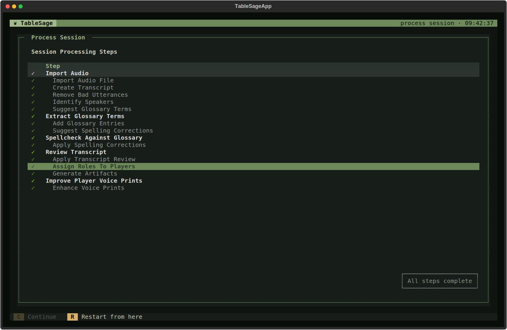

# Correct a Processed Session

Restart any completed manual or automatic step in Process Session. Reviews reopen; automatic steps run again. TableSage continues through affected work, opening required reviews and refreshing dependent outputs. Unchanged results can leave later work current.

After changing an attendee's Roles in **Attendance**, select **Assign Roles To Players**, then choose **Restart from here** to apply the change and refresh affected outputs.

## Make a Correction

1. Make any outside changes listed below, such as editing **Attendance** on Session Detail or the campaign Glossary on Campaign Detail.
2. On Session Detail, press **P** (**Process**). Click the appropriate step to highlight it, then choose **Restart from here** (**R**). Arrow keys move between manual steps only.
3. Correct and confirm any reviews that open. Follow processing through completion; use **Continue** (**C**) to resume after a pause or failure.

Restart at the latest step that can apply your correction. **Restarting before Review Transcript discards its saved edits and drafts**, so you must review the transcript again.

## Choose Where to Restart

| Change | Before Restarting | Restart From |
|---|---|---|
| Incorrect character Role | Edit Roles in **Attendance**. | **Assign Roles To Players** |
| Incorrect words, speaker, or unwanted speech | None; correct these in the review. | **Review Transcript** |
| Repeated misheard term | Check the campaign Glossary. | **Review Transcript**, then **Find/Replace** |
| Fresh spelling suggestions after a Glossary change | Update the campaign Glossary. | **Suggest Spelling Corrections** |
| Different attendees | Edit **Attendance**. | **Create Transcript**, using the revised attendee count |
| Better voice recognition | [Improve Player Voice Recognition](manage-players-and-voice-samples.md). | **Identify Speakers** |
| Accepted name corrections for a new Player | None; correct these in the review. | **Review Name Corrections**, when present |
| Accepted glossary proposals | None; edit the proposals in the review. | **Extract Glossary Terms** |
| Fresh glossary proposals | None. | **Suggest Glossary Terms** |
| Another attempt at generated outputs | None; keep the reviewed transcript. | **Generate Artifacts** |

Reviews may reopen earlier decisions; check them against the updated source. For just one output, use [Regenerate Artifact](review-and-export.md#regenerate-an-artifact).

## Check and Use the Corrected Outputs

Verify that the outputs you need are current (**●**) on Session Detail. If you corrected an earlier Session, [regenerate the Campaign's outputs](review-and-export.md#regenerate-every-session-in-a-campaign). [Export updated copies](review-and-export.md#export-an-artifact); earlier exports do not change.

## Start the Session Over

To discard all processing, use [**Clean Session**](../reference/screens/session-detail.md#other-actions), then process again. It permanently deletes all session artifacts, including imported audio, so keep the original recording and export anything you want to retain first.
