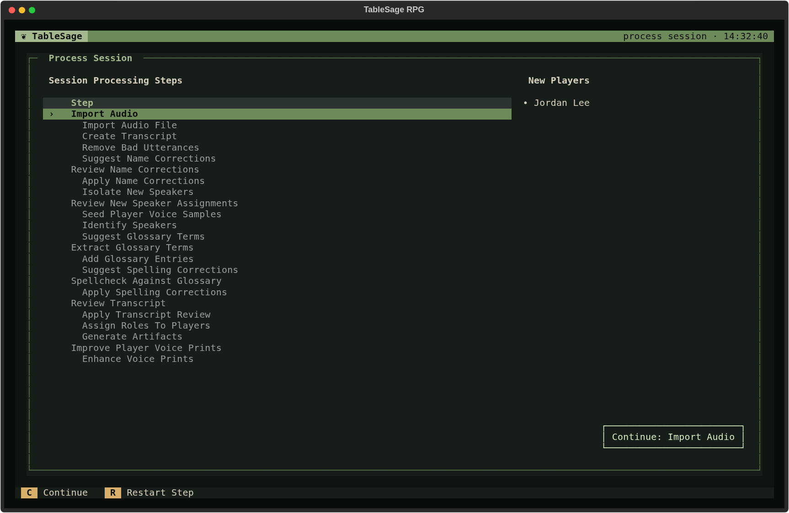
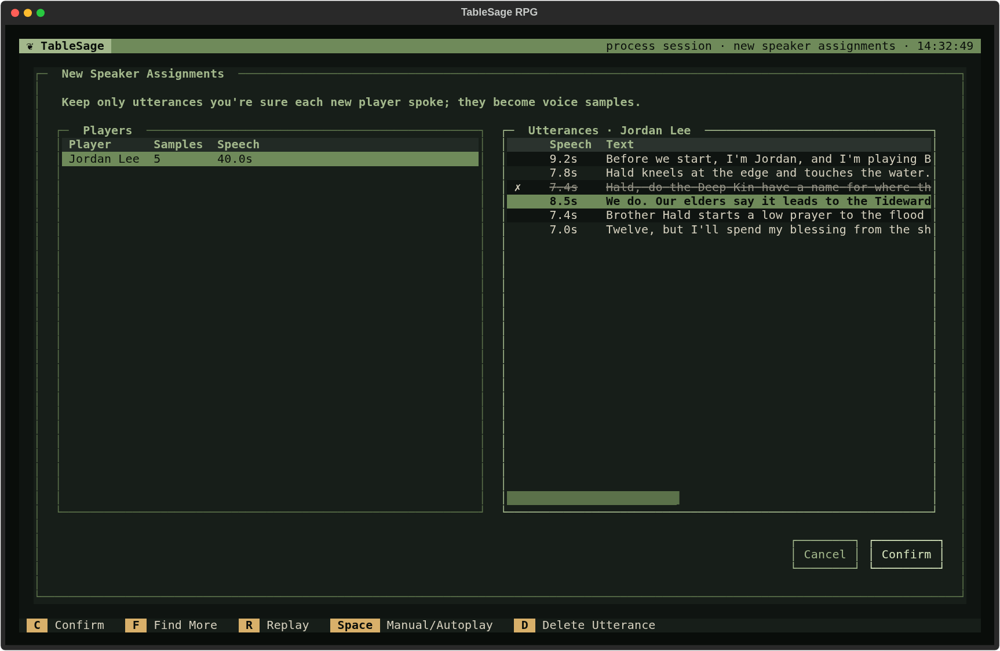
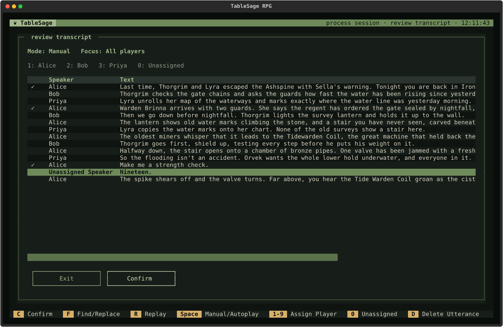

# Process a Session with New Players

Use this guide when at least one attendee has no usable voice print. This can be your first recording or a later Session with a new person joining the table. TableSage learns their voice from lines in this recording that you confirm, then uses it alongside the other attendees' voice prints.

You need the session recording, configured [keys and models](settings.md), and a Session with correct attendance and Roles. If you have not created those yet, follow [Start a Campaign](start-a-campaign.md). For an existing Campaign, create a Session on its Sessions tab, check any inherited attendees, and add the new person with **N** on Session Detail.

## Start Processing and Import Audio

1. On Session Detail, check that everyone who spoke is in **Attendance**, including the GM, and that their Roles are correct.
2. Press **P** (**Process**). The **New Players** panel names the attendees whose voices need to be learned.

   

3. Press **C** (**Continue**) and choose the recording. Supported formats are `.wav`, `.mp3`, `.m4a`, `.flac`, and `.ogg`.
4. For a `.wav`, answer **Clean Audio?**: choose **Yes** for a raw recording or **No** if it has already been cleaned. Other supported formats are cleaned automatically.

TableSage imports the recording, creates a transcript, and filters likely listener acknowledgments. Progress dialogs cover this automatic work. The run then opens each review in order; confirm a review to continue. A review with nothing to check may be skipped automatically.

## Check Player and Character Names

In **Review Name Corrections**, check each proposed **From** → **To** replacement. For example, keep a correction from *Brother Held* to *Brother Hald* if that is the character's name.

- Press **E** or **Enter** to fix a proposed replacement.
- Press **D** to delete an incorrect proposal.
- Press **N** to add a missing correction.
- Choose **Continue** when the remaining corrections are right.

The replacements apply across the transcript. Correct names help TableSage interpret introductions and conversations when it looks for each new person's speech.

## Confirm the New Players' Voices

**Review New Speaker Assignments** proposes lines for each new Player. The lines you keep will become voice samples, so listen to them and keep only speech you are sure belongs to that person.

1. Select a Player in the **Players** pane, then press **→** or **Enter** to enter their **Utterances**.
2. Move through the lines to hear their clips.
3. Press **D** to mark a wrong or uncertain line for removal. Press **D** again on that line to restore it.
4. If there is too little speech, keep at least one certain line and press **F** (**Find More**). Listen to the additions, marked **+**, and remove any that belong to someone else.
5. Press **←** to return to Players and repeat for each new person. Choose **Confirm** when you have checked the candidates.

A character name mentioned in a line is not enough to identify its speaker. If Priya says “Hald, what do you think?”, that is Priya's voice, even though Hald is Jordan's character. A few certain clips are more useful than a collection containing mixed voices. If little usable speech remains, do not keep incorrect samples to increase the count; speaker assignments will need particular attention in transcript review.

TableSage seeds voice samples from the confirmed lines and then identifies speakers in the rest of the recording. Uncertain matches remain unassigned.

For playback and pane controls, see [Review New Speaker Assignments](../reference/screens/processing-review-screens.md#review-new-speaker-assignments).

## Check New Terms and Spelling

1. In **Extract Glossary Terms**, establish the correct spellings of new names. Use **E** to edit, **D** to remove a proposal, or **N** to add a term. **Continue** adds the remaining entries to the Glossary.
2. In **Spellcheck Against Glossary**, check each replacement and its **Occurrences** count. Edit with **E** or toggle an incorrect replacement off with **D**, then choose **Continue**.

Either review may complete automatically if there is nothing to check. For all controls, see [Extract Glossary Terms](../reference/screens/processing-review-screens.md#extract-glossary-terms) and [Spellcheck Against Glossary](../reference/screens/processing-review-screens.md#spellcheck-against-glossary). See [Build and Maintain Your Campaign Glossary](build-campaign-glossary.md) for vocabulary guidance and corrections reused across Sessions.

## Review Speech and Speakers

**Review Transcript** is your final check of what was said and who said it. Give new Players' lines and unassigned speech particular attention.

1. Move through the lines to listen and compare them with the text.
2. Correct speakers with the legend's number keys. After moving to a line, press **Enter** for **Edit Utterance** to fix text or choose any attendee. Use **D** to mark unwanted speech for removal.
3. Choose **Confirm** when the transcript is ready.

See [Review Transcript](../reference/screens/processing-review-screens.md#review-transcript) for playback, editing, and **Find/Replace** controls.

## Generate Outputs and Improve Recognition

After confirmation, TableSage applies your review, assigns character Roles, and generates the Session's artifacts. If **Prior Sessions Are Out of Date** appears, choose **Regenerate Prior** to rebuild the required earlier outputs before this Session's outputs are generated.

At **Improve Player Voice Prints**, choose **Add Samples** if you have carefully checked speaker assignments. This learns clips from the reviewed Session, replaces attendees' earlier clips from it (including initial seed clips), and recomputes their voice prints. Choose **Not Now** to keep their existing samples; you can [learn from the Session later](manage-players-and-voice-samples.md#add-samples-from-a-session).

Processing is finished when Process Session says **All steps complete**. Press **Esc** to return to Session Detail and check its artifact indicators. You can now [export a summary or other outputs](review-and-export.md), or [prepare for the next Session](prepare-the-next-session.md).

## Pause or Recover

If you need to stop during a review, use **Esc** and save a draft when offered. Later, reopen Process Session and press **C** to continue. A saved draft does not complete the review.

If a step fails, its row shows the cause. Fix it, then press **Continue** to retry. To change a review you already completed, select it and press **R** (**Restart Step**); see [Correct a Processed Session](correct-processed-session.md). For every review control, see [Processing Review Screens](../reference/screens/processing-review-screens.md).
