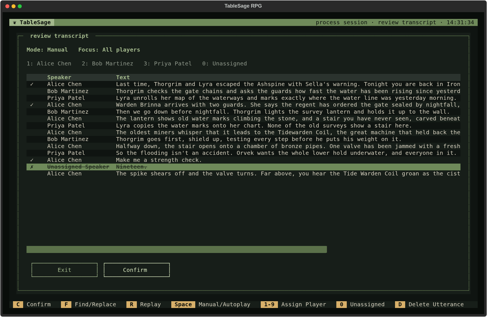

# Process a Session with Returning Players

Use this guide when every attendee already has a usable voice print. This is the usual workflow for later Sessions, but it also applies to a new Campaign whose Players are already known in the workspace. If anyone's voice still needs to be learned, use [Process a Session with New Players](process-session-new-players.md).

You need the recording and configured [keys and models](settings.md). This walkthrough takes you from the next Session's setup to generated outputs.

## Create the Session and Check Attendance

1. From the Welcome screen, press **C**, open your Campaign, and select its **Sessions** tab.
2. Press **N** (**New Session**), enter its name and optional date (`YYYY-MM-DD`), and choose **Create Session**.
3. On Session Detail, check the **Attendance** list. TableSage copies attendance and Roles from the latest dated Session before the new Session's date. If the new Session is undated, it uses the latest dated Session; if no eligible Session exists, attendance starts empty.
4. Remove anyone who was absent with **D**, add anyone missing with **N**, and edit changed character Roles with **E**. Include the GM and everyone else who spoke in the recording.

The same date rule chooses the prior recap in the session summary; see [How the Prior Recap Is Chosen](../concepts/sessions.md#how-the-prior-recap-is-chosen).

For example, if Jordan played Brother Hald last time but switched characters, edit Jordan's Role for this Session. The person's voice remains the same; the Role tells generated outputs which character they played this time.

## Import the Recording

1. Press **P** (**Process**), then **C** (**Continue**).
2. Choose the recording (`.wav`, `.mp3`, `.m4a`, `.flac`, or `.ogg`).
3. For a `.wav`, choose **Yes** at **Clean Audio?** for raw audio or **No** for audio that has already been cleaned. Other supported formats are cleaned automatically.

TableSage imports and transcribes the recording, filters likely listener acknowledgments, and matches voices to the attendees. Because everyone has a voice print, the new-player reviews are hidden. Uncertain matches are left for transcript review.

## Check New Terms and Spelling

1. In **Extract Glossary Terms**, establish the correct spellings of new names. Use **E** to edit, **D** to remove a proposal, or **N** to add a term. **Continue** adds the remaining entries to the Glossary.
2. In **Spellcheck Against Glossary**, check each replacement and its **Occurrences** count. Edit with **E** or toggle an incorrect replacement off with **D**, then choose **Continue**.

Either review may complete automatically if there is nothing to check. For all controls, see [Extract Glossary Terms](../reference/screens/processing-review-screens.md#extract-glossary-terms) and [Spellcheck Against Glossary](../reference/screens/processing-review-screens.md#spellcheck-against-glossary). See [Build and Maintain Your Campaign Glossary](build-campaign-glossary.md) for vocabulary guidance and corrections reused across Sessions.

## Review Speech and Speakers

**Review Transcript** is your final check of what was said and who said it. Check uncertain assignments and any lines whose wording could change the account of what happened. Known voices still need review: a confident match can be wrong.

1. Move through the lines to listen and compare them with the text.
2. Correct speakers with the legend's number keys. After moving to a line, press **Enter** for **Edit Utterance** to fix text or choose any attendee. Use **D** to mark unwanted speech for removal.
3. Choose **Confirm** when the transcript is ready.

See [Review Transcript](../reference/screens/processing-review-screens.md#review-transcript) for playback, editing, and **Find/Replace** controls.

If you need to pause, press **Esc** and choose **Save** when offered to retain your edits as a draft. Reopen Process Session and press **C** to resume later; the review remains incomplete until you confirm it.

## Finish Generation

TableSage applies your review, replaces player names with their Roles, and generates the Session's outputs. If earlier outputs must be rebuilt first, **Prior Sessions Are Out of Date** asks for approval; choose **Regenerate Prior** to proceed.

At **Improve Player Voice Prints**, choose **Add Samples** to learn from this carefully reviewed recording, replacing any earlier clips from this Session, or **Not Now** to keep existing samples. You can [learn from the Session later](manage-players-and-voice-samples.md#add-samples-from-a-session).

When Process Session says **All steps complete**, return to Session Detail with **Esc**. The generated outputs should have current **●** indicators. Next, [Generate and Export Session Outputs](review-and-export.md) for your players, or [prepare for the next Session](prepare-the-next-session.md).

If a step fails, fix the cause shown on its row and press **Continue** to retry. To revisit a completed review, select it and press **R**; [Correct a Processed Session](correct-processed-session.md) helps you choose the right place to restart. The [Processing Review Screens](../reference/screens/processing-review-screens.md) lists every review control.
