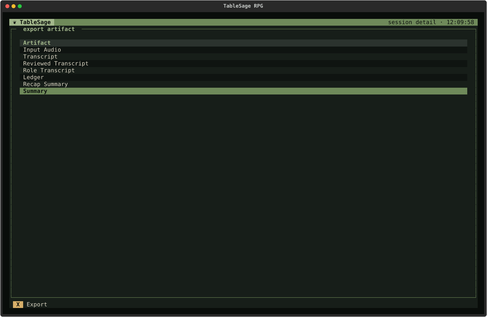

# Generate and Export Session Outputs

Produce the documents you want to share with players or keep for reference, then export copies to a location you choose. Initial generation happens at the end of processing; you can return later to rebuild an output or refresh the Campaign.

You need a Session with a current, completed transcript review. If you have not reached that point, follow [Process a Session with New Players](process-session-new-players.md) or [Process a Session with Returning Players](process-session-returning-players.md). Open the Session from your Campaign's **Sessions** tab.

## Choose What You Need

| Your task | Output to use |
|---|---|
| Send players an account of the latest Session | **Summary**, the player-ready session summary. |
| Read a short recap of that Session at the table | **Recap Summary**. |
| Look up what happened and which facts were established | **Ledger**, exported as readable Markdown or structured JSON. |
| Check the accepted words and real-world speakers | **Reviewed Transcript**. |
| Read the transcript with character names and table Roles | **Role Transcript**. |
| Build a recap selected from across campaign history | [Create Previously On](prepare-the-next-session.md#create-previously-on). |

For example, export **Summary** to send after play, then use **Recap Summary** for a brief reminder next time. Previously On is a separate preparation tool: you select scenes from campaign history according to what matters for the upcoming Session.

Transcript Sections, Scene Breakdown, and Player Introductions support generation behind the scenes; they are not separate choices on the Export screen. See [Session Artifacts](../concepts/sessions.md#session-artifacts) for the exposed records.

## Generate the First Outputs

On Session Detail, press **P** (**Process**) and **C** (**Continue**) to complete any remaining reviews. Confirming **Review Transcript** lets TableSage assign Roles and run **Generate Artifacts** automatically. If it asks to rebuild earlier Sessions first, choose **Regenerate Prior** to proceed.

Answer the optional **Improve Player Voice Prints** prompt, then return to Session Detail with **Esc**. Check that the outputs you intend to use are current before exporting.

## Read the Artifacts Panel

The **Artifacts** panel on Session Detail lists the user-facing [artifacts](../concepts/sessions.md#session-artifacts) and marks each one:

| Mark | Meaning |
|---|---|
| ● | Current: it exists and no processing changes have been detected. |
| ◐ | Out of date: it exists, but something it depends on has changed since. |
| ○ | Missing: it hasn't been produced yet. |

An out-of-date artifact is still on disk and can still be exported. Reprocessing or regenerating brings it up to date; see [Regenerate an Artifact](#regenerate-an-artifact) below.

The marks track some kinds of change but not others:

- **Can mark an output out of date (◐):** changes to its source material, review decisions, or generation prompts.
- **Can leave an output marked current (●):** changes to attendance, Roles, Session dates, Glossary entries, or model choices.

To refresh outputs after a change the marks don't track, first fix any transcript or attendance errors using [Correct a Processed Session](correct-processed-session.md), then use **Regenerate Artifact**. For date changes, see [How the Prior Recap Is Chosen](../concepts/sessions.md#how-the-prior-recap-is-chosen).

## Regenerate an Artifact

Use this when you want TableSage to write an output again and the reviewed transcript is already correct and current. For example, regenerate **Summary** if you want another generation attempt based on the same accepted record.

1. On Session Detail, press **?** to open **Other actions**, then choose **Regenerate Artifact** (**R**).
2. Choose what to rebuild: **Role Transcript**, **Transcript Sections**, **Ledger + Scene Breakdown**, **Player Introductions**, **Recap Summary**, or **Summary**.
3. Confirm. TableSage rebuilds the artifact you chose and updates the outputs that depend on it.

Regenerate Artifact is available only when the Session has a current reviewed transcript, because every generated output is built from it. It runs as a normal processing run, so it can't overlap another one; if processing is already running, TableSage tells you to wait.

If the change you made was to a *review*, such as a name correction or a transcript edit, open Process Session, highlight the completed review step, and press **R** (**Restart Step**). TableSage reopens that review and rebuilds affected work when the accepted content changes. Confirming the same decision leaves later work current. See [Process Session](../reference/screens/process-session.md#keys).

## Export an Artifact

**Export** copies an artifact out of the Session so you can use it elsewhere. It never moves or changes the original.

1. Press **X** (**Export**) in the main footer. It is available once at least one artifact exists.
2. Choose an artifact and press **X** (or **Enter**).
3. Choose where to save it.

You can stay on the Export screen and export several artifacts in a row. Two details to know:

- If the artifact is out of date, TableSage warns you and asks whether to export it anyway.
- The **Ledger** can be exported as **JSON** (the structured record) or **Markdown** (a readable version). You are asked which you want.

## Regenerate Every Session in a Campaign

Use **Regenerate All Outputs** to refresh the whole Campaign's outputs after upgrading TableSage (updated prompts mark existing outputs out of date), and before building [Previously On or Opportunities](prepare-the-next-session.md), which need every Session's scene breakdown to be current.

On Campaign Detail, **Regenerate All Outputs** (**O** under **Other actions**) checks every Session in the Campaign that has imported audio and rebuilds whatever is missing or out of date, in Session number order. A progress dialog shows which Session and which output it is working on.

Sessions whose transcript review isn't complete and current are skipped, and the message shown when it finishes says how many. If no imported-audio Session has a current completed review, nothing is generated. Process any skipped Sessions separately, then run the action again.

## Check the Exported Copy

After the export notification appears, open the file from the location you chose and check that it is the version you want to use. Read a summary before sharing it, especially names, commitments, and other details your players will rely on.

Regeneration updates TableSage's managed outputs. It does not update files you already exported, so export a new copy after any correction or rebuild. To fix the underlying record, use [Correct a Processed Session](correct-processed-session.md).

## If Something Fails

If **Regenerate Artifact** or **Extract Glossary** fails, TableSage shows an error notification and records the failure beside the affected step on [Process Session](../reference/screens/process-session.md#what-the-screen-shows). Open that screen to inspect the failure, fix its cause, and press **Continue** to retry. Export and campaign-wide regeneration failures appear in notifications.

Related tasks: to discard processing and import the recording again, see [Start the Session Over](correct-processed-session.md#start-the-session-over). For fresh vocabulary proposals from a Session, use Session Detail's **Extract Glossary**; see [Get Fresh Term Proposals from a Session](build-campaign-glossary.md#get-fresh-term-proposals-from-a-session).
