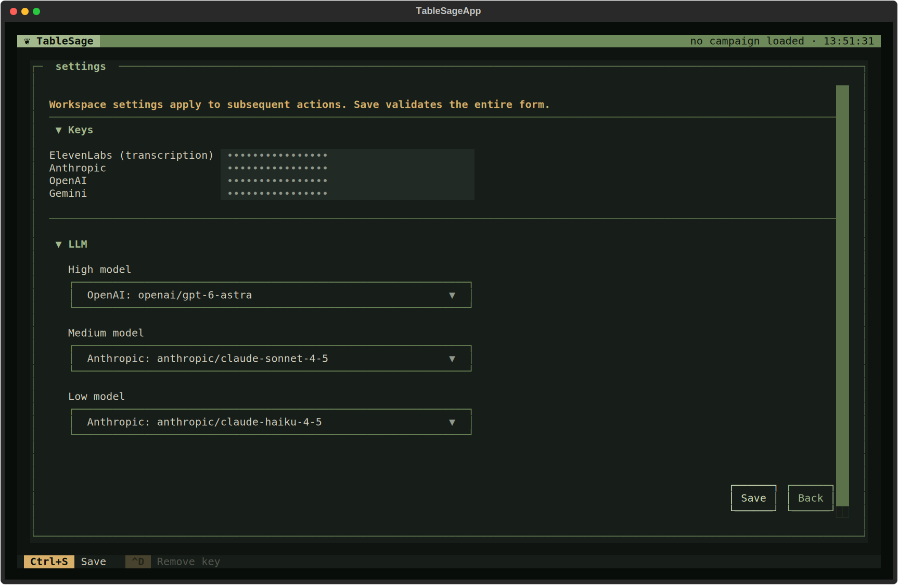
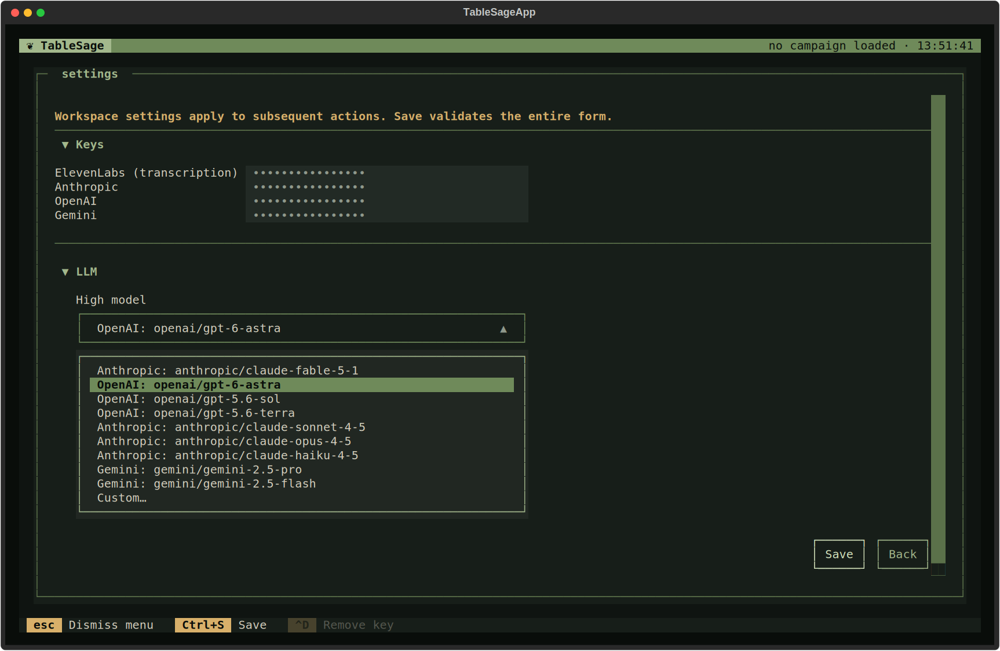

# Update your settings

Settings hold your service API keys and your three language-model choices.
This page covers what each field does, how keys are found and stored, how
shell environment variables interact with them, and what happens when you
save. See [installation](../getting-started/installation.md) for getting
here the first time, and [privacy and data handling](../reference/privacy.md)
for what TableSage sends to which service.

Open Settings from the welcome screen by pressing **S**, or from inside a
workspace through Other Actions (`?`).

## Keys

The **Keys** section has one row per service: **ElevenLabs**, **Anthropic**,
**OpenAI**, and **Gemini**. A row shows dots when a key is present, whether
you typed it or it came from your shell (see below). Click a row and type to
set or replace that key.

You only need keys for actively configured services, plus ElevenLabs:

- **ElevenLabs** is always required; it performs transcription and speaker
  diarization for every session you import.
- **Anthropic**, **OpenAI**, and **Gemini** are only required for the
  providers named in your High, Medium, and Low model IDs, described below.

Press **Ctrl+D** while a key field is focused to remove that key. Removal
takes effect on Save. A key supplied by your shell environment shows as
read-only — the field can't be typed into, and Ctrl+D does nothing for it —
because there is nothing stored to change or remove; the environment variable
stays active regardless.

### Where keys live

Keys are not part of the workspace. They are stored once per user account, in
a small file outside any workspace directory.

- Linux: `~/.config/tablesage/.env`
- macOS: `~/Library/Application Support/tablesage/.env`
- Windows: `%LOCALAPPDATA%\tablesage\.env`

This means you configure keys once, not once per campaign workspace. It also
means removing a workspace directory never deletes your keys, and a key
mistake affects every workspace until you fix it.

### How shell environment variables override keys

Before TableSage reads its stored keys, it checks your environment variables for
`ELEVENLABS_API_KEY`, `ANTHROPIC_API_KEY`, `OPENAI_API_KEY`, and
`GEMINI_API_KEY`. These environment variables take precedence, and will
override keys set at the locations above. In that case:

- The key field shows *Provided by shell environment
  (read-only)*.
- The field is not editable.
- Ctrl+D cannot remove it, since there is nothing stored to remove; the
  environment variable stays active until you change your shell.

This is useful for CI, shared machines, or keeping a key out of the on-disk
`.env` file entirely.

## Models: High, Medium, and Low

Settings asks for three model IDs, each handling a different weight of work.

| Model | Default | Used for |
|---|---|---|
| **High** | `openai/gpt-6-astra` | Generating summaries and processing raw transcripts  |
| **Medium** | `anthropic/claude-sonnet-4-5` | Helping you review transcripts, build glossaries, and identify players |
| **Low** | `anthropic/claude-haiku-4-5` | Short, high-volume checks while audio is imported |

Each field is a dropdown of bundled presets across Anthropic, OpenAI, and
Gemini, plus **Custom…** if you want a different model from one of those
three providers. A custom ID must take the form `provider/model-name`, where
`provider` is exactly `anthropic`, `openai`, or `gemini`.  Other providers
are not supported at this time.

### What each tier actually does

**High model.** Use your most capable model here. It does the long reading
and writing that produces what you keep from each session — see
[session artifacts](../concepts/session-artifacts.md) for what each generated
document actually is:

- **Regenerate Artifact** and **Regenerate All Outputs**:
  the model processes reviewed transcripts and generates summaries.
- **Create Previously On**: the model generates the recap.
- **Generate Opportunities**: the model generates opportunities.

These are the longest and most expensive calls TableSage makes.

**Medium model.** Handles moderate tasks where you check the result:

- **Process Session → Spellcheck Against Glossary**: The model proposes corrections based on the
  [Campaign glossary](../concepts/campaigns.md#glossary).
- **Extract Glossary**, the model proposes new glossary entries based on the transcript.
- **Process Session → Review Name Corrections**: when a Session has players without
  voice samples, the model proposes corrections for misheard player and
  character names, which you review before they are applied.

**Low model.** Handles operations where a fast, inexpensive model is enough.

- **Process Session → Remove Bad Utterances**: after transcribing, the model removes small
  backchannels and disfluencies like "yeah" and "ummm" — see
  [processing a Session](../concepts/sessions.md#processing-a-session) for
  where this fits in the larger pipeline.

## Saving

Press **Ctrl+S**, or the **Save** button, to save. Saving:

1. Validates every model ID and writes your settings and any key changes to
   disk.
2. Sends a very short test message to each of your three configured models,
   using your saved keys.
3. If every model responds, downloads any local audio-processing models that
   are not already installed (noise removal, voice embeddings, and
   punctuation). This may take a while the first time, since some voice
   models install locally; once they are installed, this step finishes
   immediately on later saves.

If a model test fails, Settings stays open and shows which model failed and
why. Your settings are still saved even though the check failed, so correct
the key or model ID and save again. The ElevenLabs key is not tested here —
it is first exercised when you import session audio.

Leaving Settings with unsaved changes prompts you to save or discard them.
