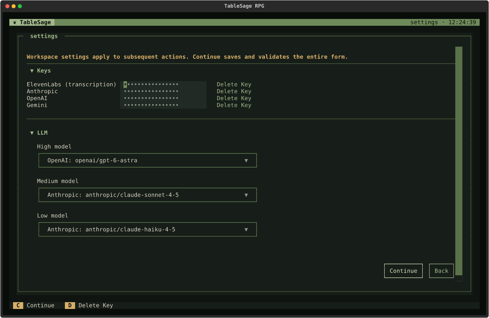
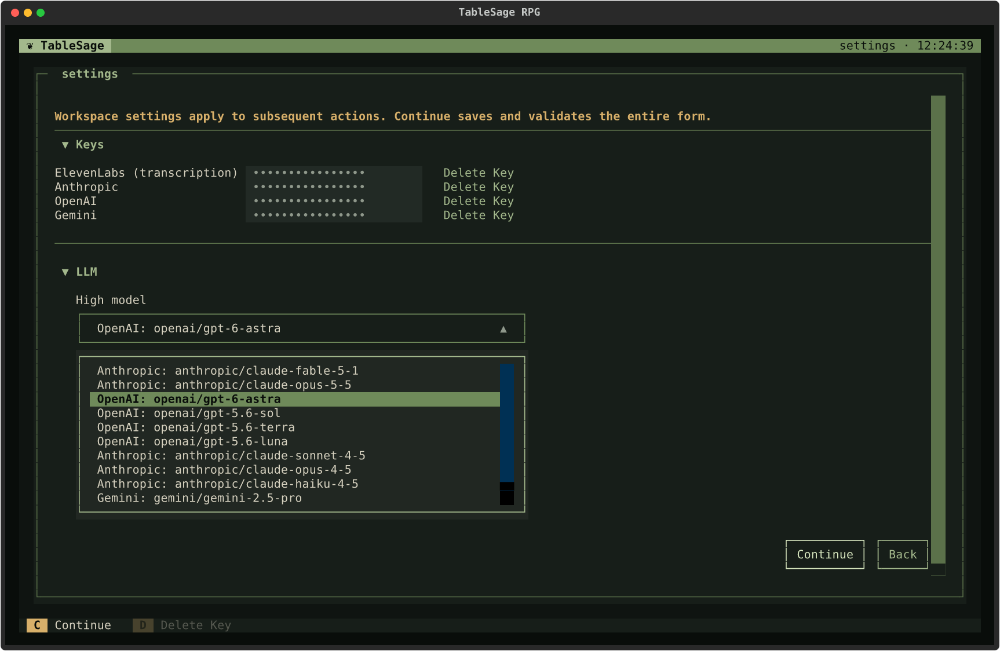

# Update Your Settings

Set up the service API keys and three language-model choices TableSage needs before it can process Sessions, then save and check them. See [Install TableSage](../getting-started/installation.md) for getting here the first time, and [Privacy and Data Handling](../reference/privacy.md) for what TableSage sends to which service.

Open Settings from the Welcome screen by pressing **S**. If a step needs a key you haven't set, TableSage also offers an **Open Settings** button.

For the usual setup, enter an ElevenLabs key, choose all three language models, and supply keys for the providers those models use. Then choose **Continue** to save and check the configuration. If you are moving to another workspace or computer, read [Move a Campaign to Another Workspace](move-campaign-workspace.md) for which configuration needs setting up again.

## Keys

The **Keys** section has one row per service: **ElevenLabs**, **Anthropic**, **OpenAI**, and **Gemini**. A row shows dots when a key is present, whether you typed it or it came from your shell (see below). Click a row and type to set or replace that key.

You only need keys for actively configured services, plus ElevenLabs:

- **ElevenLabs** is always required; it performs transcription and speaker diarization for every Session you import.
- **Anthropic**, **OpenAI**, and **Gemini** are only required for the providers named in your High, Medium, and Low model IDs, described below.

To remove a key, click its **Delete Key** button, or press **Tab** from its field to that button and press **D** or **Enter**. Removal takes effect on **Continue**. A key supplied by your shell environment can't be removed here; see below.

### Where Keys Live

Keys are not part of the workspace. They are stored once per user account, in a small file outside any workspace directory.

- Linux: `~/.config/tablesage/.env`
- macOS: `~/Library/Application Support/tablesage/.env`
- Windows: `%LOCALAPPDATA%\tablesage\.env`

You configure keys once for all your workspaces, and removing a workspace directory never deletes them. Saving a key change updates the shared file and the current instance; restart other running TableSage instances to load the change. Shell environment variables still take precedence.

### How Shell Environment Variables Override Keys

Before TableSage reads its stored keys, it checks your environment variables for `ELEVENLABS_API_KEY`, `ANTHROPIC_API_KEY`, `OPENAI_API_KEY`, and `GEMINI_API_KEY`. These environment variables take precedence, and will override keys set at the locations above. In that case:

- The key field shows dots but is disabled, and its tooltip says the key is provided by your shell environment and overrides the stored one.
- The field is not editable.
- **Delete Key** cannot remove it, since there is nothing stored to remove; the environment variable stays active until you change your shell.

This is useful for CI, shared machines, or keeping a key out of the on-disk `.env` file entirely.

## Models: High, Medium, and Low

Choose a model for each tier:

| Model | Default | Used for |
|---|---|---|
| **High** | `openai/gpt-6-astra` | Session artifacts and regeneration; Previously On and Opportunities |
| **Medium** | `anthropic/claude-sonnet-4-5` | Glossary extraction and spellcheck; new-player name corrections and speech proposals |
| **Low** | `anthropic/claude-haiku-4-5` | **Remove Bad Utterances** |

Each field is a dropdown of bundled presets across Anthropic, OpenAI, and Gemini, plus **Custom…** if you want a different model from one of those three providers. A custom ID must take the form `provider/model-name`, where `provider` is exactly `anthropic`, `openai`, or `gemini`. Other providers are not supported at this time.

### Choosing Models

**High:** use your most capable model for lengthy transcripts and campaign history. It writes the [Session Artifacts](../concepts/sessions.md#session-artifacts); **Create Previously On** also uses it at all three stages: gathering ingredients, recommending scenes, and writing the recap. Cost depends on the model and the amount of text it processes.

**Medium:** choose a model that handles invented names and conversational context well. You review its proposals before they are applied. New-player identity work can require it to read the whole transcript.

**Low:** a fast, inexpensive model handles batches of short phrases during **Remove Bad Utterances**, checking whether each phrase follows a question. This tries to preserve answers while removing listener acknowledgments, but meaningful replies can still be removed; see [Remove Bad Utterances](../concepts/session-processing-returning-players.md#remove-bad-utterances).

## Saving

Choose **Continue**, or move focus out of an editable key field and press **C**, to save. Saving:

1. Validates every model ID and writes your settings and any key changes to disk.
2. Sends a very short test message to each of your three configured models, using your saved keys.
3. If every model responds, downloads any local audio-processing models that are not already installed (noise removal, voice embeddings, and punctuation). This may take a while the first time, since some voice models install locally; once they are installed, this step finishes immediately on later saves.

If a model test fails, Settings stays open and shows which model failed and why. Your settings are still saved even though the check failed, so correct the key or model ID and save again. The ElevenLabs key is not tested here; it is first used to upload audio during **Create Transcript**.

Leaving Settings with unsaved changes prompts you to save or discard them.

## Continue After a Successful Save

You are ready when the model checks and required local-model downloads finish successfully. Return to [Start a Campaign](start-a-campaign.md) for first-time setup, or reopen your Session's Process screen and choose **Continue** to retry work that stopped for missing credentials. If a key field is read-only, change its shell environment variable as described above rather than trying to replace it in Settings.
