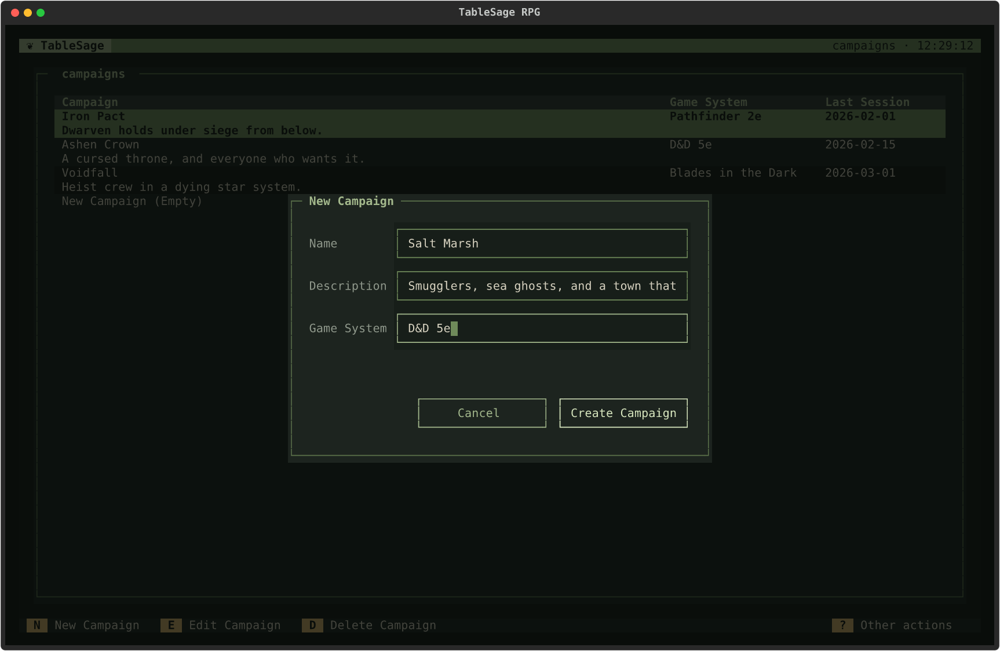
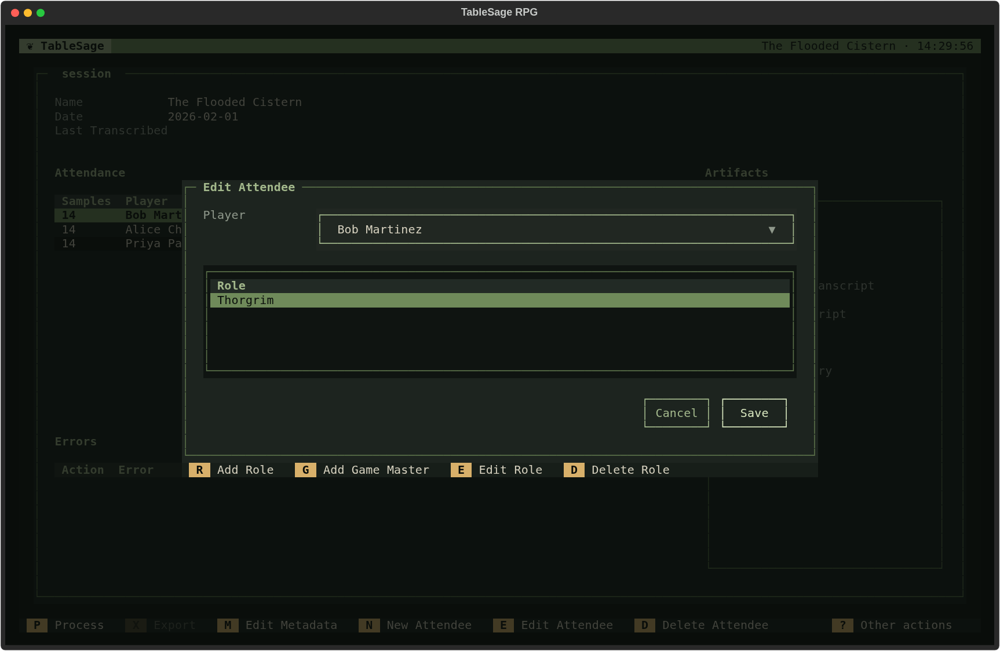
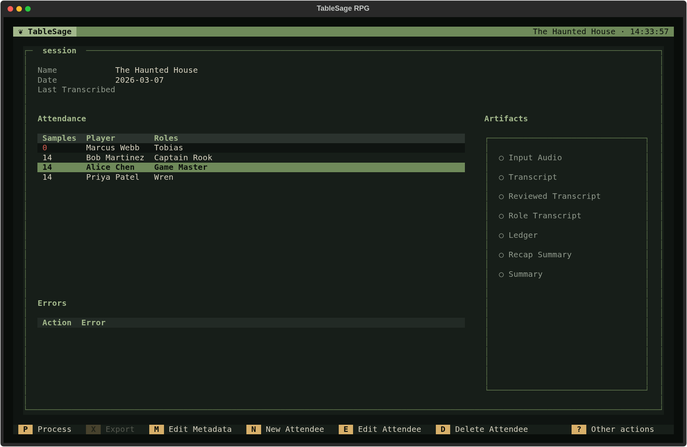

# Start a Campaign

Set up a Campaign and its first Session so TableSage knows who was at the table and which characters they played. You can start with the first game of a new Campaign or with a recording from an ongoing game.

You need an installed TableSage workspace. If this is your first launch, complete [installation](../getting-started/installation.md) and [configure your keys and models](settings.md) first. Launch TableSage from the directory where you want to keep this Campaign; see [Workspaces](../concepts/workspaces.md).

## Create the Campaign

1. From the Welcome screen, press **C** to open **Campaigns**.
2. Press **N** (**New Campaign**).
3. Enter a **Name**, such as *Salt Marsh*. Add a **Description** and **Game System** if useful, then choose **Create Campaign**.
4. Select the Campaign in the list and press **E** or **Enter** to open it.

The Campaign now has a home for its Sessions and Glossary. Its first Session can represent whichever recording you want to begin with; TableSage numbers Sessions in creation order.

## Create the First Session

On the Campaign's **Sessions** tab, press **N** (**New Session**). Give the Session a useful name, such as *Arrival at the Harbor*, and optionally enter its date as `YYYY-MM-DD`. Choose **Create Session**. TableSage opens Session Detail.

Record the date if you want later session summaries to include this game's recap. TableSage chooses the prior recap by date; when every Session is undated, no prior recap is included. See [How the Prior Recap Is Chosen](../concepts/sessions.md#how-the-prior-recap-is-chosen).

The first Session starts with an empty Attendance list. Add everyone whose speech is in the recording, including the game master.

## Add Attendees and Roles

1. Focus the **Attendance** table and press **N** (**New Attendee**).
2. In **Player**, select an existing person, or choose **<New player…>** and enter their real-world name. TableSage creates the Player and returns to the attendee dialog.
3. Add their Role: press **R** (**Add Role**) for a character name, or **G** (**Add Game Master**) for the GM.
4. Choose **Save**, then repeat for the other attendees.

For example, Jordan is the Player and *Brother Hald* is their Role. Morgan is another Player with the *Game Master* Role. Use the Player's name for the person speaking and the Role for their identity in this particular Session. A Player can have more than one Role, but transcript attribution uses only the alphabetically first Role for all their speech; TableSage does not distinguish their characters line by line.

**Save** becomes available once you have selected a Player and supplied at least one Role. Before processing, check that everyone who spoke is listed and that character names are spelled correctly.

The **Samples** column shows how many voice samples each Player's voice print was built from. A red **0** means the Player has no voice print yet: a new Player whose voice TableSage will learn from this recording.

Reuse an existing Player when the same person joins another Campaign in this workspace; their voice print is shared across Campaigns.

## Add Vocabulary You Already Know

This is optional. Press **Esc** to return to Campaign Detail, then **G** to open the **Glossary** tab. Press **N** to add a name or term and an optional description. Add distinctive names you expect to hear, such as *Brother Hald* or *Tidewarden Coil*. You can also let processing propose terms from the recording later.

See [Build and Maintain Your Campaign Glossary](build-campaign-glossary.md) for a fuller vocabulary workflow.

## Process the Recording

Return to the **Sessions** tab with **S**, open the Session, and press **P** (**Process**). TableSage chooses the processing workflow according to attendees' voice prints:

- If anyone has no usable voice print, follow [Process a Session with New Players](process-session-new-players.md).
- If everyone has a usable voice print, follow [Process a Session with Returning Players](process-session-returning-players.md).

A Player with no samples is expected at this point. You can learn their voice from the session recording; you do not need to prepare separate voice clips before starting.

You are ready to process when the Session's attendance and Roles are correct and you have its recording. For later recordings, create another Session in this Campaign rather than another Campaign.

## Sessions without Recordings

If a game was not recorded, leave it out of TableSage's Session list: an empty Session can leave a missing-recap placeholder in a later summary and block the preparation tools. If you already created a Session for that game, delete it from the Campaign's **Sessions** tab with **D** and confirm. Either way, a later summary uses the last eligible dated Session's recap, so it will not cover the unrecorded game.

You can create the upcoming Session before playing it. [Previously On and Opportunities](prepare-the-next-session.md) ignore the highest-numbered Session when it has no imported audio yet.
