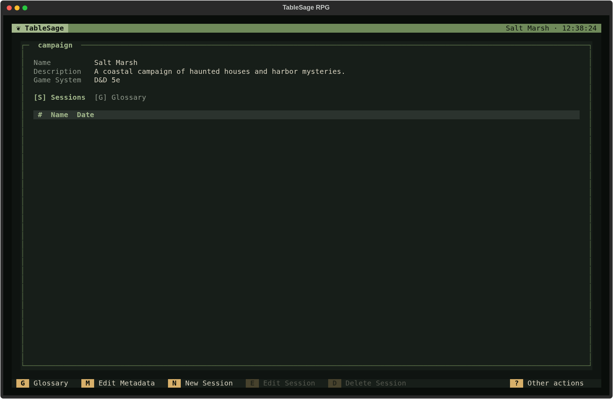
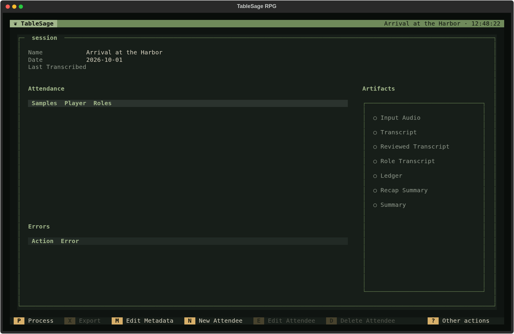

# Start a Campaign

Set up a Campaign and its first Session so TableSage knows who was at the table and which characters they played. You can start with the first game of a new Campaign or with a recording from an ongoing game.

You need an installed TableSage workspace. If this is your first launch, complete [installation](../getting-started/installation.md) and [configure your keys and models](settings.md) first. Launch TableSage from the directory where you want to keep this Campaign; see [Workspaces](../concepts/workspaces.md).

## Create the Campaign

1. From the Welcome screen, press **C** to open **Campaigns**.
2. Press **N** (**New Campaign**).
3. Enter a **Name**, such as *Salt Marsh*. Add a **Description** and **Game System**,  then choose **Create Campaign**.

4. Select the Campaign in the list and press **E** or **Enter** to open it.

## Create the First Session

On the Campaign's **Sessions** tab, press **N** (**New Session**). Give the Session a useful name, such as *Arrival at the Harbor*, and enter its required date as `YYYY-MM-DD`. Use a real calendar date, such as `2026-10-01`. Choose **Create Session**. TableSage opens Session Detail.

The first Session starts with an empty Attendance list. Add everyone whose speech is in the recording, including the game master.

## Add Attendees and Roles

1. Press tab to move the focus to the **Attendance** table and press **N** (**New Attendee**).
2. In the **Player** combo box, select an existing person, or choose **<New player…>** and enter their real-world name. TableSage creates the Player and returns to the attendee dialog. We recommend using the Player's full name, with normal spacing and capitalization, so that Players who share a first name stay distinct.
3. Add their Role: press **R** (**Add Role**) for a character name, or **G** (**Add Game Master**) for the GM.
4. Choose **Save**, then repeat for the other attendees.

For example, Jordan Lee is the Player and *Brother Hald* is their Role. Morgan Reyes is another Player with the *Game Master* Role. Use the Player's name for the person speaking and the Role for their identity in this particular Session. A Player can have more than one Role.

**Save** becomes available once you have selected a Player and supplied at least one Role. Before processing, check that everyone who spoke is listed and that character names are spelled correctly.

The **Samples** column shows how many voice samples each Player's voice print was built from. A red **0** means the Player has no voice print yet: this is a new Player whose voice TableSage will learn from this recording.

## Add Vocabulary You Already Know

This is optional. Press **Esc** to return to Campaign Detail, then press **G** to open the **Glossary** tab. 

<<# Screenshot of the Campaign Screen on the Glossary tab with the glossary empty #>>

Press **N** to add a name or term and an optional description. Add distinctive names you expect to hear, such as *Brother Hald* or *Tidewarden Coil*. You can also let processing propose terms from the recording later.

<<# Screenshot of the capaign screen with the New Glossary Entry modal dialog open and filled in #>>

See [Build and Maintain Your Campaign Glossary](build-campaign-glossary.md) for a fuller vocabulary workflow.

## Process the Recording

You are now ready to process your first recording.   
- Return to the session you created.   Press **S** to activate the Sessions tab, then select your session and press **Enter**.
- Once back in your session press **P (Process)** to begin processing your reccording. TableSage chooses the processing workflow according to attendees' voice prints:
	- If anyone has no usable voice print, follow [Process a Session with New Players](process-session-new-players.md).
	- If everyone has a usable voice print, follow [Process a Session with Returning Players](process-session-returning-players.md).