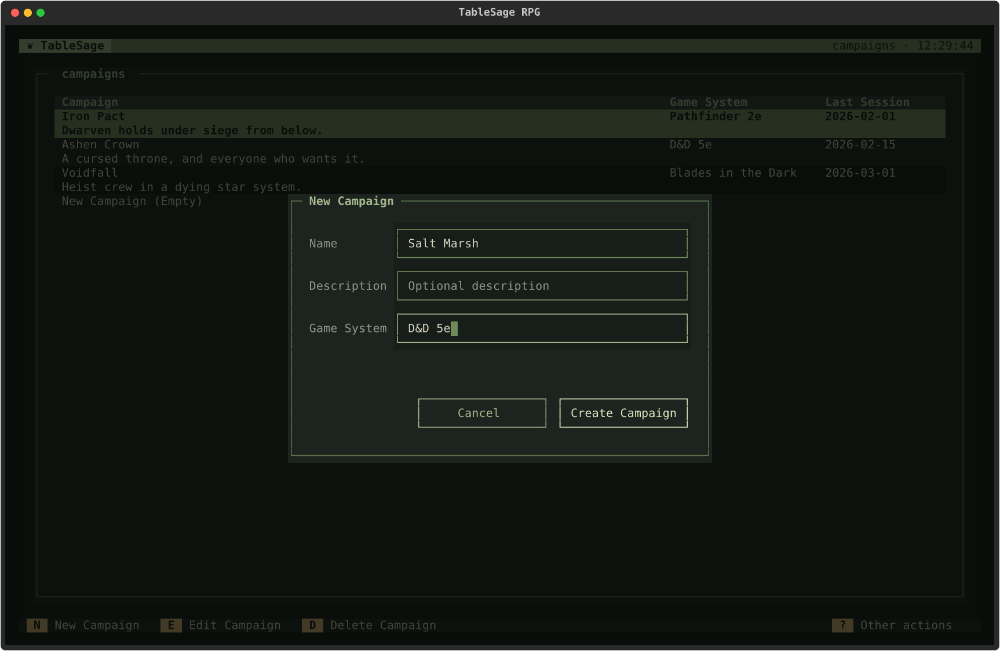
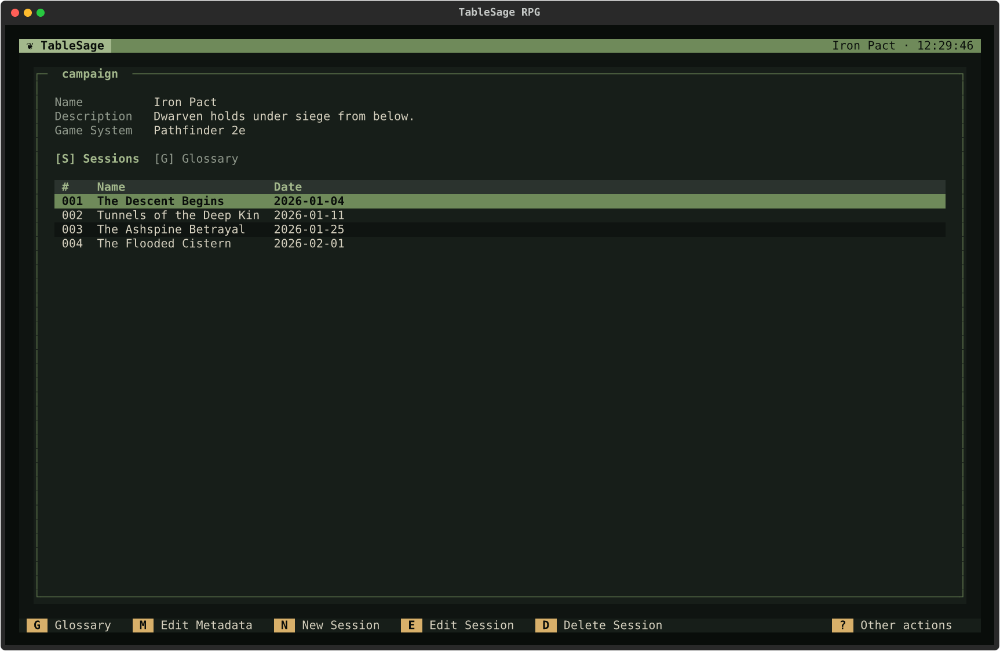
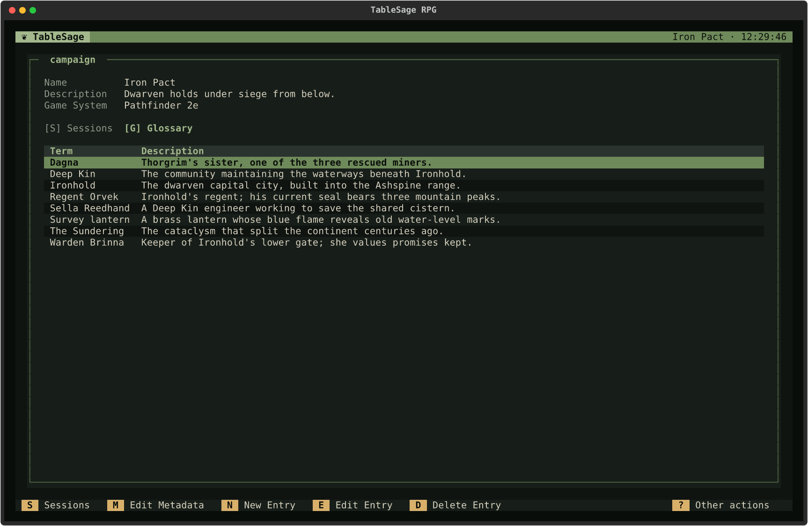
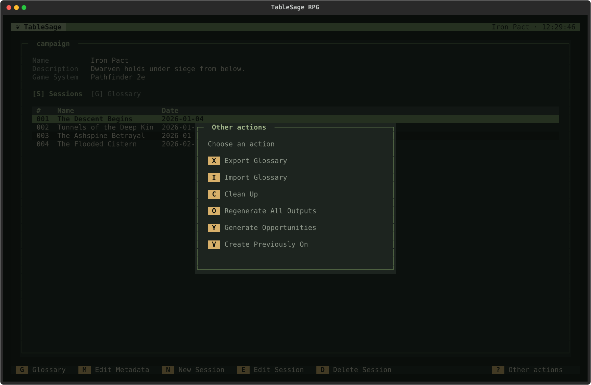
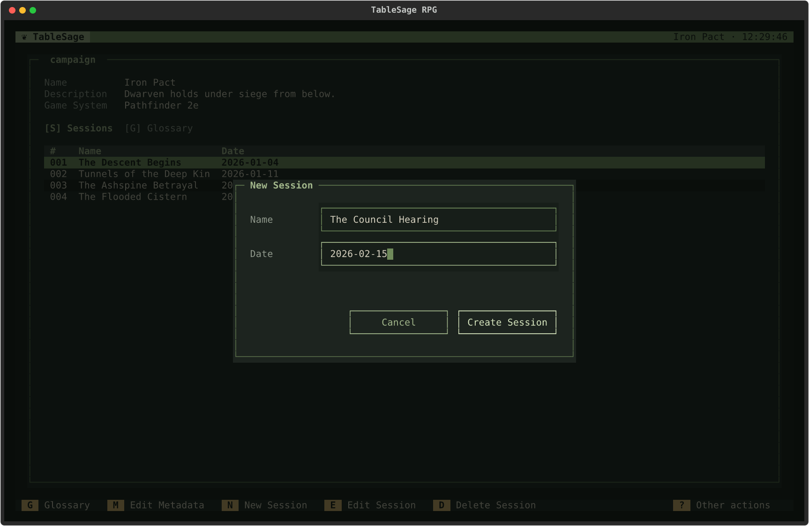

# Campaigns

[Screen Reference](index.md) › Campaigns

## How to Get Here

To get to the Campaigns List screen, press **C** on the Welcome screen.

A Campaign holds its Sessions and its own Glossary. See [Campaigns and Glossaries](../../concepts/campaigns.md) for the concepts.

## Campaigns List

The list shows every Campaign in the workspace, one Campaign per two-line row: its name with its description underneath, its game system, and the date of its most recent Session.

| Key | Action | Available |
|---|---|---|
| **N** | **New Campaign.** Opens the [Campaign Dialog](#campaign-dialog). | Always |
| **E**, **Enter** | **Edit Campaign.** Opens the highlighted Campaign in [Campaign Detail](#campaign-detail). Double-clicking a row does the same. | When a Campaign is highlighted |
| **D**, **Delete**, **Backspace** | **Delete Campaign.** Deletes the highlighted Campaign, after you confirm. Its files stay on disk until you run **Clean Up**; see [Delete and Clean Up](../../concepts/delete-and-clean.md). | When a Campaign is highlighted |
| **Esc** | Back to the Welcome screen. | Always |

### Other Actions

| Key | Action |
|---|---|
| **C** | **Clean Up.** After you confirm, removes campaign folders on disk that no longer have a Campaign in the database, such as those left by deleted Campaigns. A notification lists what was removed, or says there was nothing to remove. |
| **X** | **Export Campaign.** Writes the highlighted Campaign, with its Sessions, Glossary, and files, to a ZIP archive (default name `campaign.zip`). Unavailable when no Campaign is highlighted. It refuses with *Wait for campaign processing to finish before exporting* while any of the Campaign's Sessions is being processed. |
| **I** | **Import Campaign.** Imports a Campaign from a ZIP archive made by Export Campaign. Players are workspace-wide and aren't part of a campaign archive, so every Player who attended its Sessions must already exist here with the same name; use [Import Players](players.md#other-actions) first. If the import fails, an **Import Campaign Failed** window lists the problems, such as *Missing player: Jordan*. |

### Campaign Dialog

**N** on the list and **M** on Campaign Detail open the same dialog. It is titled **New Campaign** or **Edit Metadata**.

- **Name** is required. It is also the name of the Campaign's folder on disk.
- **Description** and **Game System** are optional.

**Enter** in any field submits the dialog, and **Esc** cancels it. If TableSage can't save, for example because the name is already taken, the message appears inside the dialog and your typing is kept.

A leftover folder from a deleted Campaign may already use the name you chose. In that case, TableSage asks whether to delete that folder and continue. If you decline, nothing is created or renamed, and the dialog stays open.

## Campaign Detail

### How to Get Here

To get to the Campaign Detail screen, select a Campaign from the Campaigns List screen and press **E** or **Enter**.

The top of the screen shows the Campaign's **Name**, **Description** (shortened to about three lines), and **Game System**. Below that are two tabs, **Sessions** and **Glossary**. The header shows the Campaign's name.

The **N**, **E**, and **D** keys act on whichever tab is showing. The footer relabels them to match, for example **New Session** or **New Entry**.

### Sessions Tab

The Sessions tab lists the Campaign's Sessions by number (**#**), with each Session's name and date.

| Key | Action | Available |
|---|---|---|
| **G** | Switch to the **Glossary** tab. You can also click the tab's label. | On the Sessions tab |
| **M** | **Edit Metadata.** Opens the [Campaign Dialog](#campaign-dialog). | Always |
| **N** | **New Session.** Opens the [Session Dialog](#session-dialog). When you create the Session, TableSage opens it in [Session Detail](session-detail.md). | On the Sessions tab |
| **E**, **Enter** | **Edit Session.** Opens the highlighted Session in [Session Detail](session-detail.md). | When a Session is highlighted |
| **D**, **Delete**, **Backspace** | **Delete Session**, after you confirm. This permanently deletes the Session, its attendance, and its Roles. Its folder stays on disk until you run **Clean Up**. | When a Session is highlighted |
| **Esc** | Back to the Campaigns List. | Always |

A new Session is numbered one higher than the Campaign's highest existing Session.

### Glossary Tab

The Glossary tab lists the Campaign's Glossary: each **Term** and its **Description**. Processing uses the Glossary to catch misheard names and places.

| Key | Action | Available |
|---|---|---|
| **S** | Switch to the **Sessions** tab. | On the Glossary tab |
| **M** | **Edit Metadata.** | Always |
| **N** | **New Entry.** Opens the glossary entry dialog. | On the Glossary tab |
| **E**, **Enter** | **Edit Entry.** Opens the highlighted entry in the glossary entry dialog. | When an entry is highlighted |
| **D**, **Delete**, **Backspace** | **Delete Entry**, after you confirm. | When an entry is highlighted |

In the glossary entry dialog, **Term** is required, and **Description** is optional. **Enter** saves. A blank term is refused with *Term cannot be blank.*

### Other Actions

| Key | Action |
|---|---|
| **X** | **Export Glossary.** Writes the Glossary to a JSON file (default name `glossary.json`). |
| **I** | **Import Glossary.** Adds the entries from a JSON glossary file. Entries whose terms are already in the Glossary are skipped, and a notification reports how many were added and skipped. |
| **C** | **Clean Up.** After you confirm, removes session folders in this Campaign that no longer have a Session in the database. |
| **O** | **Regenerate All Outputs.** Brings every Session's outputs up to date, Session by Session, in order. It skips Sessions whose transcript review isn't complete and current, and says how many it skipped. It does nothing if no Session has imported audio, and it refuses to start while a Session is being processed. See [Regenerate Every Session in a Campaign](../../guides/review-and-export.md#regenerate-every-session-in-a-campaign). |
| **Y** | **Generate Opportunities.** Opens [Generate Opportunities](previously-on-and-opportunities.md#generate-opportunities). |
| **V** | **Create Previously On.** Opens [Create Previously On](previously-on-and-opportunities.md#create-previously-on). |

**Generate Opportunities** and **Create Previously On** read scene breakdowns in Session number order, ignoring the highest-numbered Session if it has no imported audio yet. If any remaining Session's Scene Breakdown is missing or out of date, they don't open. Instead, an error lists the Sessions that need attention and suggests running **Regenerate All Outputs** first.

### Session Dialog

**New Session** here and **Edit Metadata** on Session Detail open the same dialog.

- **Name** is required.
- **Date** is optional. If you enter one, use the form `YYYY-MM-DD`; any other form is refused with a message inside the dialog.

Dates determine which Session supplies the prior recap in a session summary; see [How the Prior Recap Is Chosen](../../concepts/sessions.md#how-the-prior-recap-is-chosen).

A Session's folder is named after its number, not its name, so you can rename a Session freely. When you create a Session, TableSage checks whether a leftover folder already uses the next number, for example after you deleted the most recent Session. If so, it asks whether to delete that folder and continue.
