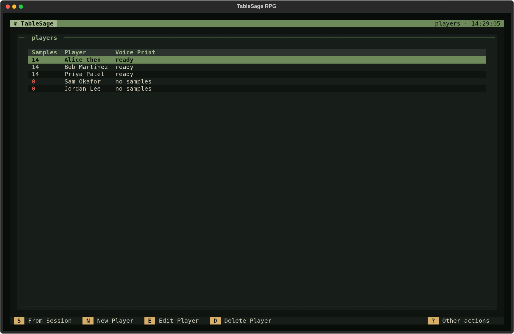
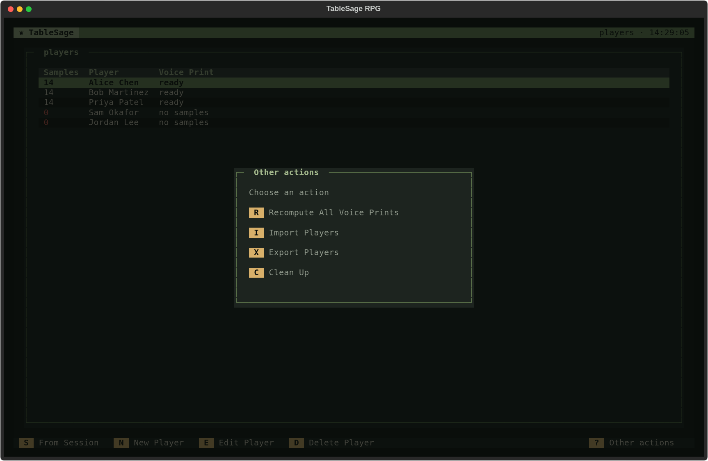
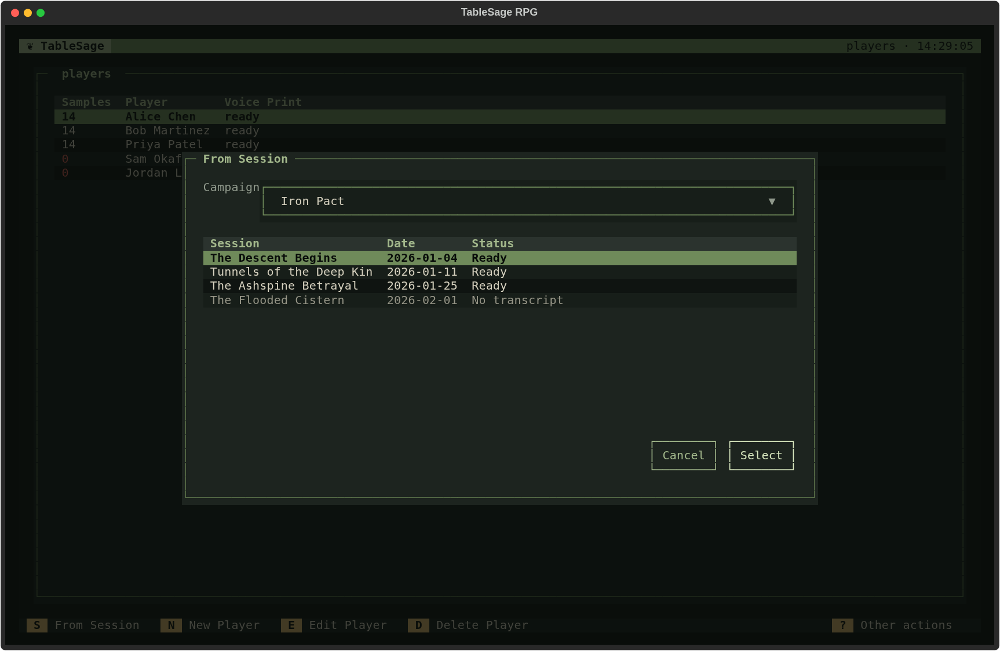
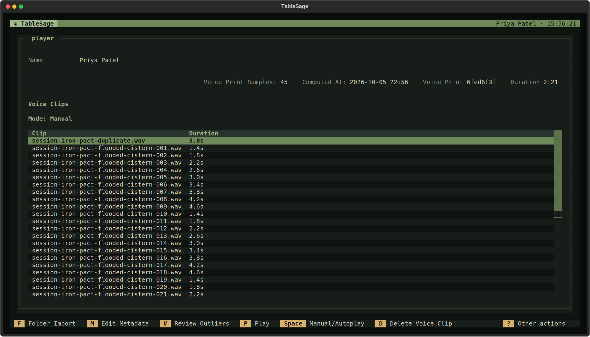
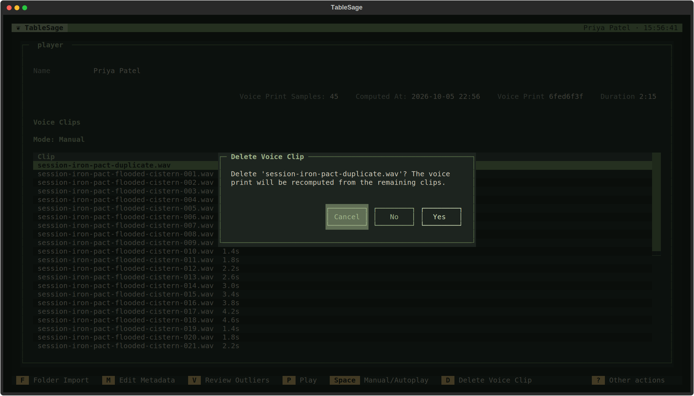
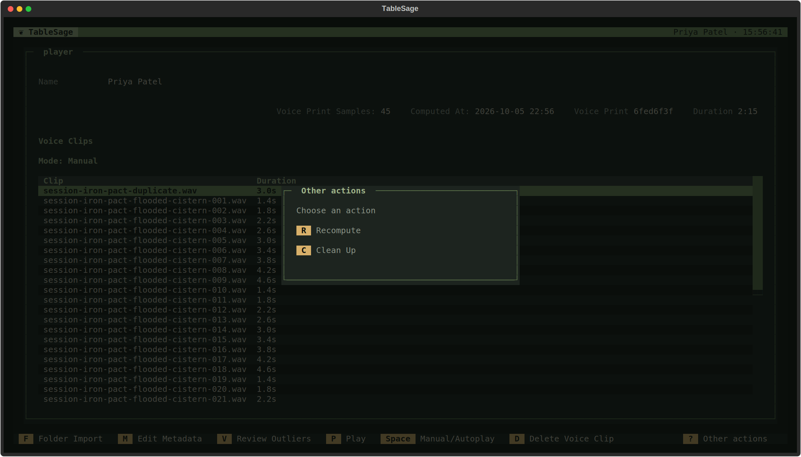
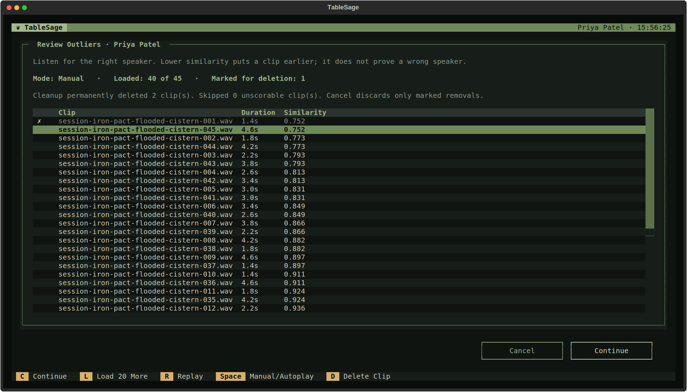

# Players

[Screen Reference](index.md) › Players

## How to Get Here

To get to the Players List screen, press **P** on the Welcome screen.

Players belong to the whole workspace, not to one Campaign. Each Player has a voice print, built from voice clips, that lets TableSage recognize who is speaking. See [Players, Voice Samples, Voice Prints, and Roles](../../concepts/players.md) for the concepts, and [Improve Player Voice Recognition](../../guides/manage-players-and-voice-samples.md) for common tasks.

## Players List

| Column | Meaning |
|---|---|
| **Samples** | How many voice samples the Player's voice print was built from. A red **0** means none yet; hovering over it says so. |
| **Player** | The Player's name. |
| **Voice Print** | *ready* when the Player has a voice print, *no samples* when they don't. |

| Key | Action | Available |
|---|---|---|
| **S** | **From Session.** Refreshes attendees' voice samples from a transcribed Session and recomputes their voice prints; see [From Session](#from-session). | Always |
| **N** | **New Player.** Asks for a name. The name becomes the Player's folder name on disk, so it can't contain `/` or `\`, and it can't be `.` or `..`. Names that differ only in capitalization count as the same name. Problems are shown inside the dialog. | Always |
| **E**, **Enter** | **Edit Player.** Opens the highlighted Player in [Player Detail](#player-detail). | When a Player is highlighted |
| **D**, **Delete**, **Backspace** | **Delete Player.** Deletes the highlighted Player, after you confirm. A Player who has attended any Session can't be deleted, and TableSage explains this before asking. Remove their attendance first. The Player's folder stays on disk until you run **Clean Up**. | When a Player is highlighted |
| **Esc** | Back to the Welcome screen. | Always |

### Other Actions

| Key | Action |
|---|---|
| **R** | **Recompute All Voice Prints.** Starts at once, without asking. Rebuilds every Player's voice print from the clips in their folder, one Player at a time, with progress. If one Player fails, it stops there and reports how many it finished. |
| **I** | **Import Players.** Imports Players and their voice clips from a ZIP archive, then computes their voice prints. Players whose names already exist are matched rather than duplicated, and identical clips are skipped. A notification summarizes what was created, matched, imported, and skipped. If the archive can't be imported, an **Import Players Failed** window lists the problems. |
| **X** | **Export Players.** Writes every Player and their voice clips to a ZIP archive (default name `players.zip`). |
| **C** | **Clean Up.** After you confirm, removes player folders on disk that no longer have a Player in the database. |

Import and export move Players between workspaces; see [Move a Campaign to Another Workspace](../../guides/move-campaign-workspace.md) for the complete transfer workflow, or [Move Players Between Workspaces](../../guides/manage-players-and-voice-samples.md#move-players-between-workspaces) for Players alone.

### From Session

**S** opens a picker. Choose a Campaign from the drop-down, then choose one of its Sessions and press **Enter** or **Select**.

Sessions that haven't been transcribed are listed but dimmed, with the status *No transcript*. Selecting one is refused with *This session hasn't been transcribed yet.* For a *Ready* Session, TableSage cuts voice clips for its current attendees and recomputes their voice prints, behind a progress dialog. A notification reports how many Players received new clips and how many clips were extracted.

For each attendee, this replaces their earlier clips from the same Session, even if no new clips qualify. TableSage trusts human assignments only when the completed transcript review is current; otherwise it uses high-confidence machine assignments. See [Add Samples from a Session](../../guides/manage-players-and-voice-samples.md#add-samples-from-a-session) for source selection and replacement details.

Only use this on a Session whose speaker assignments you have reviewed carefully. A mislabeled line teaches TableSage the wrong voice for a Player. Process Session offers the same thing at the end of processing; see [Improve Player Voice Prints](processing-review-screens.md#improve-player-voice-prints).

## Player Detail

### How to Get Here

To get to the Player Detail screen, select a Player from the Players List screen and press **E** or **Enter**.

The header shows the Player's name.

The top of the screen shows:

| Field | Meaning |
|---|---|
| **Name** | The Player's name. |
| **Voice Print Samples** | How many clips the current voice print was built from. |
| **Computed At** | When the voice print was last computed, or *Never*. |
| **Voice Print** | A short fingerprint of the current voice print, or *None*. It isn't meaningful by itself, but it changes whenever the voice print changes, so you can see whether a recompute did anything. |
| **Duration** | The total length of every clip in the Player's folder, including clips the voice print doesn't currently use. |

The **Voice Clips** table lists every clip file in the Player's folder and its length. Clips added from a Session are named after the Campaign and Session they came from.

Moving between rows plays the highlighted clip, stopping any previous playback. **P** replays it. The playback **Mode** is shown above the list; **Space** toggles Manual/Autoplay. Autoplay advances through this Player's clips and returns to Manual at the end. Moving the cursor yourself also returns to Manual. Playback stops when you leave the screen or open a dialog.

| Key | Action | Available |
|---|---|---|
| **F** | **Folder Import.** Imports clips from a folder. See [Import Clips from a Folder](#import-clips-from-a-folder). | Always |
| **M** | **Edit Metadata.** Renames the Player, which also renames their folder. If a leftover folder already has the new name, TableSage asks whether to delete it and continue. | Always |
| **V** | **Review Outliers.** Opens the ranked clip review after automatic cleanup; see [Review Outliers](#review-outliers). | Always |
| **P** | **Play.** Plays or replays the highlighted clip. | When a clip is highlighted |
| **Space** | **Manual/Autoplay.** Toggles automatic playback of successive clips. | When a clip is highlighted |
| **D**, **Delete**, **Backspace** | **Delete Voice Clip.** Deletes the highlighted clip, after you confirm. The clip file is deleted, and the voice print is recomputed from the remaining clips. | When a clip is highlighted |
| **Esc** | Back to the Players List. | Always |

### Other Actions

| Key | Action |
|---|---|
| **R** | **Recompute.** Starts at once, without asking. Rebuilds this Player's voice print from every clip in their folder. If the folder has no clips, the voice print is cleared. |
| **C** | **Clean Up.** After you confirm, recomputes the voice print and **permanently deletes** any clip files it finds to be duplicates or outliers, meaning clips that don't sound like the rest. A notification reports how many were removed. |

### Import Clips from a Folder

**F** imports every `.wav` clip at the top level of a folder you choose:

1. Choose the folder in the directory picker. TableSage checks that it contains clips it can import; if not, it says why and stops.
2. **Clean Audio** asks whether to denoise and reformat the files first. Choose **Yes** for raw recordings and **No** for audio that is already clean. **Cancel** stops the import.
3. If you have imported from this folder before, **Replace Prior Import** says how many earlier clips will be replaced. Confirm to continue.
4. TableSage imports the clips and recomputes the voice print. A notification reports how many clips it imported and replaced. It also reports any clips it skipped because they couldn't be used, and any it removed as outliers. If no clip could be used, the voice print is left unchanged, and a warning says so.

## Review Outliers

### How to Get Here

Press **V** (**Review Outliers**) on Player Detail. This screen helps you check whether each stored clip is spoken by the Player it is assigned to, starting with the least similar voices. It displays filename, duration, and **Similarity**, with no transcript text.

Before the list appears, TableSage recomputes the voice print and **permanently deletes** excluded duplicate and outlier clips. This automatic cleanup uses the same outlier settings as **Clean Up**, and survives cancellation. It does not denoise audio. If the Player has clips but no voice print, preparation computes one; if cleanup leaves no clips or no usable voice print, you return to refreshed Player Detail with an explanation.

The first **20** remaining clips appear in order from least to most similar to the post-cleanup voice print, or fewer if fewer are available. Lower scores mean the clip sounds less like the Player's voice print. Listen before removing it—a low score does not prove it belongs to someone else. Similarity is a comparison score, not a confidence percentage.

The status line shows the playback mode, loaded and total clip counts, and number marked for deletion. The line below reports how many files cleanup deleted and how many unscorable clips were skipped. Skipped files remain untouched by review. If no clips can be scored, you return to Player Detail.

The **Cancel** and **Continue** buttons sit below the clip panel, with **Continue** aligned to the table's right edge.

### Keys

| Key | Action |
|---|---|
| **C** | **Continue.** Deletes marked clips, recomputes the voice print once, and returns to refreshed Player Detail. With nothing marked, returns without another recomputation. The **Continue** button does the same. |
| **L** | **Load 20 More.** Appends the next 20 unseen clips, or the remaining clips if fewer are left. Available until all clips are loaded. It preserves the current row, playback, and removal marks. Scores and ranking stay fixed for the visit. |
| **R** | **Replay** the highlighted clip. Player Detail uses **P** for playback and keeps **R** for Recompute. |
| **Space** | **Manual/Autoplay.** Autoplay plays successive loaded clips. At the end it returns to Manual without loading more. Moving the cursor yourself also switches to Manual. |
| **D**, **Delete**, **Backspace** | **Delete Clip.** Toggles the highlighted clip's removal mark, then advances to play the next clip if one exists. A marked row stays visible, struck through and marked **✗**. Return to it and press **D** again to restore it. |
| **Esc** | **Cancel.** Returns without applying pending removals. If any are marked, offers **Discard** or **Keep Reviewing**. The **Cancel** button does the same. |
| **Ctrl+Q** | Quits; with pending removals, offers **Discard and Quit** or **Keep Reviewing**. Quitting never applies marked deletions. |

The initial cleanup remains permanent after Cancel or quitting; only review removal marks are discarded. No draft is saved. Close an open dialog before quitting. Playback stops on leaving or opening a dialog. Reopening Review Outliers creates a new ranking against the current voice print.

If cleanup or applying removals fails, TableSage returns to refreshed Player Detail with an error explaining any files already deleted and any need to run **Recompute**. Permanent file changes are not rolled back.
