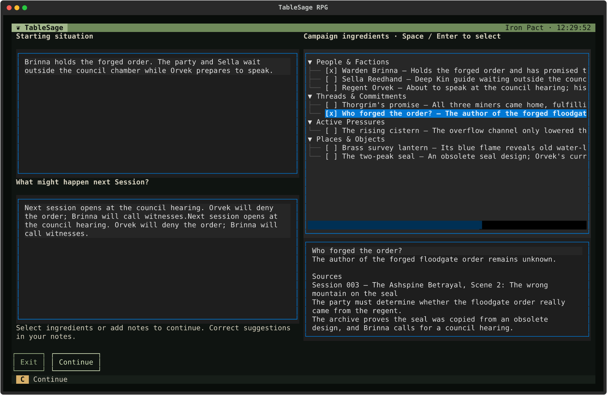
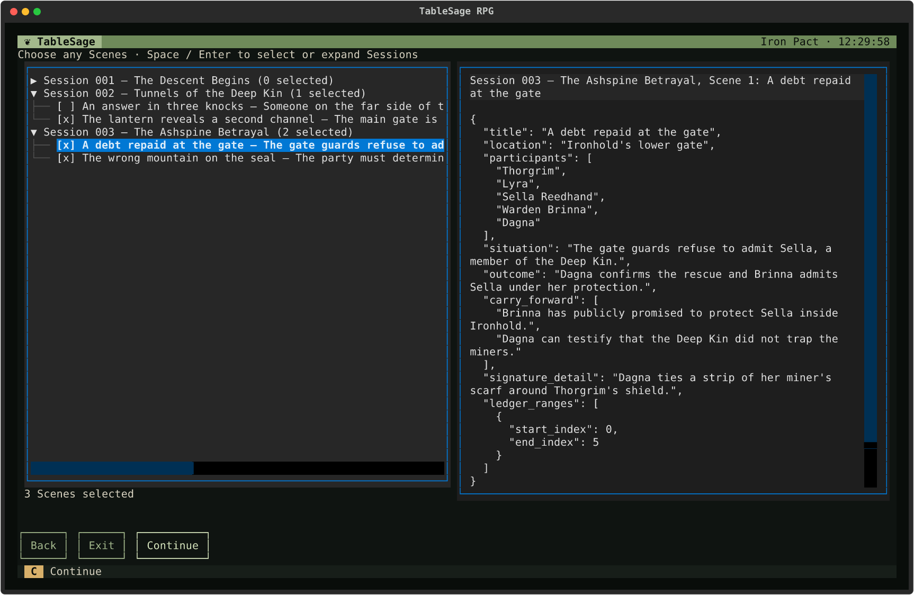
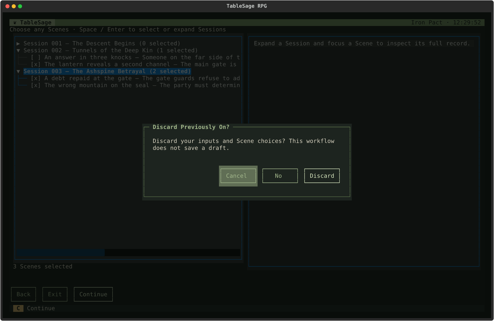
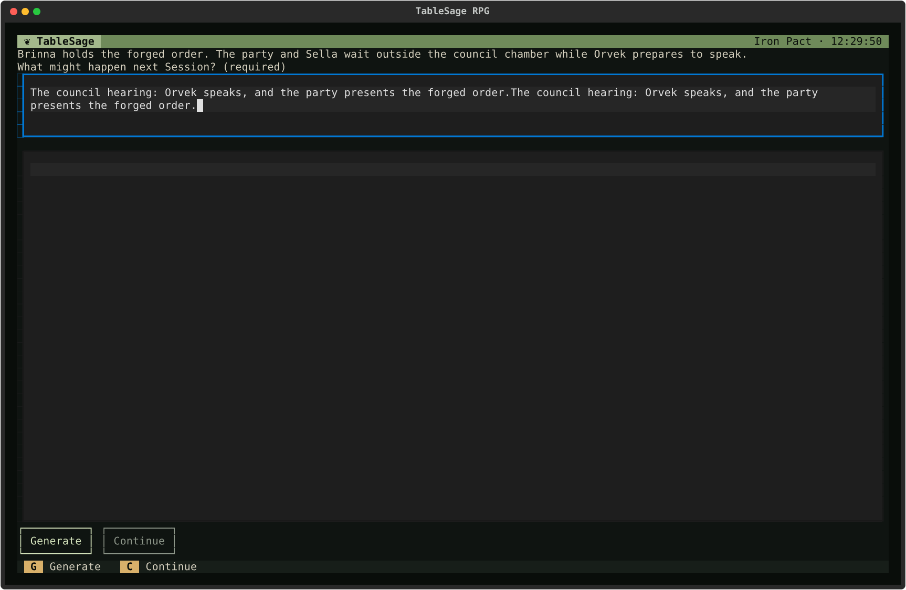
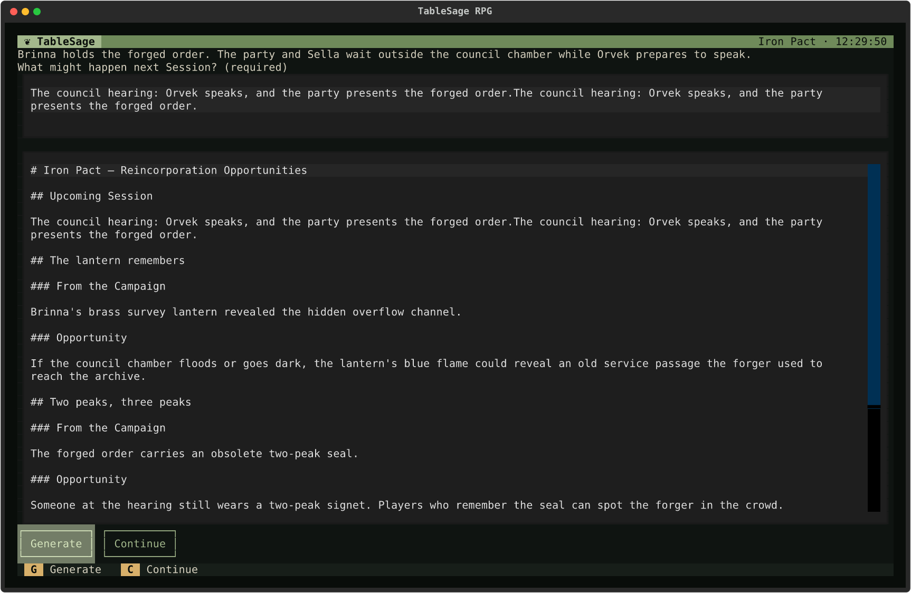

# Previously On and Opportunities

[Screen Reference](index.md) › Previously On and Opportunities

## How to Get Here

To get to Create Previously On or Generate Opportunities, press **V** or **Y**, respectively, on the Campaign Detail screen (these actions also appear in **Other actions**).

These two campaign-wide tools help you prepare the next Session. Both are opened from **Other actions** in [Campaign Detail](campaigns.md#campaign-detail): **V** opens Create Previously On, and **Y** opens Generate Opportunities. For the task-level walkthrough, see [Prepare the Next Session](../../guides/prepare-the-next-session.md).

Both tools read every Session's Scene Breakdown. The most recent Session is ignored if it has no imported audio, so an upcoming Session you have already created doesn't get in the way. If any other Session's Scene Breakdown is missing or out of date, neither opens. Instead, an error lists the Sessions that need attention and suggests running **Regenerate All Outputs**. Both also use an LLM, so they need the key for your High model; see [Settings](welcome-and-settings.md#settings).

## Create Previously On

### How to Get Here

To get to the Create Previously On screen, press **V** on the Campaign Detail screen (also listed under **Other actions**).

Create Previously On writes a short "previously on…" recap to read at the start of the next Session. You tell TableSage where the story stands and what might come up. It suggests Scenes from earlier Sessions worth recalling, you choose which to include, and it writes the recap to a Markdown file. Nothing is kept inside TableSage.

Opening it takes a moment while TableSage gathers the Campaign's *ingredients*: the people, threads, pressures, places, and objects most likely to matter next.

The screen has two stages, both with **C Continue** as the primary action. While editing text, **C** types into the field. Move focus to the ingredients, Scene list, or a button before pressing **C**, or click **Continue**.

### Stage 1: What's Coming Up

| Area | What to do |
|---|---|
| **Starting situation** | Where the story stands. It is filled in from the end of the most recent Session, and you can edit it. |
| **What might happen next Session?** | Your notes on what you expect to come up. You can also correct the ingredients here. |
| **Campaign ingredients** | Suggestions grouped under *People & Factions*, *Threads & Commitments*, *Active Pressures*, and *Places & Objects*. Press **Space** or **Enter** on an ingredient to select it (**[x]**) or clear it. On a group heading, the same keys collapse or expand the group. A group with nothing to suggest shows *No strong candidates*. |
| **Evidence pane** (below the ingredients) | For the highlighted ingredient, its current state and the Scenes it comes from. |

**Continue** (**C**) becomes available once you have selected at least one ingredient or written a note. It asks an LLM to find the Scenes that best set up what you described.

### Stage 2: Choose Scenes

The left pane lists every Session, and each Session lists its Scenes. The Scenes TableSage recommends are already selected, their Sessions are expanded, and they are marked **★ Scout**. That mark can be cut off at the end of a long line. Each Session line shows how many of its Scenes are selected, and the total appears under the list.

- Press **Space** or **Enter** on a Scene to select or clear it. On a Session line, the same keys expand or collapse it.
- The right pane shows the highlighted Scene's full record. For a recommended Scene, it ends with the *Scout rationale*, which explains why it was suggested. The rationale is for you only and doesn't go into the recap.

| Button or key | Action |
|---|---|
| **Continue**, **C** | Choose where to save the recap. The suggested file name is the campaign name and the next Session's number, such as `Iron Pact-004-previously-on.md`. If the file already exists, **Replace Markdown file?** asks first; the existing file is left untouched unless the new recap is written successfully. TableSage then writes the recap from the selected Scenes and closes this screen. Available when at least one Scene is selected. |
| **Back** | Return to stage 1 to change your notes or ingredients. |
| **Exit**, **Esc** | Leave; see below. |
| **Retry Save** | Appears only after a save fails. It tries the same file again. |

If a step fails, the reason appears at the top of the screen.

Both tools save only to a Markdown file with a `.md` extension, in an existing folder outside the workspace's `campaigns/` directory. A destination that breaks these rules is refused with a message such as *Save the recap outside managed Campaign data.*

### Leaving

If you have entered anything or found Scenes, leaving asks **Discard Previously On?** first, because this workflow keeps no drafts. **Discard** leaves, and **Cancel** stays.

## Generate Opportunities

### How to Get Here

To get to the Generate Opportunities screen, press **Y** on the Campaign Detail screen (also listed under **Other actions**).

Generate Opportunities suggests ways to bring earlier campaign elements back into the next Session, giving them new meaning or new use. Results exist only on this screen until you save them.

The line at the top is where the Campaign's most recent Session ended. Below it:

1. **What might happen next Session? (required)** Describe what you expect. **Generate** stays disabled until this has text.
2. **Generate** (**G**) asks an LLM for opportunities. Each has a title, the campaign element it draws on (*From the Campaign*), and the *Opportunity* itself.
3. **Continue** (**C**) becomes available after a successful generation. It saves the results to a Markdown file (default name `opportunities.md`). If the file already exists, **Replace Markdown file?** asks first.

While editing the prompt, **G** and **C** type text. Press **Tab** to leave the prompt before using the action keys, or click **Generate** or **Continue**.

You can edit your description and generate again as often as you like; each run replaces the results. If generation fails, the reason appears in red under the prompt.

| Key | Action |
|---|---|
| **G** | **Generate.** |
| **C** | **Continue.** Saves the generated opportunities as Markdown. |
| **Tab** | Move between the prompt, the results, and the buttons. |
| **Esc** | **Back** to Campaign Detail. This doesn't ask first, and unsaved results are lost. |
