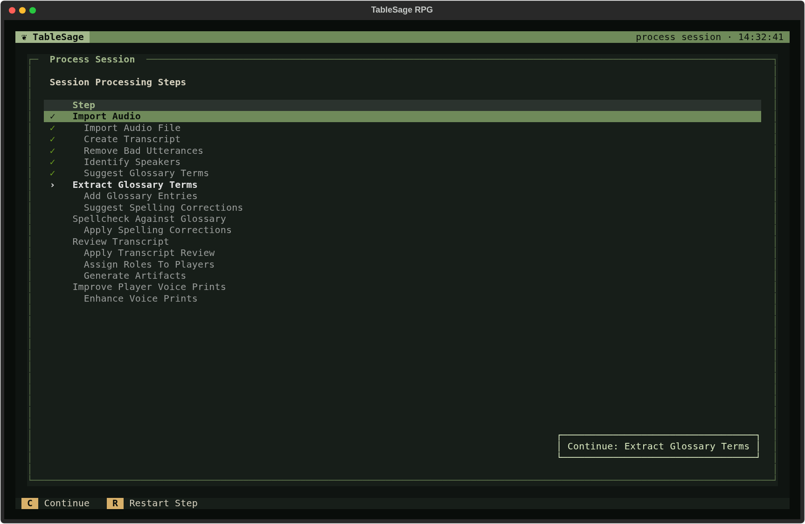
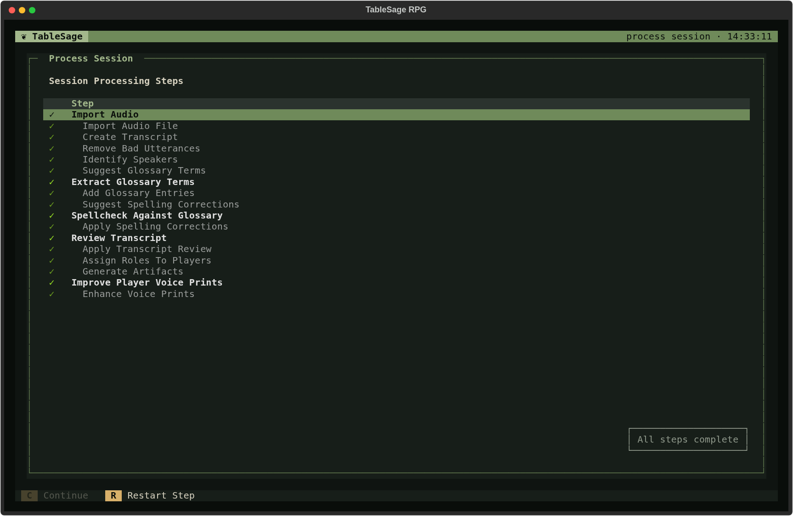
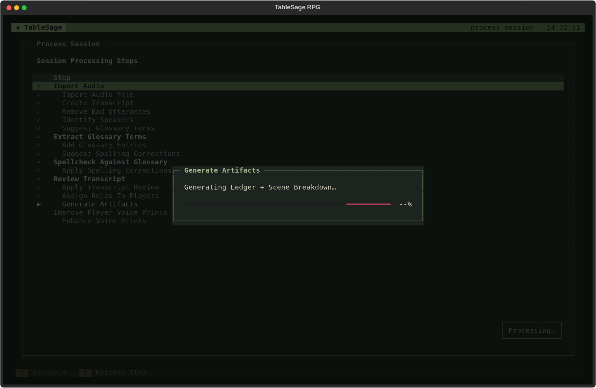

# Process Session

[Screen Reference](index.md) › Process Session

## How to Get Here

To get to the Process Session screen, press **P** on the Session Detail screen.

Process Session turns a recording into a reviewed transcript and the Session's outputs. It lists every processing step, shows where the Session has got to, and runs the next steps when you ask. What each step does and why is explained in [Session Processing](../../concepts/session-processing.md). This page covers the screen.

## What the Screen Shows

**Session Processing Steps** lists the steps in order. There are two kinds:

- **Review steps** are in bold, at the left margin. At each of these, processing stops and opens a screen where you check or decide something. These are described in [Processing Review Screens](processing-review-screens.md).
- **Automatic steps** are indented and dimmed. TableSage runs them behind a progress dialog, with no input from you.

The mark at the left of each row shows its state:

| Mark | Meaning |
|---|---|
| **›** | The next step to run. **Continue** starts here. |
| **▶** | Running now. The note beside it says what is happening, for example *preparing: Transcribing…*. |
| **✓** | Complete. Review steps show a bright check, automatic steps a dim one. A review step that had nothing to review, such as a spellcheck with no suggestions, is completed automatically and noted *Nothing to review*. |
| **!** | Failed. The reason appears in red beside the step. Fix the cause and press **Continue** to try again. |
| *(none)* | Not reached yet. Steps after the next one are dimmed. |

Some steps appear only when they apply:

- **New Players.** When any attendee is a new Player, their names are listed at the right, and six more steps appear: Suggest Name Corrections, **Review Name Corrections**, Apply Name Corrections, Isolate New Speakers, **Review New Speaker Assignments**, and Seed Player Voice Samples. The screenshot above shows a Session with a new Player, Jordan Lee. A Session where everyone already has a voice print skips those steps:

  

- **Rebuild Prior Sessions** appears only when generating this Session's outputs would require rebuilding earlier Sessions first; see [Rebuild Prior Sessions](processing-review-screens.md#rebuild-prior-sessions).

## The Continue Button

The button at the bottom right tells you what will happen:

| Button label | Meaning |
|---|---|
| **Continue: *step*** | Press it (or **C**) to run from that step. |
| **Processing…** | A run is in progress. |
| *A problem, such as* This Session has no attendees. Add them on Session Detail. | Something must be fixed before processing can start. |
| **All steps complete** | Everything is done. |

## Keys

| Key | Action | Available |
|---|---|---|
| **C** | **Continue.** Runs from the first incomplete step. The run carries on through automatic steps and opens each review step's screen in turn. It stops when a review screen is cancelled, when a step fails, or when every step is complete. | When no run is in progress, nothing blocks processing, and a step remains |
| **R**, **Enter** | **Restart from here.** Reopens a completed review or reruns a completed automatic step, then rebuilds affected work. Unchanged results can leave later work current, but restarting before **Review Transcript** discards its saved edits and drafts. On the next step (**›**), it does the same as **Continue**. Steps that haven't been reached cannot start yet. | When no run is in progress, nothing blocks processing, and a completed or next step is highlighted |
| **↑ ↓** | Move between review steps. The cursor skips automatic steps; click an automatic row to highlight it for **Restart from here**. | Always |
| **Esc** | **Back** to Session Detail. | Always |

**Esc** remains available for going back but is hidden in the footer. The footer shows **C Continue** followed by **R Restart from here**.

The screen never starts processing by itself. Opening it only shows where the Session stands.

## During a Run

Consecutive automatic steps share one [progress dialog](ui-patterns.md#progress-dialogs). It is titled with the running step and describes what that step is doing, for example *Generating Ledger + Scene Breakdown…*. When the run reaches a review step, the progress dialog closes and the step's screen opens. Confirming that screen continues the run. Cancelling it ends the run, and you can resume later with **Continue**.

Some steps report their result in a notification as they finish, for example *Added 2 glossary entries* or *Generated 6 outputs*. If a step needs an API key that isn't set, the run stops there, and the [Provider Key Required](ui-patterns.md#provider-key-required) dialog opens.

For the screens and prompts the run opens, see [Processing Review Screens](processing-review-screens.md):

1. [Import Audio](processing-review-screens.md#import-audio)
2. [Review Name Corrections](processing-review-screens.md#review-name-corrections) (new Players only)
3. [Review New Speaker Assignments](processing-review-screens.md#review-new-speaker-assignments) (new Players only)
4. [Extract Glossary Terms](processing-review-screens.md#extract-glossary-terms)
5. [Spellcheck Against Glossary](processing-review-screens.md#spellcheck-against-glossary)
6. [Review Transcript](processing-review-screens.md#review-transcript)
7. [Rebuild Prior Sessions](processing-review-screens.md#rebuild-prior-sessions) (only when needed)
8. [Improve Player Voice Prints](processing-review-screens.md#improve-player-voice-prints)
