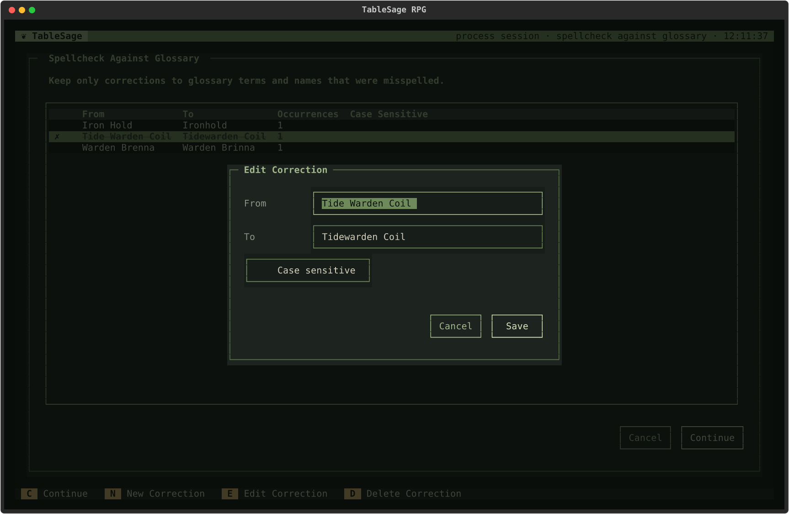
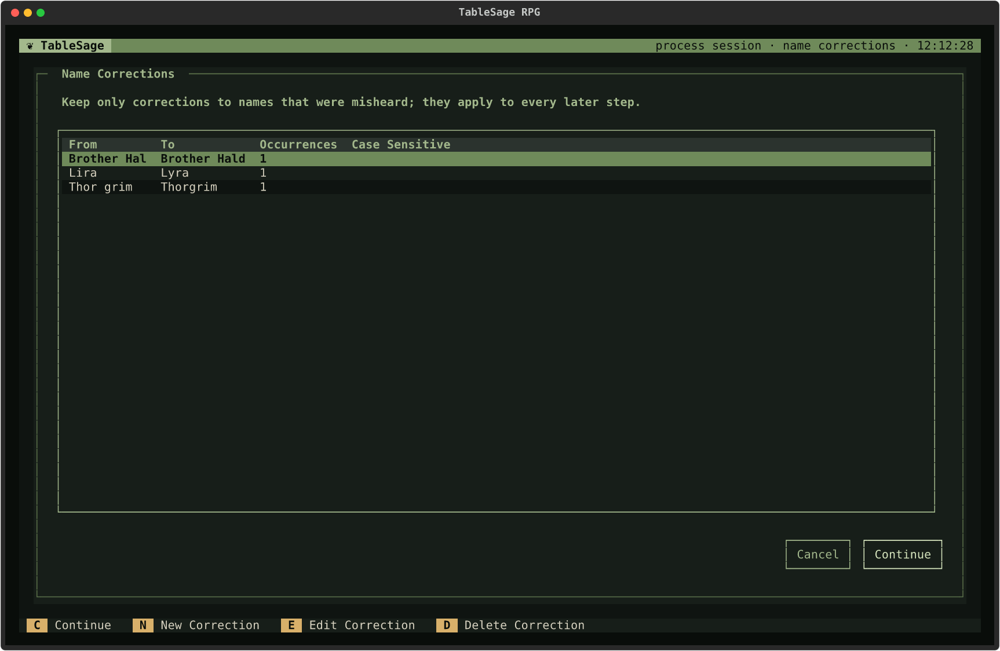
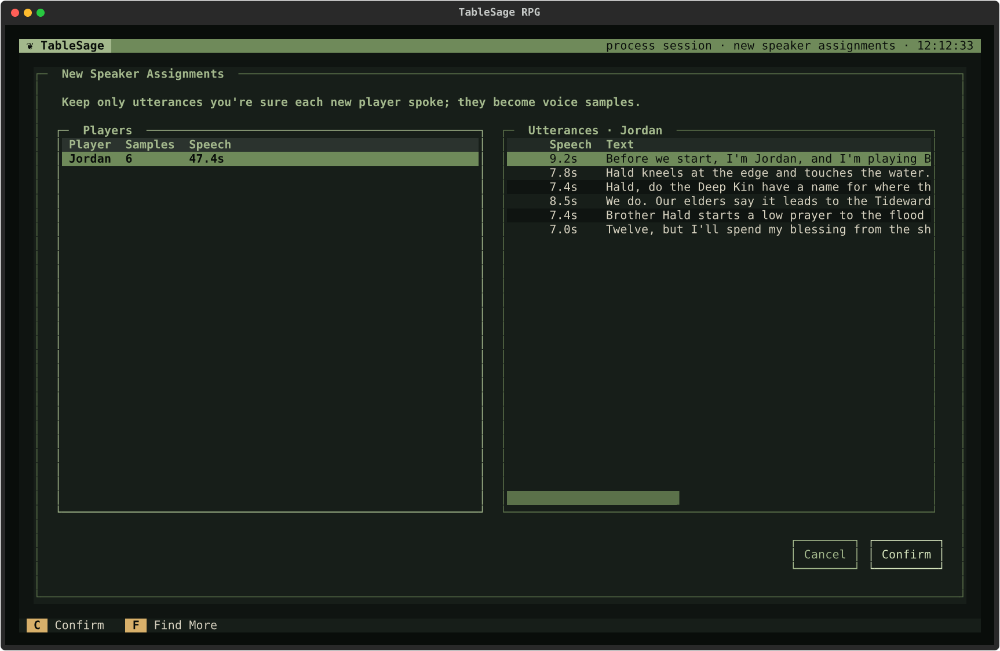
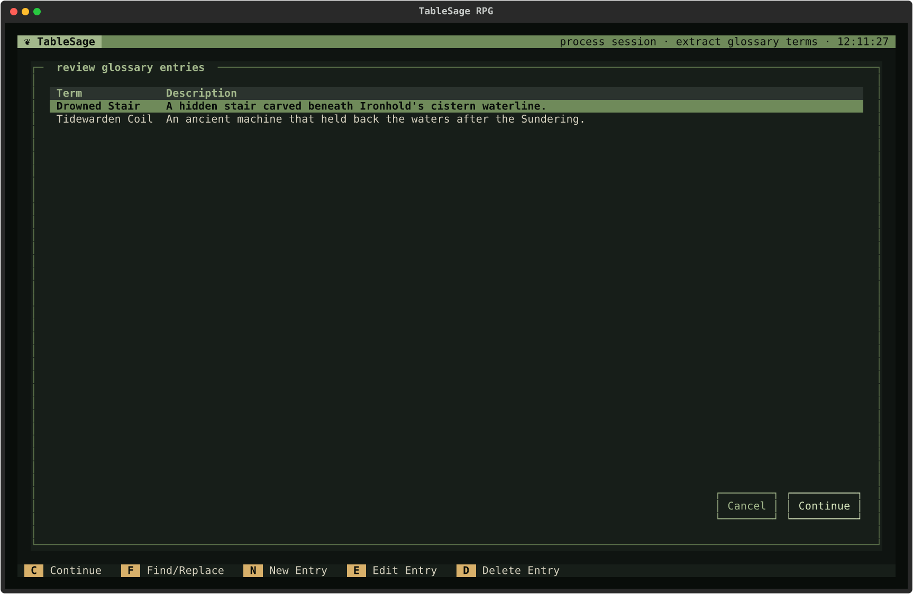
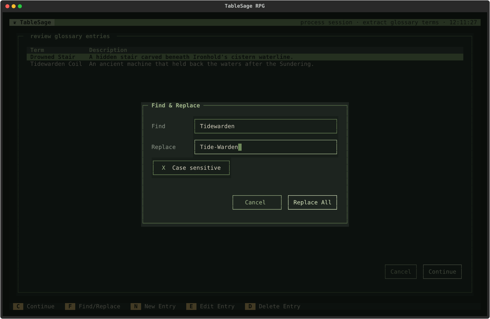
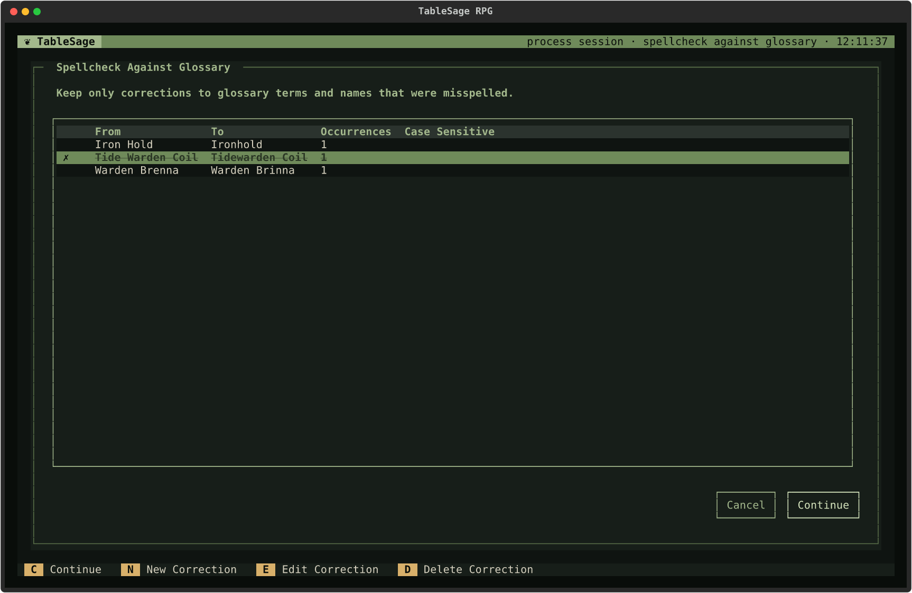
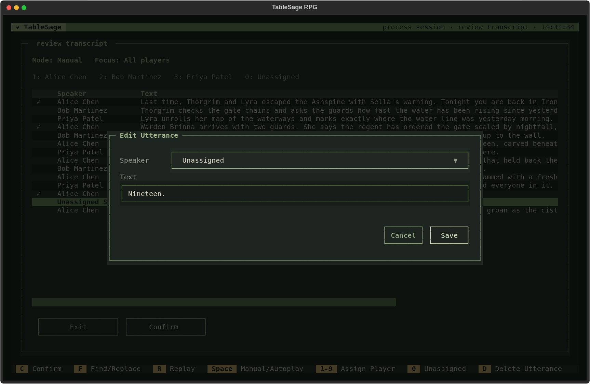
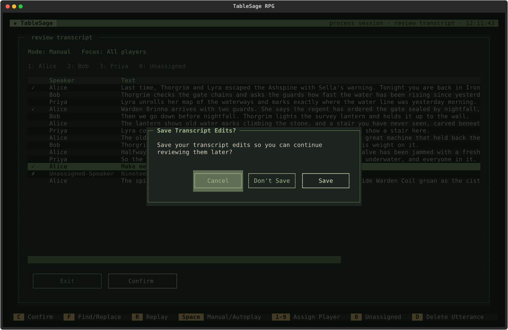
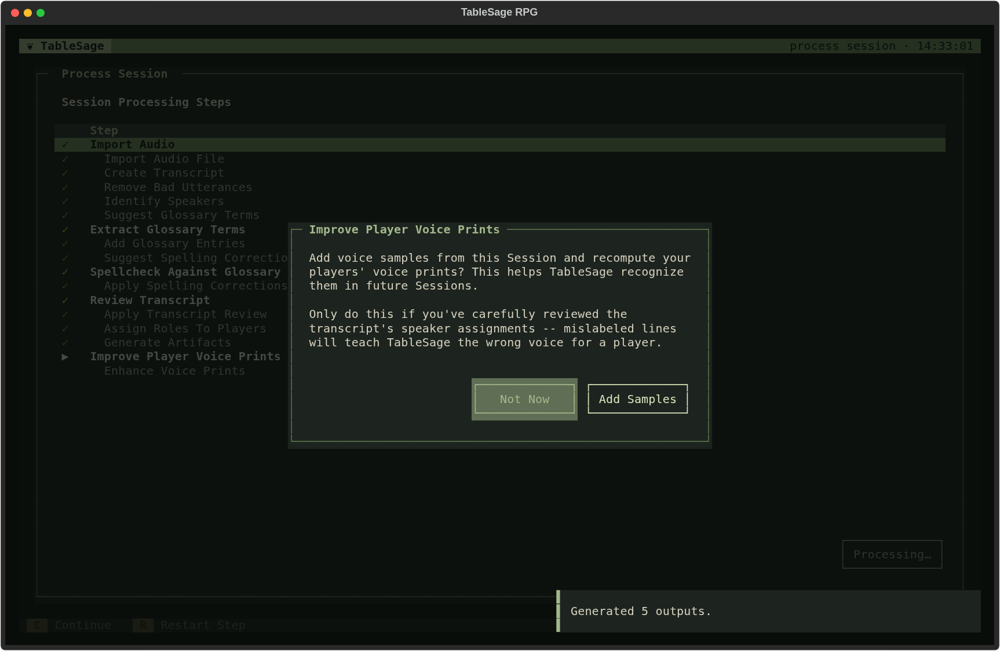

# Processing Review Screens

[Screen Reference](index.md) › Processing Review Screens

## How to Get Here

To get to a processing review screen, press **C** on the Process Session screen and complete the preceding reviews; to reopen a completed review, select its step and press **R** or **Enter**.

[Process Session](process-session.md) opens these screens and prompts as a run reaches each review step. You don't open them directly. Each screen records only your decision. Confirming it lets the run continue, and cancelling it ends the run at that step. What each step contributes to the Session is explained in [Processing with Returning Players](../../concepts/session-processing-returning-players.md) and [Processing with New Players](../../concepts/session-processing-new-players.md).

If a step finds nothing to review, such as a spellcheck with no suggestions, it completes without opening its screen.

## Reviews and Prompts

- [Import Audio](#import-audio)
- [Review Name Corrections](#review-name-corrections) — new Players only
- [Review New Speaker Assignments](#review-new-speaker-assignments) — new Players only
- [Extract Glossary Terms](#extract-glossary-terms)
- [Spellcheck Against Glossary](#spellcheck-against-glossary)
- [Review Transcript](#review-transcript)
- [Rebuild Prior Sessions](#rebuild-prior-sessions) — only when needed
- [Improve Player Voice Prints](#improve-player-voice-prints)

Review Name Corrections and Spellcheck Against Glossary use the [Shared Keys for Correction Lists](#shared-keys-for-correction-lists).

## Import Audio

### How to Get Here

To get to the **Import Audio** file picker, press **C** on the Process Session screen for a Session whose audio has not been imported.

**Continue** on a fresh Session opens a file picker filtered to audio files: `.wav`, `.mp3`, `.m4a`, `.flac`, and `.ogg`. Choose the Session's recording. If TableSage can't use the file you chose, it says why and reopens the picker in the same folder.

For a `.wav` file, **Clean Audio?** asks whether to run it through noise cleaning before importing:

- **Yes** cleans it. Choose this for a raw recording.
- **No** skips noise removal. Choose this if the file has already been cleaned.
- **Cancel** or **Esc** ends the run without importing anything.

Other formats are always cleaned. Every import converts the recording to 16 kHz mono audio and creates a separate normalized copy for review playback, even when you choose **No**. The original file is left unchanged. Importing, cleaning, and transcribing then run automatically and can take several minutes for a long Session.

## Shared Keys for Correction Lists

Review Name Corrections and Spellcheck Against Glossary share a layout: a table of find-and-replace corrections that TableSage proposes to apply to the whole transcript.

| Column | Meaning |
|---|---|
| **From** | The text as it was transcribed. |
| **To** | What it should say. |
| **Occurrences** | How many times **From** appears in the transcript right now. The count updates as you edit a row, so you can see what applying the correction will change. |
| **Case Sensitive** | ✓ if the match must have the same capitalization. |

| Key | Action |
|---|---|
| **C** | **Continue.** Saves the corrections as shown and continues the run. The **Continue** button does the same. |
| **N** | **New Correction.** Adds a correction of your own in the correction dialog. |
| **E**, **Enter** | **Edit Correction.** Changes the highlighted correction in the correction dialog. |
| **D**, **Delete**, **Backspace** | **Delete Correction.** Removes the highlighted correction. What removal means differs between the two screens; see each screen below. |
| **Esc** | **Cancel.** Ends the run at this step. If you changed anything, TableSage offers to [save a draft](ui-patterns.md#drafts). |

The correction dialog has **From** and **To** fields and a **Case sensitive** checkbox, which is off by default. **From** can't be empty.

## Review Name Corrections

### How to Get Here

To get to **Review Name Corrections**, press **C** on the Process Session screen and complete the preceding reviews until processing reaches that step (Sessions with new Players only).

*New Players only.* Before TableSage looks for a new Player's lines, it proposes corrections to names the transcription misheard, such as *Lira* for *Lyra*. Keep only corrections to names that were really misheard. They apply to every later step.

Name corrections match whole words only. On this screen, **D** deletes the correction from the list.

See [Shared Keys for Correction Lists](#shared-keys-for-correction-lists) for adding, editing, and confirming corrections.

## Review New Speaker Assignments

### How to Get Here

To get to **Review New Speaker Assignments**, press **C** on the Process Session screen and complete the preceding reviews until processing reaches that step (Sessions with new Players only).

*New Players only.* TableSage proposes which lines each new Player spoke. The lines you keep become that Player's first voice samples, so keep only lines you're sure of.

The screen has two panes:

- **Players** lists each new Player, the number of lines currently kept (**Samples**), and their total **Speech** time. *Too little speech* in red means the kept lines add up to less speech than a reliable voice print needs.
- **Utterances** lists the proposed lines for the Player highlighted in the Players pane.

Press **→** or **Enter** in the Players pane to move into that Player's utterances. The first line starts playing. In the Utterances pane, moving to a line plays it. Press **←** or **Esc** to return to the Players pane. The footer changes to match the focused pane:

| Key | Action | Pane |
|---|---|---|
| **C** | **Confirm.** Saves the kept lines and continues the run. The **Confirm** button does the same. | Both |
| **F** | **Find More.** Adds similar-sounding lines, marked **+**; keep at least one line first. See [Find More](#find-more) below. | Both |
| **R** | **Replay** the highlighted line. | Utterances |
| **Space** | **Manual/Autoplay.** In Autoplay mode, each line plays through and then moves to the next. Moving the cursor yourself switches back to Manual. | Utterances |
| **D**, **Delete**, **Backspace** | **Delete Utterance.** Toggles the highlighted line between kept and removed, then moves to the next line. A removed line is struck through and marked **✗**; press **D** on it again to keep it. | Utterances |
| **Esc** | In Utterances: back to Players. In Players: **Cancel**, which ends the run and offers to [save a draft](ui-patterns.md#drafts). | Both |

### Find More

**Find More** searches the rest of the Session for lines that sound like this Player's kept lines. Listen to each addition and remove any that aren't the Player. Removed Find More additions also steer later searches away from that voice. When nothing more is found, a notification says so.

## Extract Glossary Terms

### How to Get Here

To get to **Extract Glossary Terms**, press **C** on the Process Session screen and complete the preceding reviews until processing reaches that step.

TableSage proposes new glossary entries for names and terms that came up in the Session. The entries you keep are added to the Campaign's Glossary, which the spellcheck in the next step uses.

| Key | Action |
|---|---|
| **C** | **Continue.** Saves the entries and continues the run. Blank terms are refused with *Glossary terms cannot be blank.* |
| **F** | **Find/Replace** across every proposed term and description; see below. |
| **N** | **New Entry.** Adds an entry of your own. |
| **E**, **Enter** | **Edit Entry.** Changes the highlighted entry's term or description. |
| **D**, **Delete**, **Backspace** | **Delete Entry.** Removes the highlighted entry from the proposals. |
| **Esc** | **Cancel.** Ends the run at this step, and offers to save a draft if you changed anything. Esc isn't shown in this screen's footer, but it works. |

Terms already in the Glossary are skipped when the entries are added.

### Find & Replace

**Find** can't be empty. **Replace** may be empty, which deletes every match. **Case sensitive** is on by default. **Replace All** makes the change and reports how many occurrences it replaced, or warns *No matches found.* Review Transcript uses the same dialog.

## Spellcheck Against Glossary

### How to Get Here

To get to **Spellcheck Against Glossary**, press **C** on the Process Session screen and complete the preceding reviews until processing reaches that step.

TableSage looks for glossary terms and names that the transcript misspells, such as *Warden Brenna* for *Warden Brinna*. Corrections you approved in earlier Sessions of the Campaign are suggested again. Keep only real misspellings.

On this screen, removing is reversible. **D** toggles the highlighted correction between kept and removed. A removed correction stays in the list, struck through and marked **✗**, and pressing **D** again brings it back. Only one correction for each **From** text can be active. Keeping, adding, or editing one removes any other correction for the same text.

Spellcheck corrections match anywhere in the text, not only whole words.

See [Shared Keys for Correction Lists](#shared-keys-for-correction-lists) for adding, editing, and confirming corrections.

Restarting this review reopens saved corrections; it does not generate new suggestions from the current Glossary. To apply a later glossary change to reviewed speech, use **Review Transcript** and **Find/Replace**; see [Correct an Existing Entry](../../guides/build-campaign-glossary.md#correct-an-existing-entry).

## Review Transcript

### How to Get Here

To get to **Review Transcript**, press **C** on the Process Session screen and complete the preceding reviews until processing reaches that step.

Here you check who said each line, and fix what they said. Every line has its audio clip, so you can listen as you go. The screen opens with your saved draft if you left one, otherwise with your last completed review, and otherwise with the spellchecked transcript.

The top of the panel shows the playback **Mode** (Manual or Autoplay). Under that is the legend of number keys for assigning speakers. Each row shows a marker, the **Speaker**, and the **Text**:

| Marker | Meaning |
|---|---|
| ✓ | You changed this line's speaker or text. |
| ✗ | Removed. The line is struck through and will be left out of the reviewed transcript. |

### Keys

| Key | Action |
|---|---|
| **C** | **Confirm.** Saves the review and continues processing. |
| **F** | **Find/Replace** across the text of every line that hasn't been removed. Replacements you make here are remembered for the Campaign and suggested by the spellcheck in later Sessions. |
| **R** | **Replay** the current line. |
| **Space** | **Manual/Autoplay.** In Autoplay mode, each clip plays through and then moves to the next line. Moving the cursor yourself switches back to Manual. |
| **1**–**9** | **Assign Player.** Assigns the current line to the attendee with that number in the legend, then moves to the next line. Attendees are numbered alphabetically, and only the first nine get a number key. |
| **0** | Marks the current line **Unassigned**. |
| **D**, **Delete**, **Backspace** | **Delete Utterance.** Toggles the current line between kept and removed. The line and its clip stay available, so you can restore it later. |
| **↑ ↓** | Move between lines. Moving to a line plays its clip. |
| **Enter** | Opens **Edit Utterance** for the current line. If you haven't moved since the screen opened, the first **Enter** only plays the line. |
| **Esc** | **Exit.** Leaves without completing the step; see below. |

### Mouse

Clicking a line selects it and plays its clip. Clicking the selected line again opens **Edit Utterance**.

### Edit Utterance

**Speaker** lists *Unassigned* and every attendee, including any beyond the first nine. **Text** is what the line says; it can't be blank. **Enter** or **Save** applies the change, and **Esc** or **Cancel** discards it.

### Completing and Leaving

**Confirm** (**C**) saves the review, and the run continues: it applies your review, assigns Roles, and generates the Session's outputs.

**Exit** or **Esc** leaves without completing the step. If you changed anything, **Save Transcript Edits?** asks what to do with your edits:

- **Save** keeps the edits as a draft. The screen reopens with them next time.
- **Don't Save** discards them.
- **Cancel** returns to the review.

**Ctrl+Q** asks the same question before quitting.

## Rebuild Prior Sessions

### How to Get Here

To get to **Rebuild Prior Sessions**, press **C** on the Process Session screen and complete the preceding reviews until processing reaches that step (only when earlier Sessions need rebuilding).

This step appears only when an earlier Session's outputs are out of date. That happens, for example, after you reprocess an earlier Session, because each Session's outputs build on the ones before it. **Prior Sessions Are Out of Date** says how many outputs in how many earlier Sessions must be rebuilt first:

- **Regenerate Prior** rebuilds them, then generates this Session's outputs.
- **Cancel** ends the run without changing anything.

## Improve Player Voice Prints

### How to Get Here

To get to **Improve Player Voice Prints**, press **C** on the Process Session screen and complete the preceding reviews until processing reaches that step.

The last review step offers to add voice samples from this Session to the attendees' voice samples and recompute their voice prints, which helps TableSage recognize them in later Sessions.

- **Add Samples** cuts clips for each attendee, replaces their earlier clips from this Session, and recomputes their voice print. Earlier clips are removed even if no new clips qualify; see [Add Samples from a Session](../../guides/manage-players-and-voice-samples.md#add-samples-from-a-session).
- **Not Now** completes processing without adding samples. A notification reminds you that you can add them later with [From Session](players.md#from-session) on the Players List.

Choose **Add Samples** only if you have carefully checked the speaker of each line in Review Transcript. A mislabeled line teaches TableSage the wrong voice for a Player.
