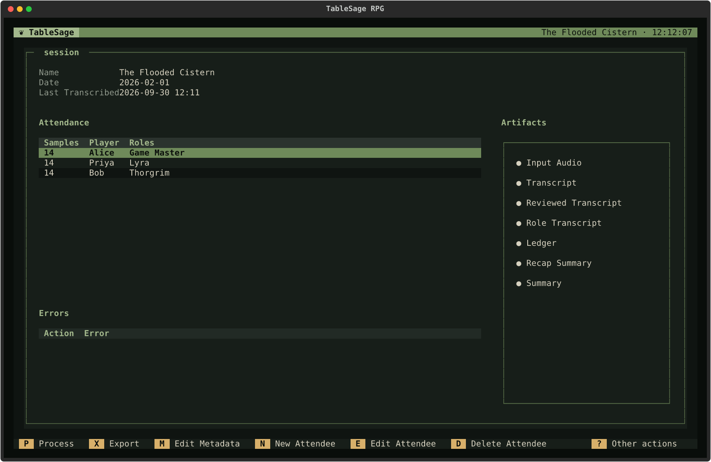
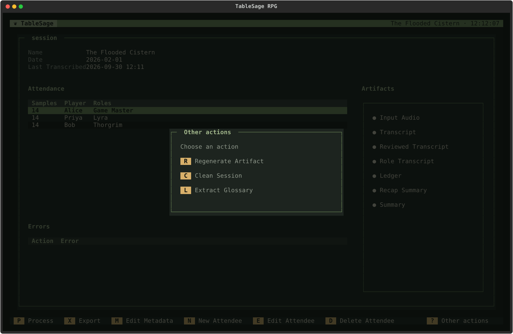
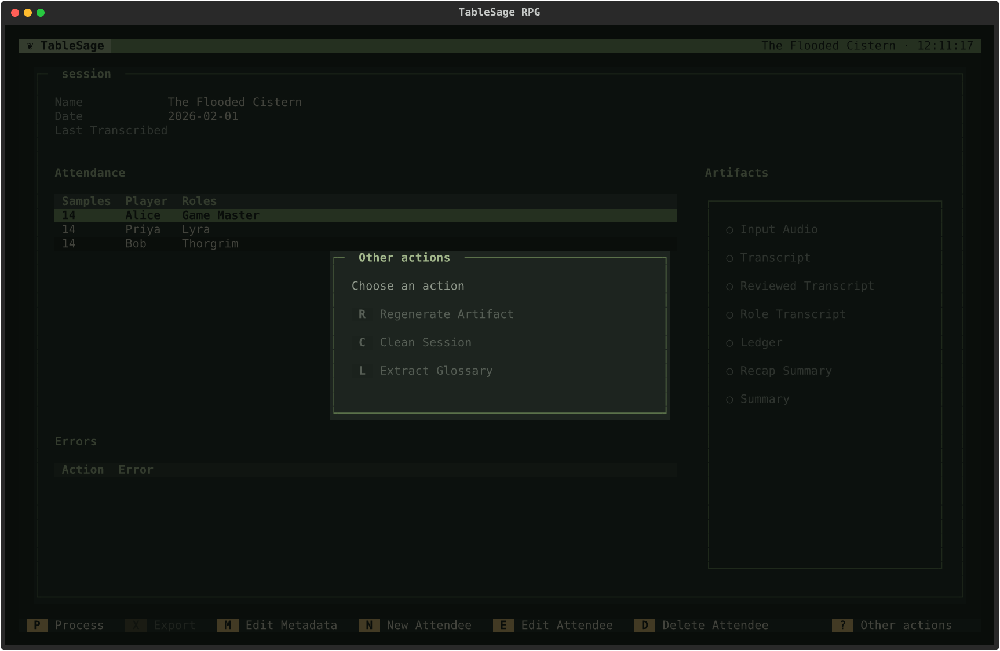
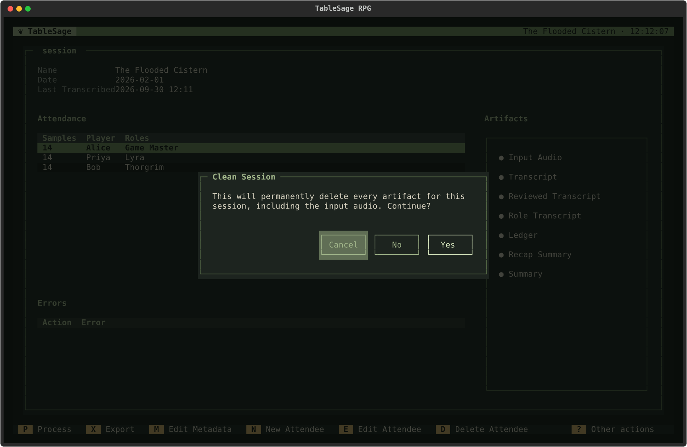
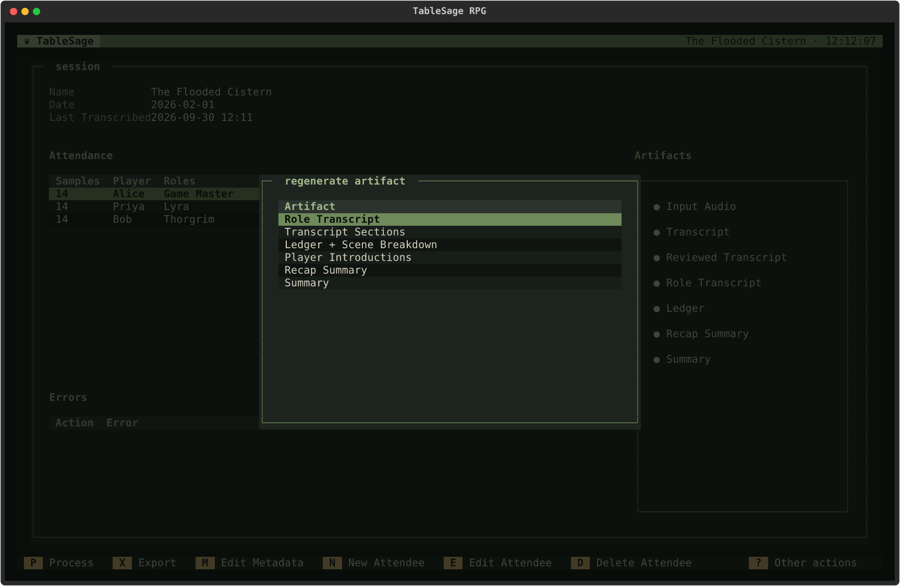
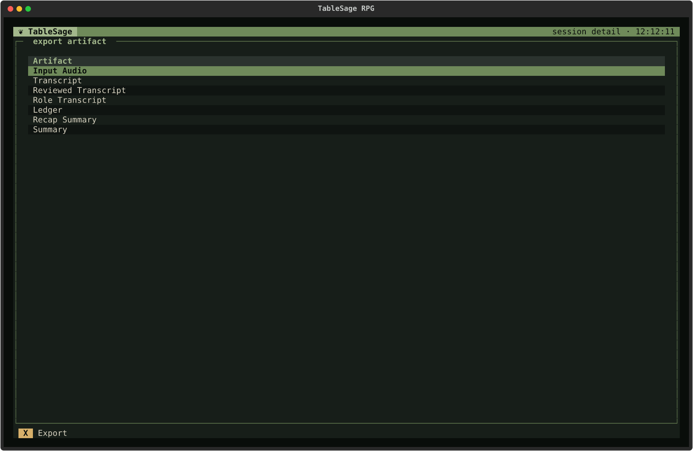
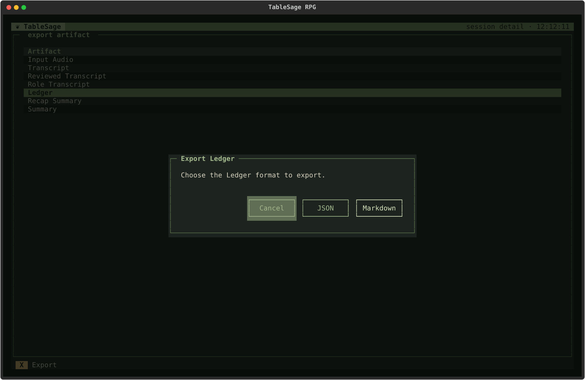

# Session Detail

[Screen Reference](index.md) › Session Detail

## How to Get Here

To get to the Session Detail screen, select a Session from the **Sessions** tab on the Campaign Detail screen and press **E** or **Enter**.

Session Detail is where you set up a Session before processing and check its results afterward. Creating a new Session also opens this screen. The header shows the Session's name. See [Sessions, Processing, and Session Artifacts](../../concepts/sessions.md) for the concepts.

## What the Screen Shows

- **Name**, **Date**, and **Last Transcribed** at the top. **Last Transcribed** is the time the Session's transcript was last created, and it is blank until then.
- **Attendance.** One row per Player who attended: their voice-sample count (**Samples**, with a red **0** for a Player with no samples yet), the **Player**, and the **Roles** they played. An attendee with no usable voice print is a *new Player*, and processing identifies them from what is said at the table. See [Processing with New Players](../../concepts/session-processing-new-players.md).
- **Errors.** Failures from **Clean Session** are listed here. Processing failures, including those from **Regenerate Artifact**, appear as an error notification and on the failed step's row in [Process Session](process-session.md).
- **Artifacts.** The Session's user-facing outputs, each marked **●** current, **◐** out of date, or **○** missing. See [Read the Artifacts Panel](../../guides/review-and-export.md#read-the-artifacts-panel).

Before processing, every artifact is missing, and **Export** is dimmed:

## Keys

| Key | Action | Available |
|---|---|---|
| **P** | **Process.** Opens [Process Session](process-session.md). | Always |
| **X** | **Export.** Opens [Export Artifact](#export-artifact). | When at least one artifact exists |
| **M** | **Edit Metadata.** Opens the [Session Dialog](campaigns.md#session-dialog) to change the name or date. | Always |
| **N** | **New Attendee.** Adds an attendee to this Session with the [Attendee Dialog](#attendee-dialog). | When the Attendance table has focus |
| **E**, **Enter** | **Edit Attendee.** Changes the highlighted attendee's Player or Roles. | When the Attendance table has focus and a row is highlighted |
| **D**, **Delete**, **Backspace** | **Delete Attendee.** Removes the highlighted attendee from this Session, after you confirm. It does not delete the Player. | When the Attendance table has focus and a row is highlighted |
| **Esc** | Back to Campaign Detail. | Always |

**New Attendee**, **Edit Attendee**, and **Delete Attendee** change this Session's attendance. To create or delete Players themselves, use the [Players List](players.md).

## Other Actions

| Key | Action | Available |
|---|---|---|
| **R** | **Regenerate Artifact.** Rebuilds one output and everything downstream of it; see [Regenerate Artifact](#regenerate-artifact). | When the transcript review is complete and current |
| **C** | **Clean Session.** After you confirm, **permanently deletes every artifact of this Session, including the imported audio**. Attendance is kept. Use it to process the Session again from the beginning. It refuses to run while any Session is being processed. | When the Session has at least one artifact |
| **L** | **Extract Glossary.** Proposes new glossary terms from this Session again. It restarts processing from the glossary suggestion step, so the [glossary review](processing-review-screens.md#extract-glossary-terms) opens and the later steps run as usual. | When the Session has been processed through speaker identification |

Before a Session is processed, all three are dimmed:

## Attendee Dialog

### How to Get Here

To get to the Attendee dialog, press **N** on the Session Detail screen to add an attendee, or select an attendee and press **E** or **Enter** to edit them.

The dialog is titled **Add Attendee** when adding someone and **Edit Attendee** when editing them.

- **Player.** Choose from the Players who aren't already attending. Choosing **<New player…>** asks for a name, creates the Player, and returns you to the dialog with that Player selected and your Roles kept.
- **Role.** The Roles this Player had in this Session, such as a character name or *Game Master*. A Player can have more than one.

The dialog has its own keys, shown at its foot:

| Key | Action |
|---|---|
| **R** | **Add Role.** Asks for a role name. |
| **G** | **Add Game Master.** Adds the *Game Master* Role in one step. |
| **E** | **Edit Role.** Renames the highlighted Role. |
| **D** | **Delete Role.** Removes the highlighted Role. |
| **Esc** | Cancel. |

**Save** stays disabled until you have chosen a Player and added at least one Role.

## Regenerate Artifact

### How to Get Here

To get to the Regenerate Artifact dialog, press **R** on the Session Detail screen (also listed under **Other actions**).

The dialog lists the outputs that can be rebuilt, in the order they are built:

Choose one with **Enter** or a double-click, then confirm. TableSage rebuilds that output and brings every output that depends on it up to date. This runs as a processing run, so a progress dialog shows each output as it is built. It refuses with *Processing is already running* if another run is in progress. If the rebuild fails, an error notification says why, and the Generate Artifacts row in [Process Session](process-session.md) shows the failure. See [Regenerate an Artifact](../../guides/review-and-export.md#regenerate-an-artifact).

## Export Artifact

### How to Get Here

To get to the Export Artifact screen, press **X** on the Session Detail screen.

The screen lists this Session's artifacts that exist. The screen stays open after each export, so you can export several in one visit.

| Key | Action |
|---|---|
| **X**, **Enter** | **Export** the highlighted artifact. Double-clicking does the same. |
| **Esc** | Back to Session Detail. |

Exporting always copies the file; the Session keeps its own copy. Before the file picker opens:

- If the artifact is out of date, **Artifact Is Stale** asks whether to export it anyway. **Continue** goes ahead, and **Back** doesn't.
- For the **Ledger**, **Export Ledger** asks which format you want: **Markdown** for reading or **JSON** for other tools.

Then choose where to save the file. The suggested name is the artifact's own file name, or `ledger.md` for a Markdown Ledger. A notification confirms where it was written. See [Export an Artifact](../../guides/review-and-export.md#export-an-artifact).
