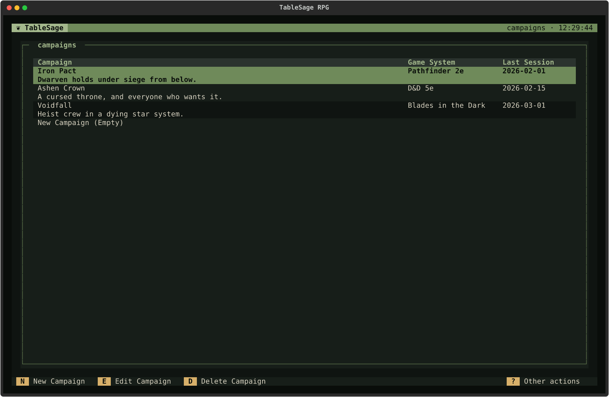
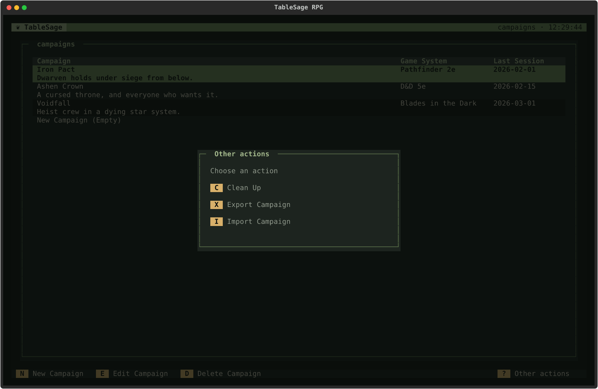
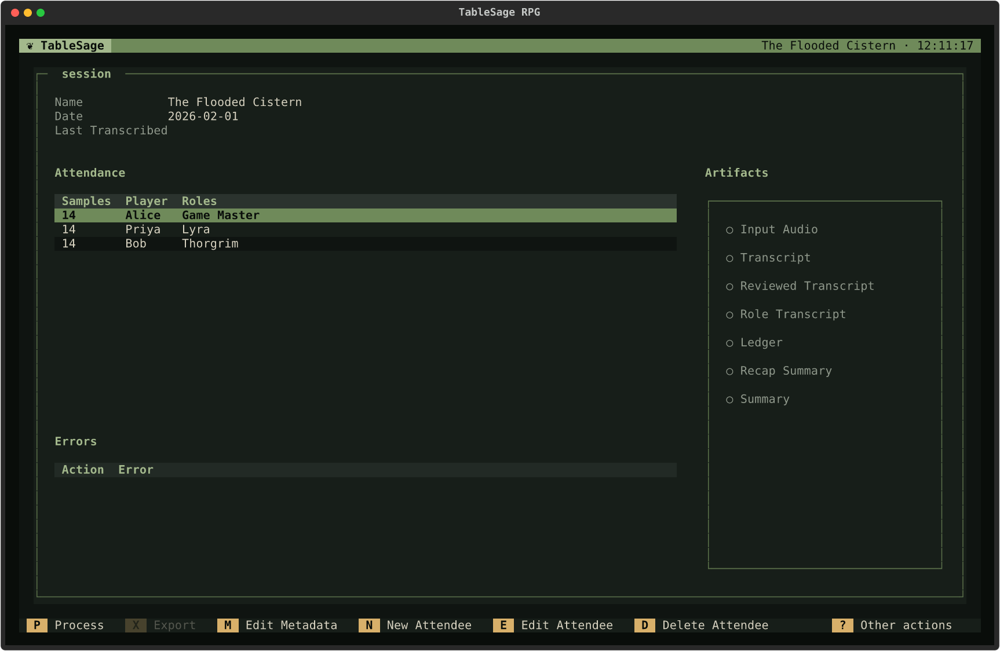
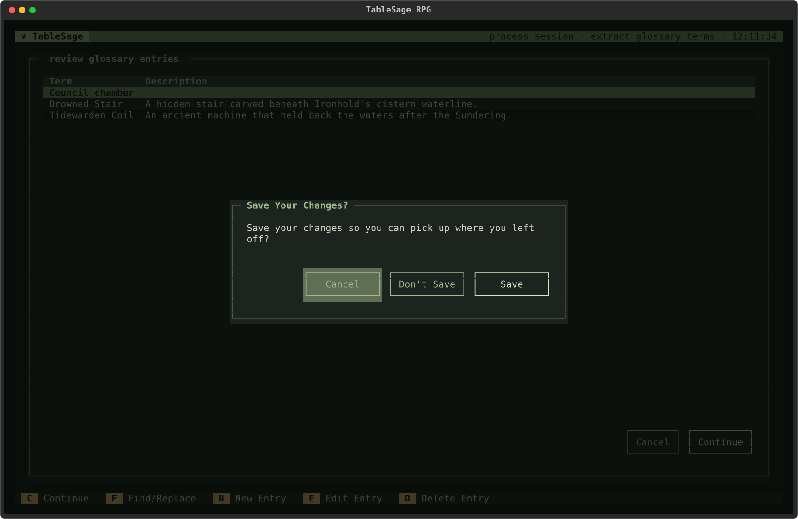

# Common UI Patterns

[Screen Reference](index.md) › Common UI Patterns

TableSage's screens share a small set of conventions. Once you know them, most screens work the way you expect. This page describes those shared patterns. The page for each screen lists only what is specific to that screen.

## The Parts of a Screen

Every full screen has the same three parts:

- **Header.** The top bar shows *TableSage* on the left. On the right it shows what you are looking at, such as the name of a Campaign, Player, or Session, followed by the time.
- **Body.** A bordered panel titled with the screen's name. Most screens are built around a table, and the highlighted row is the one that row actions such as **E** and **D** act on.
- **Footer.** The bottom bar lists the screen's main keys, each shown in a gold box next to its action. On screens that have [Secondary Actions](#secondary-actions), the right end of the footer shows **? Other actions**.

The complete footers fit at 140 columns, the width used for these screenshots. Narrower terminals can clip long footers; their key bindings still work.

## Moving Between Screens

TableSage's screens form a tree. The Welcome screen is the root. You go down a level by opening something and back up a level with **Esc**.

| Key | What it does |
|---|---|
| **E** or **Enter** | Opens the highlighted row when a screen presents you with a list of items. |
| **Esc** | Goes back to the screen you came from. On screens where you could lose work, TableSage asks first; see [Leaving a Screen](#leaving-a-screen). |
| **Ctrl+Q** | Quits TableSage from any screen; see [Quitting](#quitting). |

The Campaigns List, the Players List, and Campaign Detail refresh when you come back to them, so changes you made on a detail screen, such as a rename, show up straight away.

Screen footers leave **Esc** hidden. It still works to go back or cancel a review step; the screen reference explains any special behavior.

## Working with Lists

Most screens are built around a list, and the same three key bindings manage the items in it:

| Key | Action |
|---|---|
| **N** | **New.** Adds an item, usually through a small dialog. |
| **E**, **Enter** | **Edit.** Opens the highlighted item: its detail screen if it has one, otherwise a dialog for editing it. Clicking the highlighted row again, or double-clicking a row, does the same. |
| **D**, **Delete**, **Backspace** | **Delete** the highlighted item. |

These list keys appear on:

- the Campaigns and Players lists;
- the Sessions and Glossary tabs of Campaign Detail;
- the attendance table on Session Detail;
- the voice clips on Player Detail, where there is only **D**;
- the correction and glossary lists that processing asks you to review.

The footer labels these keys with what they act on, for example **New Campaign**, **Edit Session**, or **Delete Entry**. For lists with all three actions, **New**, **Edit**, and **Delete** appear together in that order at the end of the left-aligned bindings. Other main actions come before them. **? Other actions** stays last at the far right, so its position is consistent across screens.

Some behavior to expect:

- **Edit and Delete need a highlighted row.** When a list is empty, they are dimmed and do nothing.
- **Deleting saved data asks first.** Deleting a Campaign, Player, Session, glossary entry, voice clip, or attendee opens a confirmation dialog.
- **Deleting a Campaign, Player, or Session removes it from TableSage but leaves its folder on disk.** Each list has a **Clean Up** secondary action that removes such leftover folders. See [Delete and Clean Up](../../concepts/delete-and-clean.md).
- **Review lists change only your working copy.** On the processing review screens, nothing is saved until you confirm the screen. So deleting an entry there doesn't ask first. Some review screens make **D** a toggle between *kept* and *removed*, so you can bring a line back; each screen's page says which.
- **Arrows move the highlight.** **↑ ↓**, **PgUp**, **PgDn**, **Home**, and **End** move through the list that has focus.

### Dialogs for New and Edited Items

Most dialogs that add or edit an item share these conventions:

- The first field has focus when the dialog opens. **Tab** and **Shift+Tab** move between fields.
- **Enter** in a text field submits most simple editing dialogs, like pressing their main button. In the attendee dialog, select the Player, add Roles, then click **Save** or focus that button and press **Enter**.
- **Esc** or **Cancel** closes the dialog without saving.
- A problem, such as a name that is already taken, appears inside the dialog. What you typed is kept, so you can fix it and try again.

## Secondary Actions

TableSage divides each screen's actions into two groups:

- **Main actions** are the ones you use often, such as New, Edit, Delete, and Process. They are shown in the footer.
- **Secondary actions** are used less often or affect more at once, such as imports and exports, clean-ups, recomputing voice prints, regenerating outputs, and the campaign preparation tools. The footer doesn't list them individually, which keeps it short enough to read.

Five screens have secondary actions:

| Screen | Secondary actions |
|---|---|
| [Campaigns](campaigns.md#other-actions) | Clean Up, Export Campaign, Import Campaign |
| [Campaign Detail](campaigns.md#campaign-detail) | Export Glossary, Import Glossary, Clean Up, Regenerate All Outputs, Generate Opportunities, Create Previously On |
| [Players](players.md#other-actions) | Recompute All Voice Prints, Import Players, Export Players, Clean Up |
| [Player Detail](players.md#player-detail) | Recompute, Clean Up |
| [Session Detail](session-detail.md#other-actions) | Regenerate Artifact, Clean Session, Extract Glossary |

The other screens have none, and their footers don't show **? Other actions**.

### Opening the Other Actions Menu

On a screen with secondary actions, press **?** or **/** to open the **Other actions** menu. You can also click **? Other actions** in the footer.

The menu lists each secondary action with its key. In the menu:

- press an action's letter to run it;
- or move with **Tab** and **Shift+Tab** and press **Enter** or **Space**;
- or click the action;
- press **Esc** to close the menu without doing anything.

An action that can't be used right now is dimmed in the menu, and choosing it does nothing. Each screen's page lists the condition that enables it.

### Using the Keys Directly

The secondary menu helps you find secondary actions and see which are available, but you don't have to open it. Each secondary action's key also works directly on the screen. For example, pressing **C** on the Campaigns List starts **Clean Up** without opening the menu.

Most secondary actions ask you to confirm before they change anything. These start work immediately, without asking:

- **R** (Recompute All Voice Prints) on the Players List, and **R** (Recompute) on Player Detail;
- **O** (Regenerate All Outputs) on Campaign Detail;
- **L** (Extract Glossary) on Session Detail.

## Available, Unavailable, and Hidden Actions

An action that can't be used right now is shown dimmed, in the footer or in the Other actions menu, and pressing its key does nothing. For example, **Export** on Session Detail stays dimmed until the Session has something to export:

An action that doesn't apply to the current view at all is hidden instead. For example, Campaign Detail shows **G Glossary** only on the Sessions tab, and **S Sessions** only on the Glossary tab.

Which part of the screen has focus can matter too:

- On Session Detail, the attendance keys (**N**, **E**, **D**) work only while the attendance table has focus.
- On Review New Speaker Assignments, the footer changes depending on which of the two panes you are in.
- While a text field has focus, letter keys type into the field instead of running actions. To use **C Continue** or **G Generate** on a text-entry screen, press **Tab** to move focus out of the editable field first, or click the corresponding button or footer action. In Settings, focus a provider's **Delete Key** button to use **D** for that key; typing **c** or **d** into a key field remains ordinary text entry.

## Shared Keys

| Key | What it does |
|---|---|
| **Esc** | Back, or Cancel in a dialog. |
| **Ctrl+Q** | Quit TableSage. |
| **F5** | Reload data on Campaigns List, Campaign Detail, Players List, Player Detail, Session Detail, and Process Session. Use it after changing files outside TableSage. It is hidden in the footer and does nothing on the other screens. |
| **Tab**, **Shift+Tab** | Move focus between tables, fields, and buttons. |

Keys are not case-sensitive: **n** and **N** do the same thing. Where two keys do the same thing, the footer shows one of them. For example, **Enter** also does what the footer lists under **E**, and **Delete** and **Backspace** also do what it lists under **D**.

## Quitting

**Ctrl+Q** quits TableSage from any screen. The footer shows it only on the Welcome screen, but it works everywhere, even while a dialog is open.

Review Transcript, Create Previously On, and Settings use the unsaved-work prompts described in [Leaving a Screen](#leaving-a-screen) before quitting. If a dialog is open over one of them, close it first. Other screens quit immediately; to retain edits in another processing review, leave with **Esc** and save a [draft](#drafts) before quitting.

Quitting stops active processing. Finished steps remain complete; **Continue** resumes from the first unfinished step.

## Leaving a Screen

| Screen | What Esc (or Exit or Cancel) does |
|---|---|
| Lists, detail screens, Export Artifact, Process Session, Generate Opportunities | Goes straight back. Generate Opportunities doesn't keep its results, so save them first if you want them. |
| Review Transcript, Review Name Corrections, Spellcheck Against Glossary, Extract Glossary Terms, Review New Speaker Assignments | Leaves without finishing the step. If you changed anything, offers to save a [draft](#drafts). Review Transcript titles this prompt **Save Transcript Edits?**. |
| Create Previously On | If you entered anything, asks **Discard Previously On?** first. This workflow keeps no drafts. |
| Settings | If you changed anything, offers **Save** or **Discard** first. When settings must be reviewed before first use, you can't leave until you save. |

## Dialogs

### Confirmation Dialogs

Deleting, cleaning up, and other consequential actions ask first. A confirmation dialog has up to three buttons:

- **Cancel**, on the left, closes the dialog and does nothing. **Esc** does the same.
- The other two buttons carry the choice, for example **No** and **Yes**, or **Don't Save** and **Save**.
- The right-hand, highlighted button is the one that goes ahead.

When the dialog opens, the safe button has focus: Cancel if there is one, otherwise the left-hand choice. So pressing **Enter** straight away never deletes anything.

### Progress Dialogs

Work that takes more than a moment runs behind a progress dialog. The dialog shows what TableSage is doing and, where it can count, how far it has got. It has no Cancel button, and it closes by itself when the work finishes. While it is open, the screen behind it doesn't respond to keys. If the work fails, an error notification explains why.

### Provider Key Required

If an action needs an API key that hasn't been set, TableSage doesn't start it and shows **Provider key required** instead. **Open Settings** takes you to [Settings](welcome-and-settings.md#settings), and **Cancel** closes the dialog.

During processing, each automatic step checks for its keys just before it runs, and a missing key stops the run at that step. Import Audio checks for the transcription key and your Low model's provider key before it opens the file picker, so you don't choose a recording that can't be processed.

### Drafts

When a processing review offers to save your changes:

- **Save** keeps your changes as a draft and leaves.
- **Don't Save** discards your changes and leaves.
- **Cancel** (or **Esc**) keeps you on the screen.

The next time processing reaches that step, it reopens with your draft if the source material hasn't changed. Confirm the review to complete the step; saving a draft leaves it unfinished.

### File Pickers

Import, export, and save actions open a file browser. It starts in your home directory and shows hidden files. You can move through folders with the keyboard or mouse, or type a path into the field at the bottom. Import pickers show only the relevant file type, such as ZIP archives, JSON files, or audio files. **Esc** or **Cancel** closes the picker without doing anything.

## Notifications

Short messages appear in the lower-right corner. Information and warnings disappear after a few seconds. **Errors stay until you click them**, so you don't miss them.

## Mouse

You can click buttons, tabs, footer keys, and Other actions menu items. Clicking a table row highlights it, and clicking the highlighted row again (or double-clicking) is the same as pressing **Enter**. The review screens that play audio play a line when you click it; see [Review Transcript](processing-review-screens.md#mouse).
