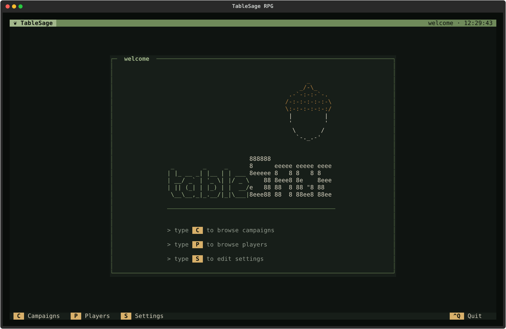
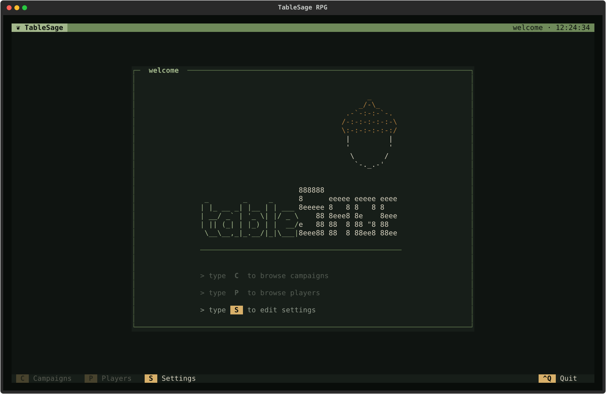
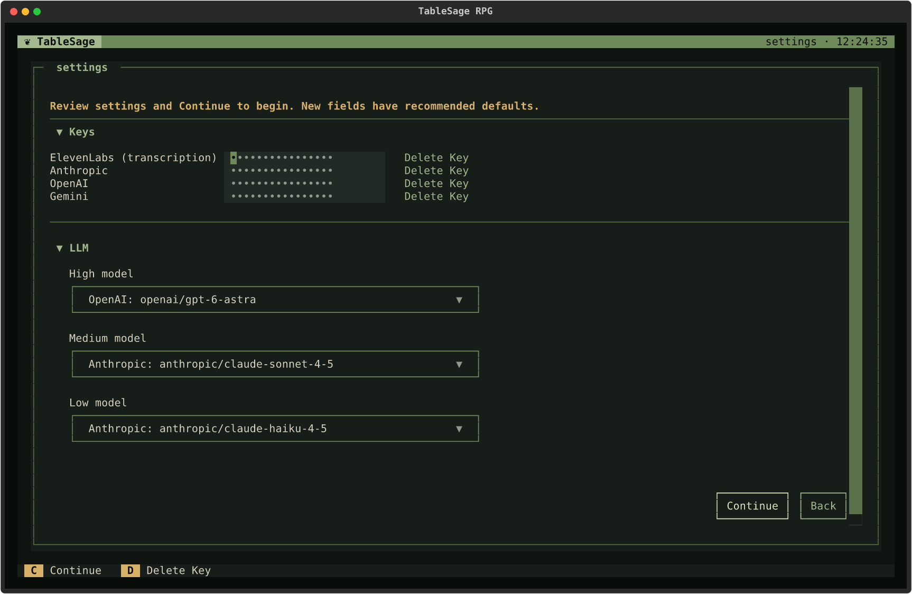

# Welcome and Settings

[Screen Reference](index.md) › Welcome and Settings

## How to Get Here

To get to the Welcome screen, start TableSage in your workspace; to get to Settings, press **S** on the Welcome screen.

## Welcome

The Welcome screen appears every time TableSage starts. Everything else is opened from here, and **Esc** from the Campaigns, Players, or Settings screen brings you back.

The three lines under the logo are also buttons. You can click them instead of pressing the key.

| Key | Action |
|---|---|
| **C** | Open [Campaigns](campaigns.md). |
| **P** | Open [Players](players.md). |
| **S** | Open [Settings](#settings). |
| **Ctrl+Q** | Quit TableSage. This is the only screen whose footer shows it, but it works everywhere. |

### When Settings Must Be Reviewed First

On a new workspace, or after an update adds settings you haven't seen, TableSage asks you to review your settings before anything else. A *Settings required* notification stays in the corner until you save. Until then, **C** and **P** are dimmed and do nothing.

Press **S**, check your keys and models, and save. Campaigns and Players become available as soon as the save succeeds.

## Settings

### How to Get Here

To get to the Settings screen, press **S** on the Welcome screen.

Settings holds your provider API keys and your choice of LLM for each of TableSage's three model tiers. [Update Your Settings](../../guides/settings.md) explains what each setting means and where keys are stored. This section covers the screen itself.

The screen has two sections, each of which can be collapsed by clicking its title:

- **Keys.** One masked field per provider: ElevenLabs (transcription), Anthropic, OpenAI, and Gemini. Dots in an empty field mean a key is already stored. Typing in a field replaces that key when you save. Each field has a **Delete Key** button beside it. A field is disabled if the key comes from your shell environment; hovering over it explains that the shell key takes precedence.
- **LLM.** A drop-down for each of the **High**, **Medium**, and **Low** models. Each lists preset models. Choosing **Custom…** opens a **Custom model ID** dialog, where you can type any `anthropic/`, `openai/`, or `gemini/` model ID.

| Key | Action |
|---|---|
| **C** | **Continue.** Saves, then checks the settings (same as the **Continue** button). Move focus out of an editable key field first. |
| **D** | **Delete Key.** Removes the key for the focused provider. Tab from its key field to its **Delete Key** button, then press **D** or **Enter**, or click the button. Available for stored or typed keys; shell keys cannot be removed. A stored key shows *Deleted on Continue* until you save. |
| **Esc** | Leave (same as the **Back** button). |

### Saving

Saving first validates the whole form. If a field is invalid, TableSage expands its section, focuses it, and shows a message under the form.

After saving, TableSage tests every configured model and downloads any local models it still needs, behind a *Checking settings* progress dialog. If every check passes, it closes Settings and shows a confirmation. If a check fails, your settings stay saved, but the screen stays open and shows *Settings saved, but the check failed*, with the reason. Correct the key or model and save again.

### Leaving

If you haven't changed anything, **Esc** or **Back** returns to where you came from. If you have, an **Unsaved settings** dialog offers **Save** (save and check, as above), **Discard**, or **Cancel**.

During the required first review, you can't leave until you save. **Esc** only reminds you to *Continue to save settings and finish setup, or use Ctrl-Q to quit.*
